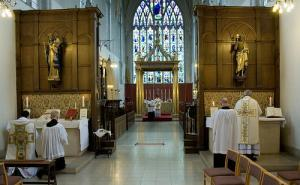

Als ik onlangs vertelde dat er die ochtend niet veel volk in de mis was, vroeg de kleinste _**"en als er niemand in de kerk was, zou de priester dan nog de mis doen?"**_. Een bal voor open doel om het verschil te duiden tussen de heilige Mis en een theaterstuk, een onderscheid dat niet altijd even duidelijk meer is! Het idee is een interessant gedachtenexperiment, waar menig gelovige én priester zich aan zou moeten onderwerpen.

Theologisch of kerkrechterlijk zal ik het niet perfect kunnen onderbouwen, maar ik ben er zeker van dat het enige principieel juiste antwoord op de vraag _**"ja"**_ is! Natuurlijk is het jammer als een zondagsmis weinig volk trekt en mag er nagedacht worden over een [kerkenplan](/blog/antwerpse-kerken-voor-toekomst-gevrijwaard-via-medegebruik-door-andere-christelijke-gemeenschappen/) om te voorkomen dat dit ooit werkelijk zou gebeuren, maar het is een reële vraag en in de praktijk niet volledig uit te sluiten. Mocht ik de priester zijn die ooit voor een lege kerk zou komen te staan, ik zou met knikkende knieën en met het zweet op mijn aangezicht mijn werk doen en meer dan ooit ervaren wat voor een offer Christus heeft gebracht dat zich nu op het altaar voltrekt!

Als er een **theaterstuk** wordt opgevoerd en er zou niemand opdagen in het publiek, dan kan ik me niet inbeelden dat de acteurs de vertoning laten doorgaan. Een theaterstuk bestaat immers bij de gratie van het publiek, dat moet worden vermaakt en voor de inkomsten zorgt. Niet zo de **heilige Mis**. Die bestaat bij de gratie van Christus' tegenwoordigstelling en die is niet afhankelijk van de aanwezigheid van gelovigen om aan de eucharistie deel te nemen.

 Mis(sen) zonder gelovigen: geen gebrek aan godsvrucht, maar overvloed van godsvrucht

Vroeger, meen ik, kwam het trouwens vaak voor dat een priester die geen 'dienst' had in een parochie, toch zijn dagelijkse mis opdroeg, samen met een acoliet, eventueel zelfs tijdens de gewone mis, aan een zijaltaar, terwijl de aanwezige gelovigen deelnamen aan de mis op het hoofdaltaar. In die mis-zonder-gelovigen konden dan wel specifieke intenties opgedragen worden, wat meteen het onzichtbare gemeenschapskarakter bevestigde.

Die gewoonte bestaat nu (haast) niet meer, onder meer omdat er sinds het tweede vaticaans concilie kan worden geconcelebreerd, maar in wezen kan er toch niets veranderd zijn aan het beginsel dat de eucharistie in zichzelf bestaansrecht verdient en niet in de aanwezigheid van gelovigen? Een mis zonder 'publiek' is misschien niet nastrevenswaardig, maar wel een concept dat een en ander in een juist perspectief kan plaatsen, ook als we liever eucharistie vieren in een volle kerk.

* * *

Interessante lectuur die mijn aanvoelen bevestigt, maar ook nuanceert, snorde ik op uit de constitutie Sacrosanctum Concilium in [paragraaf 27](https://www.rkdocumenten.nl/rkdocs/index.php?mi=600&doc=570&id=2332): _"Wanneer bepaalde riten, overeenkomstig elks eigen aard, een gemeenschappelijke viering met zich meebrengen met een talrijke en actieve deelname van de gelovigen, moet men er met nadruk op wijzen, dat deze zoveel mogelijk de voorkeur moet hebben boven een individuele en quasi private viering ervan. Dit geldt vooral voor de viering van de Mis - onverminderd het publiek en sociaal karakter van iedere Mis - en voor de toediening van de Sacramenten",_ maar in [paragraaf 57](https://www.rkdocumenten.nl/rkdocs/index.php?mi=600&doc=570&id=2337): _"Iedere priester behoudt echter altijd de vrijheid, de Mis afzonderlijk te vieren, maar niet op dezelfde tijd in dezelfde kerk en ook niet op Witte Donderdag."_

Een heel interessant artikel is te lezen op Wikipedia onder het [lemma Sine Populo](https://en.wikipedia.org/wiki/Sine_populo), dat beschrijft hoe verschillende pausen en concilies tegen de mis zonder gelovigen aankeken.

De finale uitkomst is te vinden in dit [artikel](https://sarumuse.wordpress.com/2012/04/23/mass-without-a-congregation/), dat verwijst naar een doctoraat geschreven om de concreet voorliggende vraagstelling te beantwoorden: _"The likelihood of a priest being unable to find anyone to be present at his Mass celebration or to participate in another priest’s celebration is very remote – as “on the Missions or in an isolated place where the priest is alone”. The Church does allow for this unlikely eventuality, but stresses the need for a congregation."_
