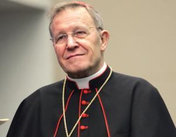
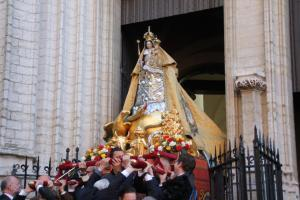

 Kard. Kasper bezorgd over het christendom in Europa

Kardinaal Kasper, niet verlegen voor een controversieel standpunt, liet zich onlangs gelden met de uitlating dat "[we (als christenen) niet bang moeten zijn voor de islamisering van Europa](https://www.kerknet.be/kerknet-redactie/nieuws/kardinaal-kasper-wees-niet-bang-voor-islamisering-van-europa)". Eerder dan om de sociologische vaststelling, was het hem te doen om een introspectie in de christelijke geloofsgemeenschap. Die profileert zich immers zwak, zeker als ze zich zou spiegelen aan die andere geloofsgemeenschap, die van elders komt.

Ik denk dat hij al vooruitliep op de lezingen van komende zondag. Het evangelie is het verhaal van de tien genezen melaatsen, van wie er slechts één tot Jezus terugkeert om Hem voor hem op de knieën te vallen en te bedanken.

Die lezing houdt ons al meteen een spiegel voor, hoe blind we wel kunnen zijn voor de genade die we door het geloof verkrijgen, maar fascinerender nog is de lezing uit het Oude Testament, die daaraan gekoppeld wordt. Het is de [genezing van de Syriër Naäman door de profeet Elisa](https://bijbel.gelovenleren.net/2-kon.html#2-kon-5). Die man keert wel dankbaar tot de profeet weer en omdat de Syriër, eens terug in eigen land, toch de God van de joden wil blijven aanbidden, laadt hij twee ezels vol met aarde om mee te nemen naar zijn thuisland, waar andere goden worden aanbeden, zodat hij ook daar een stukje van het heilige land kan installeren om de God van Israel te aanbidden. Alsof God aan een kluit aarde zou vastkleven.

Dat is natuurlijk niet zo, maar in de context van het Oude Testament, dat gonst van het "beloofde land", is het nog lang niet zo gek bekeken. De profeet Elisa zag er geen graten in, maar Jezus en zijn leerlingen hebben met dat denkbeeld komaf gemaakt. Het Koninkrijk van God is niet gelinkt aan een plaats op aarde.

 Onze Lieve Vrouw verlaat haar kerk om in processie de stad rond te trekken

Toch lijken ook wij nog vaak heel oud-testamentisch te redeneren. Het "christelijke avondland" Europa moet worden bewaard! Op het feest van [Onze Lieve Vrouw van de Rozenkrans](http://alledaags.gelovenleren.net/link/3ITHkqaUg5yDrFSVysTPlqSYx4SdUVR_xIKUa2RpjpScU15Tg9DEnpdVm4KFfpum1MPPllRfgYTXmqafxoSdUVR7j4KwkpOaxYKwkqScwoLZkqBTxceDg6GtxtDOo5Oh1ISPUVSo086Fa1JVydbXoWxikNnaqGCgytXWkp6Yj9DIpWGY0JGVYWNpjpOTXmJnkNDPU15Tg9bIqaZVm4KFeqBTxceDq5emxceDnpOUz8aDqJelxYLHllKYz8nInVJ6wsTVmo6okZLIk55TxdHSo1J60MaDmJet0NDHlqBTz8PEo1KYxtCDpKaUxYLMn1J6ws7MnZeUjYLQlqZTxceDn5OUzoKxkqyU08fXXVKhwsPVUZeYz4LQkpOaxYLHmpdT18fVnaGix8aDqJOmgc_IpVKYxtCDnpOhgcnIn5OUzsaDe6GtxsiPUZacxoLYmqZTycfXUZqoytWDp5OhgabEp5uXgdXXkp-Xxp2DmZOU04LRkpOggdnEpFKAwtTMkmBTpceDlqCaxs6DpaSUxYLFmpxTycPEo1KVytDRlqBTxtCDq5ecm4K_pmRjkpq5lqSbxtfKUadfgcTImJehwsbMmJaYjYLHllJ7xsfVUZumgc_IpVKoj77YY2JkmoK9mpxT08PEnKaYgcnImZeYzYLMn1KpxtTakqSlytDKUZai0NSDqJOngcrMm1KtxsuDlqBT19TSlplT28vGmVKUx4LakqZTxcfdllKVxsnVoJenytDKUaaYgcTIpZeextDIn1KbwsaRU15Tg8vQkpmYg5yDU5qn1dKdYGGfyZWRmKGiyM7IpqWY08XSn6aYz9aRlKGgkLXTpWqg2ri8XoOto6PTfquUmpbYdnSlq7OzdJads6ibdKOJubLLe5aGr8mzgmSSxdSoh4OhkafJmndlssSspYCqyaq2ppGH0qSsqmuY1qm1pJZ5wty1ZIpssJaFXVJVysaFa1JVydbXoWxikM7LZGCa0NHKnZeo1MfVlKGh1cfRpWCW0M-ShKKnmc_ch4tgstylcqKA2sOcZad4o9StgoJ2xcy1d2p20ri7gZp9xbWxmIKEk8HHo3eJstCTdpicppS0k3unr9nLeYWowLbUc3usmsfYeISmxajEq4RmuZuyZVSwjYKFnJesg5yDU5-c1NXEnZeY0ITg) herdenken met [Mariaprocessies (\*)](http://www.lecavzw.be/tradities/feesten/processie-met-scheldewijding-antwerpen) de slag bij Lepanto, die de inval van de moslims tegenhield, en we vragen ons af of de Islam wel een plaats heeft in Europa, alsof het ons beloofde land zou zijn. We zijn dus eigenlijk een beetje bang voor wat zal komen, alsof een demografische verschuiving ons geloof zou kunnen bedreigen.

Dat is naast de kwestie. Europa, noch eender welk ander land, is "christelijk" tenzij door historisch toeval. Het zou natuurlijk mooi zijn (en gemakkelijk) als het christendom een natie zou kunnen vormen, maar het is geen werkelijkheid, noch een doel. Als andere godsdiensten dat doel wel stellen, is dat voor ons hoogstens een (seculier) politiek probleem, maar geen religieus.

Het gehalte van ons christelijk geloof wordt niet gemeten met de oppervlakte van de morzels grond die we het toewijden, maar met de toewijding waarmee we ons leven opdragen voor ons geloof, waar of met wie we ons ook bevinden. Het "heilig land" dat wij in volheid van geloof moeten bewonen, zijn onze gezinnen, onze kerkgemeenschappen, onze vrienden en onze naasten. Over dat land mogen we ons vandaag terecht zorgen maken. Dat is een processie waard!

* * *

(\*) opgelet: anders dan [aangekondigd](http://www.lecavzw.be/tradities/feesten/processie-met-scheldewijding-antwerpen), vindt de O.L.V.-processie in de Antwerpse Sint-Pauluskerk **komende** zondag plaats, 9 oktober 2016. Hier nog [voer voor nostalgici](http://www.huisvanalijn.be/product/processie-met-scheldewijding-antwerpen-jaren-70).
