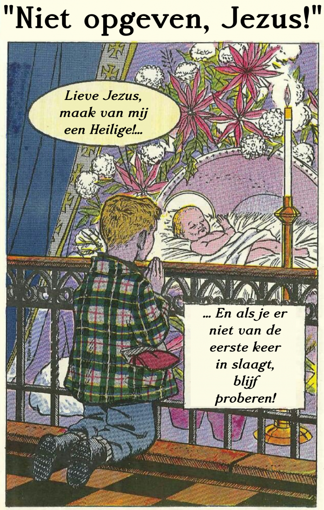

Genade is een moeilijk begrip. Niet eenvoudig om uit te leggen aan iemand die geen theologisch vocabularium heeft.

Het [Compendium van de Catechismus van de Katholieke Kerk](https://www.rkdocumenten.nl/rkdocs/index.php?mi=600&doc=663&al=423&highlight=genade) definieert genade als volgt: "De genade is de vrij geschonken gave die God ons geeft, om ons deelgenoten te maken van zijn drie-ene leven, en ons in staat te stellen te handelen uit liefde voor Hem. Zij wordt _habituele_, of _heiligmakende_ of _vergoddelijkende_ genade genoemd, omdat zij ons heiligt en ons vergoddelijkt. Zij is bovennatuurlijk, omdat zij geheel en al afhangt van het vrije initiatief van God, en omdat zij het bevattingsvermogen van het verstand en de krachten van de mens te boven gaat. Zij onttrekt zich dan ook aan onze ervaring."

De [Prentencatechismus](http://prentencatechismus.org/uncategorized/de-genade/) doet het als volgt, al iets bevatterlijker: "De genade is een bovennatuurlijk geschenk van God. God schenkt ons de genade niet omdat we die zelf hebben verdiend, maar door de verdienste van Jezus Christus. We kunnen de genade gebruiken om tot rechtvaardiging te komen."

Maar zeg nu zelf, dat zijn toch definities die enige voorkennis vereisen. Gelukkig is ook hier het oude adagium van toepassing: _A picture says more than a thousand words_. Ziehier een volmaakte definitie van genade, met een zekere schalksheid in beeld gebracht:

Niet opgeven, Jezus!

Meestal bidden we om te danken voor de nieuwe kans die we krijgen en voor het welslagen van onze zoveelste poging terug op de goeie weg te geraken. Dat onze wil sterk mag zijn en ons doorzettingsvermogen krachtig. Niets mis mee, maar toch opgelet: dit gebed zou kunnen laten uitschijnen dat de last van de bekering volledig op onze eigen schouders rust en dat de verdienste van onze rechtvaardiging volledig bij onszelf ligt. Het jongentje bij de kribbe draait brutaal de rollen om. Hij geeft Jezus nog een kans... Brutaal? Nee, eerder nederig, want op die manier toont het baasje aan dat hij goed beseft waar het zwaartepunt ligt in onze weg naar heiligheid: de genade van Christus.

Zonder de genade kunnen we niet heilig worden. Om heilig te worden, moeten we niet meer doen dan de genade beantwoorden. Het zware werk, dat wordt door Jezus gedaan. Het jongentje beseft dat hij het Jezus nog moeilijk zal maken, daarom bidt hij dat Jezus het dan nog eens zou proberen… en  nog eens… en nog eens.

Genade lijkt ook een een beetje op de opbrengst van een sponsorloop, waaraan de kinderen op school toevallig vandaag moesten deelnemen om de schoolkas te spijzen. Ze bekloegen zich als volgt: wij moeten ons moe maken, en de juffen, die aan de kant staan te tetteren, krijgen de centen die wij verdienen! Zo gaat het ook met de genade. Ook daar worden rondjes gelopen om genade te verdienen. Wij staan aan de kant onaandachtig te beuzelen, zoals de juffen op school, slechts een enkeling heeft aandacht voor de renbaan en roept de bezwete renner toe "Niet opgeven, Jezus!!"

Jezus op de sponsorloop (maar veel gekker hoeft het niet te worden)
