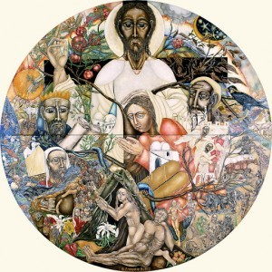

Volgende zondag valt het feest van Christus Koning, de laatste zondag van het kerkelijk jaar. Op dat feest, evenals op de daaropvolgende zondagen van de Advent, wordt er verwezen naar [Jezus' komst](/blog/het-rijk-gods/). Niet alleen zijn komst als verlosser, in de gedaante van een kindje, zo'n slordige twee millennia geleden, maar ook zijn beloofde wederkomst, op het Einde der Tijden, als rechter van het Laatste Oordeel.

Het concept van het 'Einde der Tijden' is moeilijk te vatten, zeker in ons hedendaagse wereldbeeld, dat zelfs de [dood uit het leven bant](/blog/christelijke-doodsgedachte/)\---maar op een heel andere manier dan Jezus heeft bedoeld---, laat staan dat we ons [druk zouden maken over wat er daarna volgt](http://blog.adw.org/2016/11/love-of-the-world-fuels-the-fear-of-death/). We moeten er ons echter van bewust zijn dat "[de uitersten](http://prentencatechismus.org/uncategorized/de-vier-uitersten-in-het-algemeen-de-dood/)" een essentieel deel uitmaken van een _christelijk_ wereldbeeld.

De relevantie ligt er niet in te weten _wanneer_ het einde zich zal voltrekken, daarover is Jezus duidelijk: dat weet alleen de Vader. Ook niet bijzonder relevant is te weten _hoe_ het einde zich zal voltrekken. Het evangelie, met name de eschatologische rede van Jezus in [Matteus 24-25](https://rkbijbel.nl/kbs/#/bijbel/neovulgaat/willibrord1975/matteus/24), geeft heel wat aanwijzingen waaruit je de gekste voorstellingen kan ontwikkelen, maar daarmee kom je geen stap dichter bij de betekenis van Jezus' wederkomst voor jouw leven.

 La Genèse (Francoise Burtz, © Francoise Burtz)

Als je goeie eschatologische meditatie wil mét een actuele boodschap voor jouw leven, moet je niet ver zoeken. Heel wat van Jezus' parabels zijn eigenlijk verhalen over de Eindtijd, waarbij telkens een tipje van de sluier wordt opgelicht over het Oordeel dat zal plaatsvinden.

Een thema dat nogal eens voorkomt in Jezus' parabels is dat van de Heer die op reis gaat en bij zijn terugkomst rekenschap vraagt, of varianten daarop. Het ligt er vingerdik op dat Jezus zichzelf als de (nu afwezige) Heer voorstelt en dat het ogenblik van de rekenschap het Laatste Oordeel is. Die reizende Heer is niet zomaar een verpakking voor een vrome les, het is ook een beeld van de eschatologische dimensie van ons bestaan, waarover Jezus ons wil inlichten.

[Lc 19:11-27](https://rkbijbel.nl/kbs/#/bijbel/neovulgaat/willibrord1975/lucas/19) - de parabel van de tien ponden "Een man van hoge geboorte ging op reis naar een ver land om het koningschap te verkrijgen en dan terug te keren"

[Mt 24:45-51](https://rkbijbel.nl/kbs/#/bijbel/neovulgaat/willibrord1975/matteus/24) - de parabel van de knecht van de Heer "dan zal de heer van die knecht komen op een dag waarop hij het niet verwacht en op een uur dat hij niet kent"

[Mt 25:1-13](https://rkbijbel.nl/kbs/#/bijbel/neovulgaat/willibrord1975/matteus/25) - de parabel van de wijze en de dwaze maagden "Maar midden in de nacht klonk er geroep: Daar is de bruidegom! Trekt hem tegemoet!"

[Mt 25:14-30](https://rkbijbel.nl/kbs/#/bijbel/neovulgaat/willibrord1975/matteus/25) - de parabel van de talenten "Na lange tijd kwam de heer van die dienaars terug, en rekende met hen af"

De parabels zijn niet zozeer van belang omdat ze een diepe morele les meegeven. Wat dat betreft, zijn de verhaaltjes eerder oppervlakkig. Waar Jezus wel op hamert is dat we het voortdurend besef van het Einde een plaats moeten geven in ons leven. Hij maant ons aan waakzaam te zijn en Hij maakt in niet mis te verstane taal duidelijk dat er geen tweede kans volgt.

In de [eindtijdparabels](https://www.rkdocumenten.nl/rkdocs/index.php?mi=600&doc=4939&id=0&highlight=) is er aan het slot [verrassend weinig](http://blog.adw.org/2016/11/meanest-thing-jesus-ever-said/) te merken van die barmhartigheid waarvan Jezus de personificatie is. Barmhartigheid kan niet wachten, [die ondervinden we nu reeds](https://www.rkdocumenten.nl/rkdocs/index.php?mi=600&doc=5220&id=0&highlight=)!

Wil je nog wat verder lezen, Lucepedia heeft een bevattelijk artikel over het [Laatste Oordeel](https://www.lucepedia.nl/dossieritem/laatste-oordeel/laatste-oordeel) en de Thomaswebsite verzamelt een aardig dossiertje "[Laatste Oordeel](https://www.kuleuven.be/thomas/page/laatste-oordeel/)", waarin heel wat verwijzingen naar Bijbel en traditie opgelijst worden, naast tal van referenties vanuit populaire cultuur.

Ben je er klaar voor de generale repetitie van het Oordeel, speel dan het [toneel](/portfolio/de-talenten/).

