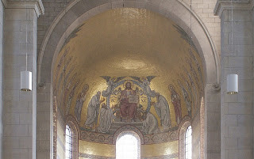
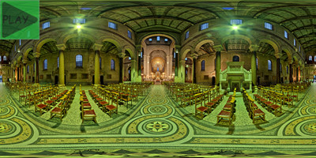

Vorige zondag, feest van Christus Koning, was ik 's morgens niet tot in de mis geraakt. Dat is jammer, want dan mis ik de wekelijkse koffie achteraf.

Mozaiek in het koor van de Sint-Michael-en-Petruskerk

De eucharistie, die haal ik 's avonds in. Er is in Antwerpen immers nog een **laatste zondagsmis** om half negen (20u30) in de [prachtige kerk van Sint-Michiel](http://salviatimosaics.blogspot.be/2013/02/church-of-st-michael-and-peter-antwerp.html) op de Amerikalei. De mis wordt er 's avonds niet opgedragen door de plaatselijke pastoor, maar er is een beurtrol van priesters uit heel Antwerpen. Hoewel ik er maar sporadisch aanwezig ben, heb ik al minstens een **dozijn priesters** de revue zien passeren. Alleen dat al, maakt het een interessante plaats om de mis bij te wonen, want het is fijn om regelmatig eens vanuit een andere invalshoek te horen **preken** en om een andere stijl van **liturgie** mee te maken. De vorm van de liturgie is er redelijk consistent, volgens het missaal (joepie!), maar zelfs dan merk je nog hoe sommige priesters hun eigen _finishing touch_ aanbrengen. Eén van de priesters heeft het met de **organist**\---oh, had ik al verteld dat er ook elke week prachtig orgelspel te genieten valt, van de  hand van de organist van de Antwerpse kathedraal, [Peter van de Velde](http://www.petervandevelde.org/)?---op een akkoordje gegooid om de consecratiewoorden te ondersteunen met een ijle orgeltoon, wat een prachtig invocatief effect geeft.

3D-binnenzicht van de Sint-Michael-en-Petruskerk, klik verder voor een werkelijke 3D-ervaring!

Deze zondag was er een priester, zijn naam is me niet bekend, wiens liturgie getuigde van buitengewone klasse en stijl en die bovendien ook nog een knappe homilie bezorgde.

De [evangelielezing van Christus Koning](http://www.bijbelcitaat.be/lezing/lezingen-van-de-dag-zondag-20-november-2016/), en meerbepaald de laatste zin ervan, waarmee we het liturgisch jaar als het ware afsluiten, noemde hij het **mooiste van alle evangelielezingen**. _"Ik verzeker je: nog vandaag zal je met mij in het paradijs zijn."_ Hij had het ook over het einde van het **jaar van de barmhartigheid**. We kunnen proberen een balans op te maken en ons afvragen hoeveel het nu uiteindelijk heeft opgebracht, dat jaar. Daar zullen we echter nooit een getal op kunnen kleven. Enkel God weet hoeveel zielen de weg naar de Kerk hebben gevonden, of teruggevonden na jaren van lauwheid of afwezigheid.

Het aantal zielen dat de weg naar de Kerk heeft gevonden… Het deed me denken aan het artikel dat ik onlangs schreef, ["als er niemand in de kerk was, zou de pastoor dan nog de mis doen"](/blog/en-als-er-niemand-in-de-kerk-was-zou-de-priester-dan-nog-de-mis-doen/)? Het scheelde niet veel of die vraag had vorige zondag een antwoord gevonden. In de reuzegrote Sint-Michiels valt het extra op, maar meer dan een dozijn gelovigen namen er die avond niet deel aan de eucharistie.

U zal nu zeggen: wie gaat er nu ook op **zondagavond** naar de mis? Ik zou denken: heel veel mensen! Hoeveel gelovigen slagen er nog in de zondagvoormiddag systematisch vrij te houden om naar de mis te gaan? Zelfs al tracht je dat met de beste wil, eens om de zoveel weken komt er toch iets tussen. Zo'n avondmis op zondag is dan een ideale oplossing!

Er moeten op een gemiddelde zondag in gans Antwerpen toch wel meer dan een dozijn **praktiserende gelovigen** zijn, die om God weet welke (drog)reden 's zondags niet in hun parochiekerk geraken, maar 's avonds vrij zijn? Hoeveel praktiserende gelovigen telt Antwerpen, iemand enig idee? [500.000 inwoners, 270.000 autochtoon](https://stadincijfers.antwerpen.be/dashboard/Diversiteit--c635848465162752890/), [3% praktiserend](http://www.hln.be/hln/nl/957/Binnenland/article/detail/1400804/2012/02/27/Nog-3-praktiserende-katholieken-in-Belgie.dhtml) = 8.000, goeie gok? Al is er er maar één op honderd die 's zondagochtends belet is, dat zijn er dan nog 80 die 's avonds naar de Sint-Michiels kunnen afzakken! En dan heb ik de allochtone katholieken nog niet meegerekend. Het zou er al meteen een pak gezelliger op worden, want dan zou het een plek kunnen worden waar gelovigen van verschillende parochies mekaar om de zoveel wekens eens, toevallig, kunnen ontmoeten. We zouden misschien nog een pint kunnen gaan pakken :) Dan zouden de excuses die we verzinnen om 's morgens niet naar de mis te gaan, eindelijk hout snijden.

Misschien zijn er gelovigen die zich handig bedienen van het **excuus** dat ze 's morgens niet in de mis geraken, om hun geweten te sussen en gewoon een weekje over te slaan. Ik ga echter uit van de goeie wil van mensen en vraag me af hoeveel gelovigen weet hebben van die zondagavondmis. Ik heb het zelf ook maar toevallig uitgevonden. Het zou de verantwoordelijkheid moeten zijn van elke Antwerpse pastoor om zijn gelovigen ervan op de hoogte te brengen dat ze 's zondagsavonds nog een eucharistie kunnen bijwonen (hen zo impliciet wijzend op hun **[zondagsplicht](https://www.rkdocumenten.nl/rkdocs/index.php?mi=600&doc=402&id=350)**, wat men expliciet toch niet zou pikken), net zoals elke pastoor zijn parochianen regelmatig zou moeten inlichten waar en wanneer ze kunnen [biechten](http://www.sint-janscentrum.nl/index.php?p=biecht) of welke activiteiten naburige parochies aanbieden die nuttig zijn voor het geestelijk leven.

We leven in het tijdperk van de **informatica**, dus eigenlijk zouden we geen excuus mogen hebben om niet te weten dat er 's avonds nog een mis is. De parochiefiche op het oude Kerknet zal echter niemand vinden, tenzij hij de moed heeft om de 75 Antwerpse parochies te overlopen op zoek naar een avondmis. Op [Maptiming](http://naar-de-mis.maptiming.com/51.205620,4.392615,15z,654px/all/location/sint-michiel-en-sint-pieter-antwerpen), dat dezelfde informatie bevat als Kerknet, vind je sneller je weg. Daar kan je 's zondagsmiddags opvragen waar er "later vandaag" nog een mis is… tadaa! _Les excuses sont faites pour s'en servir,_ want zo kom je nog eens ergens_._ Hopelijk komt het nieuwe Kerknet snel met de beloofde vieringenzoeker op de proppen, hij is broodnodig!

\[UPDATE: de website Maptiming geeft niet langer de gewone eucharistievieringen, enkel nog die volgens de tridentijnse ritus (buigengewone vorm)---die trouwens ook in deze kerk plaatsvinden!---, maar via de [Vieringenzoeker van Kerknet](https://www.kerknet.be/kerk/st-michiel-en-st-pieter-parochiekerk-antwerpen) kan je de mis nu ook terugvinden.\]
