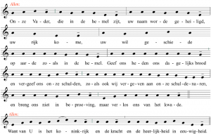
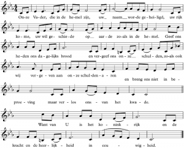

Na de papieren publicatie van een hoogstpersoonlijke [top-10 van gregoriaanse liederen](/blog/top-10-van-gregoriaanse-liederen/), volgt de digitale versie. Met de app "Katholieke Gebeden" heb je de gregoriaanse liederen overal bij de hand, samen met een bloemlezing van traditionele gebeden. De Latijnse teksten zijn voorzien van toonzetting en een Nederlandse vertaling. Ook voor de nieuwe vertaling van het Onze Vader zijn drie populaire toonzettingen opgenomen: van Peter Pieters, van Peter van de Velde en de melodie naar Mozarabische psalmtoon IV.

De app is beschikbaar voor Android:

De katholieke gebeden staan ook online op de website [gebeden.gelovenleren.net](http://gebeden.gelovenleren.net/):

 

Als je het nieuwe Onze Vader wil aanleren, kan je de toonzettingen downloaden als PDF of beluisteren op YouTube. Wie nog andere melodieën voor liturgisch gebruik kent, mag ze me altijd doorsturen!

 Onze Vader - Peter Pieters

 Onze Vader - mozarabische psalmtoon IV

 Onze Vader - Peter van de Velde

https://youtu.be/UmSCdkHh0Kw?t=133

https://youtu.be/05AqaZS7ruk?t=128

https://www.youtube.com/watch?v=oUODJxzmvYg
