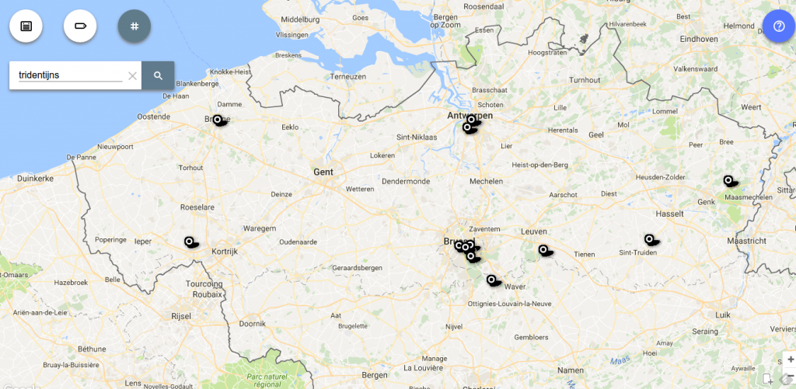

Op [http://naar-de-mis.maptiming.com/](http://naar-de-mis.maptiming.com/) staan de misuren van alle Vlaamse parochies, zoals ik die ooit kopieerde van de antieke 'fichenbak' op het oude Kerknet. De laatste tijd verandert er veel in het parochielandschap en erg accuraat zullen die gegevens dus niet meer zijn. Zonder lokaal draagvlak is het jammer genoeg onbegonnen werk om de gegevens te actualiseren.

Waar ik me wel enkele uurtjes mee heb zoetgehouden, is het invoeren van gegevens voor een tweetal kleinere 'niche-producten' van onze Kerk: biechtgelegenheid en tridentijnse missen.

De gegevens voor biechtgelegenheid pluk ik van de website van het Nederlandse [Sint-Janscentrum](http://sint-janscentrum.nl/index.php?p=biecht). Voor de tridentijse missen vond ik de website [Mysterium Fidei](http://tridentijnsemis.blogspot.be/) als bron.

Zo zien de kaartjes er uit, en als je erop klikt, kom je op de 'live' versie:

\[caption id="attachment\_3343" align="alignnone" width="640"\] Biechtgelegenheid in Vlaanderen\[/caption\]

 

\[caption id="attachment\_3344" align="alignnone" width="640"\] Tridentijnse Missen in Vlaanderen\[/caption\]

Wie correcties of aanvullende gegevens heeft, mag die altijd doorspelen naar [info@gelovenleren.net](mailto:info@gelovenleren.net). Je kan ze ook [zelf invoeren](http://www.maptiming.com/nl/category/help-nl/).

Voor aanbiddingsuren kan je nog steeds terecht op [http://adoremus.maptiming.com/](http://adoremus.maptiming.com/).
