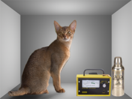

De debatten over de fameuze [voetnoot in Amoris Laetitiae](http://www.arsacal.nl/?p=contentitem&id=1160), met de _dubia_ van de kardinalen als meest sprekende uiting, tonen aan dat er verschillende opinies bestaan over de verhouding tussen moraal en de sacramenten. Een nederige poging om die verschillen te belichten wil ik wagen vanuit een vergelijking met enkele wetenschappelijke disciplines uit de mechanica, meerbepaald de statica, de dynamica en de quantummechanica.

### Mechanica

De _statica_ bestudeert een stelsel van lichamen dat zich in evenwicht bevindt en de onderlinge krachten die daarvoor nodig zijn. Verschillende evenwichtstoestanden kunnen bestaan, die elk eenduidig bepalen welke onveranderlijke onderlinge **positie** de lichamen innemen.

De _dynamica_ bestudeert lichamen in **beweging**. Zij beschrijft de krachten die op de lichamen inwerken en het effect op hun richting, snelheid en versnelling.

De _quantummechanica_ bestudeert de mechanica van de kleinste bouwstenen van de materie, waarop statica en dynamica niet meer van toepassing zijn. Daarbij kent ze het principe van de 'superpositie' die zegt dat het onmogelijk is tegelijk positie en snelheid van een deeltje waar te nemen en die daarom uitdrukt in termen van **waarschijnlijkheid**.

### Moraalleer

Je zou de vergelijking kunnen maken tussen deze methodes, die allemaal deel uitmaken van de mechanica, en soortgelijke benaderingen in de moraalleer. Die bestudeert niet de materie, maar de ziel. Het is daarbij belangrijk in te zien dat noch de statica, noch de dyncamica, noch de quantummechanica allesomvattende theorieën zijn, maar wel elk in hun eigen toepassingsgebied perfect bruikbaar én juist.

De ziel is alles wat materie niet is, maar toch benaderen we haar vaak op analoge wijze. De leer van de Kerk heeft een heel eigen begrippenkader dat merkwaardige parallellen vertoont met de mechanica. De vraag is echter of we nog wel alle invalshoeken in acht nemen.

### Statische moraalleer

Van de ziel zegt de Kerk dat ze zich kan bevinden in twee onderscheiden toestanden: de **staat van genade** en de **staat van doodzonde**. De overgang van de ene toestand in de andere gebeurt ogenblikkelijk, hetzij door het begaan van een doodzonde, hetzij door het ontvangen van het sacrament van de verzoening. De sacramentenleer bepaalt eenduidig welke sacramenten in elke toestand van toepassing zijn en welke effecten ze teweegbrengen. Aan gene zijde van de dood kent de Kerk ook twee, corresponderende toestanden waarin de ziel zich kan bevinden: de **Hemel** (met als opstapje het **vagevuur**) of de **Hel**. Dat noem ik de _statische moraalleer_.

Evenmin als de statica een volledige theorie van de mechanica is, kan je met dit stukje moraalleer volstaan om de verhouding tussen de moraalleer en de sacramenten volledig te beschrijven---wat evenwel niet wil zeggen dat het daarom onjuist zou zijn!

### Dynamische moraalleer

De _dynamische moraalleer_ gaat een stap verder. Die bekijkt ook krachten die op ons inwerken en de bewegingen die daarvan gevolg zijn. Die beweging verloopt niet ogenblikkelijk, maar in de tijd, in een bepaalde richting en met een bepaalde snelheid. Van een ziel zou je zelfs kunnen zeggen dat ze nooit in rust is, maar altijd in beweging. De enige echte toestand van rust die een ziel kent, is precies in de uitersten, over de dood heen. Begrippen die de Kerk hanteert om de beweging van de ziel uit te drukken zijn talrijk. Ik som er enkele op: de verschillende vormen van **genade**, de werking van het **geweten**, de sterkte van de **deugden**, de gave van de **heilige Geest**, het proces van **berouw en boete**, de kracht van het **gebed**, de aantrekking van **bekoringen**, de verdienste van de **beproeving**, de aanstoot van de **ergernis**, de beoefening van de **naastenliefde**,... Al die dynamische aspecten van de moraalleer worden nog het best samengevat in het kernbegrip van het christendom, dat de metafoor met de bewegingsleer bekrachtigt: de **bekering** (letterlijk: de verandering van richting).

Dit rijke begrippenkader toont aan hoe gevoelig de kerkelijke leer is voor de nuances in het reilen en zeilen van de menselijke ziel. Ook in de sacramentenleer komt dat tot uiting. De sacramenten zijn immers een bekrachtiging van een verandering die zich in de ziel reeds heeft voltrokken. Op het ontvangen van een sacrament, zelfs één dat voor velen zo banaal lijkt als de eucharistie, moet je jezelf voorbereiden en eens je het hebt ontvangen, moet je jezelf openstellen voor de werking ervan en het voortdurend bewust in je ziel meedragen. Doe je dat niet, is het sacrament zonder effect. Ook op sacramenten is dus een soort van dynamica van toepassing.

De statische en dynamische moraalleer is gedurende twee millennia theologisch ontwikkeld en verfijnd. Jammer genoeg wordt het bijhorende begrippenkader niet vaak meer gehanteerd. Alsof die niet meer van toepassing zijn door invoering van een verbeterde theorie… De quantummoraalleer?

### De kat van Schrödinger

 De kat van Schrödinger

De mechanica kent tenslotte nog de quantummechanica. Misschien ken je het gedachtenexperiment van Schrödinger, die een beetje de draak steekt met het onzekerheidsprincipe van Heisenberg? Hij sluit een kat op in een doos samen met een recipiënt gif dat geactiveerd wordt door het verval van een elementair deeltje. Na verloop van tijd zijn er verschillende mogelijkheden: ofwel is het radioactief materiaal vervallen, waardoor het mechanisme in werking treedt en de kat komt te sterven, ofwel is er niks gebeurd. Vermits volgens de quantummechanica de toestand van het deeltje onmeetbaar is, zegt hij, is de kat **tegelijk dood en levend** zolang de doos gesloten blijft.

### Quantummoraalleer

Ook dit heeft gelijkenis met een bepaalde strekking in de moraalleer, waarmee ik nu ook even de draak wil steken. Die sluit de ziel op in een doos die enkel God kan openen. Zolang we leven blijft de doos gesloten en is de toestand van onze ziel onkenbaar. De wetten van de statica en dynamica worden niet van toepassing geacht op elementaire deeltjes. Zo worden ook de analoge concepten uit de klassieke moraalleer, de toestand van genade en doodzonde, de bekering en de werking van de sacramenten op de helling gezet. Blijbaar kan een ziel tegelijk in een toestand van genade en in een toestand van doodzonde verkeren en hebben wij geen middelen om daarover uitsluitsel te geven. Dat komt toe aan de---oneindig barmhartige---God, en wij kunnen, overeenkomstig de probabiliteitstheorie van Heisenberg, slechts onze _kansen_ berekenen.

Veel mensen gaat de quantummechanica boven het petje, mijzelf incluis, en hetzelfde geldt voor de analoge quantummoraalleer. Misschien kunnen mystici ermee aan de slag, die immers God ontmoeten in het diepste van hun ziel, maar die inzichten zijn mij nog vreemd. Ik hou het liever bij de beproefde wetten van statische en dynamische moraalleer. Die zijn tegelijk bevattelijk en bieden ruim voldoende nuance om de verhouding tussen het zielenleven en het sacramenteel leven te sturen. Die wetten zijn bovendien in hun toepassingsgebied theologisch perfect toepasbaar en juist. Pas als ik de quantummoraal volledig onder de knie heb, zal ik durven beweren dat de kat tegelijk dood en levend is.
