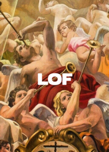

Het zal je ook al overkomen zijn. Je neemt deel aan een liturgische dienst, plotseling wordt er een gregoriaans gezang of een Latijnse hymne aangeheven en er is niet voorzien in een boekje of projectie van de tekst en de melodie. Je kent de melodie wel vaag, dus je kan in het beste geval nog wat mee neuriën, maar je kan met de beste wil van de wereld het lied geen recht doen door mee te zingen en je voelt je in je deelname aan de liturgie een beetje verloren.  

Laatst overkwam het me nog. Hoewel we tegenwoordig een beamer hebben in de kerk, waarop netjes alle lezingen en gezangen verschijnen, kwam onze kosteres-ad-interim op het idee om na de mis nog het _Salve Regina_ te zingen. Ik was de enige die het lied, uit het hoofd, kon meezingen, tot ontzag van mijn buurman :) Hoe komt dat? Eenvoudig: het was me al te vaak voorgevallen met de mond vol tanden te staan, dus had ik ooit eens besloten mezelf deze hymne aan te leren!

Vroeger werd elke mis of vesper afgesloten met een mariale antifoon en klonk het _Tantum Ergo_ tijdens elk lof, dus dat kende je zo van buiten. Nu weerklinken die gezangen slechts in uitzonderlijke omstandigheden. Eigenlijk zou elke praktiserende gelovige de uitdaging moeten opnemen minstens een top-10 van Latijnse hymnes van buiten te leren, om met fierheid deel te kunnen nemen aan het gezang als een lucide liturgist dat op een onverwacht ogenblik in de dienst inlast.

Een garantie op succes is het evenwel niet. Met de introductie van het nieuwe Onze Vader dacht ik: nu hebben ze me niet meer liggen! Nog voor de nieuwe versie goed en wel officieel van kracht ging, kon ik de gepubliceerde toonzetting al netjes uit het hoofd zingen. En dan kom je in een mis terecht waar men voor de eerste keer het nieuwe Onze Vader gaat zingen… op een toonzetting die een of andere lokale componist heeft opgesteld. Hoe verdienstelijk die ook moge zijn, in liturgische context is het een domper van formaat. Dan doe je eens je best, en sta je toch weer met je mond vol tanden. Contraproductieve creativiteit, vind ik dat. Ze zullen het ook nooit leren! Hou het dan liever bij gregoriaans...

 Lof - gregoriaanse liederen

Zoals gewoonlijk proberen we het de lezer wat gemakkelijker te maken, dus kan je onder de rubriek "[Katholieke boekjes om zelf af te drukken](http://gelovenleren.net/katholieke-printerboekjes/)" nu een nieuwe publicatie vinden onder de titel "[Gregoriaanse liederen](/portfolio/gregoriaanse-liederen/)", die volgende ---volledig subjectieve--- top-10 van Latijnse liederen bevat:

- ALMA REDEMPTORIS MATER
- SUB TUUM PRÆSIDIUM
- AVE REGINA CÆLORUM
- REGINA CÆLI
- SALVE REGINA
- PANGE LINGUA
- TANTUM ERGO
- ADORO TE DEVOTE
- VENI CREATOR SPIRITUS
- TE IOSEPH CELEBRENT
- AVE MARIA
- PATER NOSTER

Je vindt er versies van het boekje om te bestellen, online te lezen en af te drukken, in diverse formaten, met en zonder illustraties en Nederlandse vertalingen. De versie met illustraties bevat voor elk lied een QR-code, die verwijst naar een opname van het lied, wat kan helpen bij de zelfstudie.

Geen excuus meer om bij de volgende gelegenheid nog met de mond vol tanden te staan meeneuriën!!

