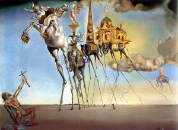

Eigenlijk is het wel interessant om eens na te denken over de 'bekoring' en de 'beproeving' waarover we in het onzevader bidden. In de commentaar op de nieuwe vertaling lijkt het wel alsof bekoring en beproeving tegenovergestelde begrippen zijn, maar naar mijn aanvoelen is er tussen beide woorden een grote overeenkomst. Beide woorden gaan over een omstandigheid die aanleiding geeft tot een keuze voor iets dat slecht is, voor zonde. Het gaat om de 'aanleiding', niet om de oorzaak, want vermits het om een keuze gaat, is de werkelijke oorzaak onze eigen wil, of de zwakte ervan.

 Bekoring in tweestrijd met de deugd

Het verschil, zo voel ik dat aan, ligt in de aard van de omstandigheid. Je wordt bekoord door dingen waaraan je eigenlijk [geen behoefte](/blog/boek-i-hoofdstuk-6-over-de-ongeregelde-begeerten/) hebt, uit hebzucht, uit gulzigheid, uit jaloezie, uit nijd, uit luiheid. Ingaan op een bekoring is in het algemeen een vorm van hoogmoed. Een beproeving daarentegen, gaat gepaard met een zekere nood. Je bent arm, je bent onrechtvaardig behandeld, je bent ongeneeslijk ziek, je hebt een grote tegenslag meegemaakt. Ook dat kan aanleiding zijn tot zonde, als dat je liefdevolle relatie met je naasten verstoort, of erger nog: met God.

Het verschil tussen bekoring en beproeving is echter ook deels subjectief: wat voor de één een bekoring is, kan voor de ander een beproeving zijn. De bekoring overwin je met de kardinale deugden van matigheid, voorzichtigheid, rechtvaardigheid of vasthoudendheid. De beproeving daarentegen, daagt je uit in de goddelijke deugden van geloof, hoop en liefde. Het hangt er dus maar van af hoe sterk je staat in [deugdzaamheid](/blog/gewetensonderzoek-2/), of je bekoord dan wel beproefd wordt.

 De verzoeking van de heilige Antonius.  
Salvador Dali, 1946

Of een bekoring of beproeving op één of andere manier door God wordt opgelegd als een test, laat me koud. De bekoring is een gevolg van de zwakte van je deugdzaamheid. De beproeving kan voortkomen uit ongeluk, natuurgeweld, kwaadwillige medemensen, of ---wie weet--- misschien wel uit God. De opdracht blijft in alle gevallen hetzelfde: jij moet er goed mee omgaan. Wel kan er een verschil zitten op de verdienste. Die is het grootst voor iemand die een zware beproeving doorstaat.

Als we bidden "en leid ons niet in beproeving", gaat het dus niet om het een of het ander, het gaat om beproeving zowel als bekoring, maar onze taal heeft nu eenmaal geen begrip dat beide afdekt (tenzij misschien "verzoeking"?). Ook gaat het er niet om wie de oorzaak is van die verzoeking, want wie zich daarover druk maakt, verwart aanleiding en oorzaak en probeert slechts de schuld voor het werkelijke kwaad, het ingaan op de verzoeking, buiten zichzelf te leggen. "Et ne nos inducas" uit Hiëronymus' vulgaat vraagt niet dat er geen verzoeking zou zijn, want die is zo eigen aan onze natuur dat alleen al de vraag een vorm van hoogmoed zou zijn, maar wel dat God er ons niet in alleen laat.

In deze betekenissen is het althans dat ik in rust het onzevader bid. U mag ondertussen vurige twistgesprekken aangaan en blogs volposten waarom beproeving beter is dan bekoring of vice versa.
