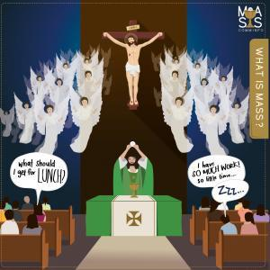

"Sààài !" ...dat krijg je te horen als je kinderen vraagt of ze graag naar de mis gaan. Niet alleen kinderen: de vraag is of hun ouders er anders over denken, want ook die vinden telkens wel 'betere' bezigheden, zo lijkt het, om hun kroost de [kerkgang te besparen](http://catholic-link.org/2016/11/07/children-mass-sundays/).

Hoe is het echter mogelijk de wekelijkse bijeenkomst als "saai" te evalueren, waarmee gelovigen wereldwijd tweeduizend jaar lang ingaan op de vraag die Jezus zijn leerlingen (en ons met hen) stelde op het Laatste Avondmaal? Hoe kan je het grootse wonder dat tijdens de eucharistie voor onze ogen werkelijk wordt, "saai" noemen, dat niets minder inhoudt dan de zelfopoffering van de Zoon van God aan het kruis en de daardoor verkregen genade van eeuwig leven bevrijd van onze zonden?

 Wat is de eucharistie?

### Menselijk

Eigenlijk is het heel begrijpelijk. Het wonder dat geschiedt, is onzichtbaar voor onze ogen, dus we hebben moeite het te "beleven", tenzij vanuit een diep geloof. Je zou kunnen denken dat dit een modern gegeven is, omdat we met al onze techniek en onze multimedia zo gewoon zijn geworden aan intense "belevenissen", aan het spektakel van tv, games, pretparken en wat niet meer, dat een eucharistie geen schijn van kans meer maakt om, tenminste op zintuigelijk vlak, als een "belevenis" te gelden.

Dat zal wel meespelen, maar het probleem is niet 'modern', gelovigen van alle tijden hebben ermee geworsteld. Hoe ik dat weet? Heel eenvoudig: omdat de liturgie, dat is de vorm waarin de eucharistie wordt uitgevoerd, onze 'interface' tussen het hemelse en het wereldse, altijd heel veel aandacht heeft gekregen in de geschiedenis van de Kerk.

Liturgie is conceptueel een onmogelijke opdracht. Ze moet vorm geven aan een ontzagwekkend wonder, maar dat wonder zelf… is onwaarneembaar. Als ze elke zondag een indrukwekkende en verrassende show zou opzetten om van dat wonder een belevenis te maken, dan verdwijnt het onwaarneembare wonder in het niets en blijft er slechts aandacht over voor de show errond. Dat is dus alvast niet de taak van liturgie.

### Nederige elementen

In de loop van twintig eeuwen heeft de Kerk geworsteld met het liturgisch dilemma en minutieus heeft ze een vorm gedistilleerd die ons helpt het eucharistisch wonder te beleven, zonder in de plaats ervan te treden. Dat doet ze door het opwekken van een sfeer van ontzag, mysterie en verbondenheid. Om die sfeer te bewerken, bespeelt de Kerk alle zintuigen: zicht (kaarslicht, duisternis, liturgische gewaden, gouden vaatwerk, altaarstukken,...), gehoor (gregoriaanse liederen, stiltes, secreta-gebed, belgeluid,...), geurzin (wierook), tastzin (besprenkeling met wijwater, knielen, vredeswens, kruisverering,...) en smaak (het Heilig Sacrament zelf).

Wat al deze liturgische middelen, die van een eucharistie een belevenis helpen maken, gemeen hebben, is dat het _nederige_ elementen zijn, die geen van allen in de plaats treden van het sacrament of de spektakelwaarde ervan overtreffen, maar die ons toelaten onze aandacht op het wonder te vestigen.

### Woord

Interessant is de liturgische rol van spraak en taal. In onze parochie is de vaste priester Pools en als hij andere verplichtingen heeft, vervangen hem de priesters van onze resp. anglo-Afrikaanse en Witrussissche gemeenschappen. Alledrie spreken ze Nederlands 'naar gosdvrucht en vermogen', wat wil zeggen dat ze soms wel eens moeilijk te begrijpen zijn. Als men zich erover verbaast dat mij dat niet ergert, zeg ik altijd dat ik de mis woord voor woord kan volgen. Het scenario ligt vast: louter qua tekst is alles voorspelbaar en om de gaten in te vullen heb ik een missaaltje. Aan nieuwe teksten, buiten de homilie, verwacht ik me niet en ik zou er---eerlijk gezegd---ook geen boodschap aan hebben.

Onder de elementen waarmee we liturgie invullen, is het woord het minst nederig. Woorden eigenen zichzelf de betekenis van de belevenis toe en hebben de neiging in de plaats te treden van het sacrament. Woorden die geen betrekking hebben op het misoffer, dragen niet bij tot de sfeer van ontzag, mysterie en verbondenheid, maar zijn snel gesproken. Een priester die zich opstelt als een radioverslaggever die zijn programma moet volpraten met interessant weetjes, is een stoorzender. Een ogenblik van stilte is minstens zo betekenisvol. Zelfs het gebruik van een andere taal (Latijn?) zou niets mogen afdoen aan de beleving van de eucharistie, integendeel! Overdreven belangstelling voor 'wat de priester ons te vertellen heeft' is in de liturgie misplaatst en is een symptoom van clericalisme.

### Gebaar

Een andere vorm van clericalisme treedt op in een liturgie waar de priester achter het altaar de mis 'staat te doen', terwijl het gelovige volk er als een publiek naar zit te kijken. Het is niet door aandachtig te kijken en te luisteren dat de eucharistische werkelijkheid ons plots in de ogen zal schijnen. De enige gestalte waarin we Christus zullen waarnemen, is die van het doodgewone stukje brood en spectaculairder dan dat, wordt het niet.

Wel kunnen we Christus' nederige gestalte waardig beantwoorden met een expressieve houding van eerbied. Wist je dat het de gewoonte is in een kerk om tijdens de eredienst te buigen voor het altaar en om ---ook buiten de eredienst--- te knielen voor het heilig Sacrament, hetzij op het altaar voor aanbidding, hetzij in het tabernakel? En dat het knielen gebeurt op de rechterknie, die voorbehouden is voor God, in tegenstelling tot de linkerknie, waarop je zou knielen voor wereldse heersers, mocht dat nog gebruikelijk zijn?

Ook het verloop van de liturgie kent een aantal geplogendheden als het op lichaamshouding aankomt. Die beschreef ik reeds in mijn [Praktische gids bij gebedshoudingen in de liturgie](http://gelovenleren.net/praktische-gids-bij-gebedshoudingen-in-de-liturgie). Dat lijkt misschien allemaal overbodig, maar het is een hulp om God te (h)erkennen in ons gebed zodat het niet gewoon iets tussen mensen onderling wordt. Een hulp om de persoonlijke relatie met Jezus in de liturgie te tonen.

 Het grootste Wonder

Op die manier ben je geen toeschouwer van de mis, maar een deelnemer. Eén van de belangrijkste argumenten voor de _ad-orientem-_oriëntatie van het altaar is dat de priester daarmee dezelfde gebedshouding aanneemt als de gelovigen. Hij gaat  niet alleen _voor_, maar hij gaat samen met de gelovigen _op_ in het gebed van de Kerk. Dat kan je niet zeggen van de _versus-populum-_oriëntatie, waar de persoon van de priester veel meer aandacht opeist.

### Voor Wie kom je?

Je kan naar de kerk gaan om bevriende medegelovigen te onmoeten, omdat je van de muziek houdt, omdat je de priester graag hoort preken of omdat de liturgisten ervoor zorgen dat er altijd iets speciaals te beleven is. Je kan uit een kerk wegblijven omdat het publiek je niet aanstaat, omdat je de muziek slecht vindt, omdat je niet op dezelfde golflengte als de priester zit of omdat je de liturgie gewoon sààài vindt. Het is natuurlijk mooi meegenomen als je je ergens volledig thuis kan voelen, maar stel je eens de eerlijke vraag voor Wie je naar de mis gaat. Wie verwacht je te ontmoeten? Wat hoop je te beleven?

* * *

