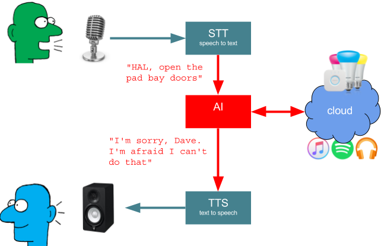
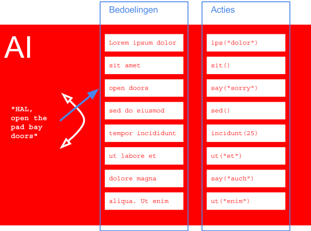
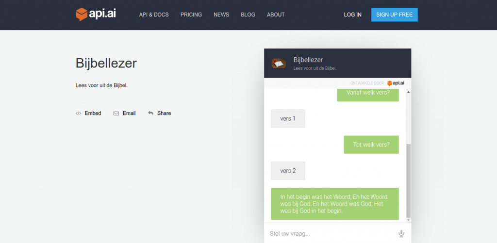
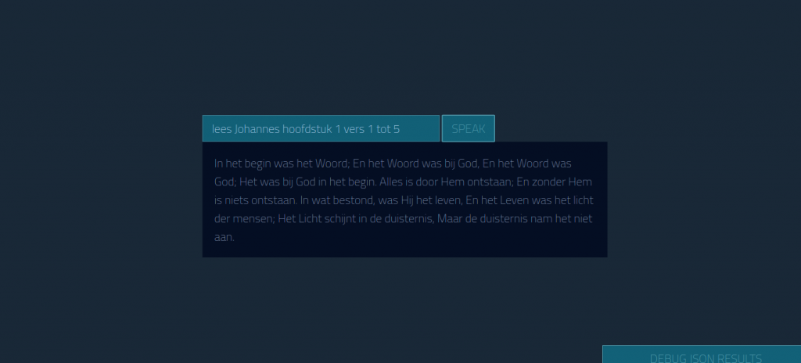

Vanmorgen tijdens de koffie na de mis ging het over de lectorenlijst voor de komende weken. Telkens een heel gedoe om te zorgen dat er elke zondag iemand aanwezig is… Geen nood echter, nu is er ROBOTLECTOR!

Doorworstel even deze technische inleiding, dan wordt het verderop wel duidelijk.

### Virtuele secretaresses

De volgende technologische golf waaraan niemand zal kunnen ontsnappen, evenmin als aan de gsm, is die van de virtuele 'Personal Assistants'. Ze zitten nu al in de nieuwere telefoons. Google heeft zijn [Assistant](https://assistant.google.com/), Microsoft heeft [Cortana](https://support.microsoft.com/nl-be/help/17214/windows-10-what-is), Apple heeft [Siri](http://www.apple.com/ios/siri/). Je kan ermee praten of chatten. Ook Facebook heeft een eigen assistent 'M'. Binnenkort zitten ze zelfs lekker mee in de zetel of aan tafel: Google brengt de [Home](https://madeby.google.com/home/) (roepnaam "OK Google") naar jouw huiskamer, en Amazon de [Echo](https://www.amazon.com/Amazon-Echo-Bluetooth-Speaker-with-WiFi-Alexa/dp/B00X4WHP5E) (roepnaam "Alexa").

"Personal Assistant" is in het Engels wat wij doorgaans een secretaresse noemen. Secretaresses voeren geen taken uit waarvoor ze veel technische know-how nodig hebben. De taken die de virtuele equivalenten uitvoeren zijn evenmin breinbrekers. De kwaliteit van een goeie secretaresse ligt erin dat ze je begrijpt: ze kan je op het juiste moment de juiste informatie verschaffen, zelfs al geef je slechts vage instructies.

De motor van de virtuele PA's is de software die in staat is om jouw instructies, in mensentaal, te begrijpen en om te zetten in commando's, in computertaal, die uitgevoerd kunnen worden door een domoticacontroller, een online bestelsysteem of een muziekapplicatie.

Om er toch even dieper op in te gaan, toont dit schema wat er zich in zo'n PA afspeelt zodra je hem aanspreekt:

 Componenten van de virtuele Personal Assistant

Twee belangrijke interfaces zijn de STT and TTS-componenten. Zij zetten spraak om in geschreven tekst en zorgen ervoor dat de Assistant je kan horen (nog niet 'begrijpen'!) en dat jij de Assistant kan horen. Chat-assitants hebben deze componenten niet nodig. Het 'begrijpen', dat zit verscholen in de 'AI'-component. Die moet je opdracht interpreteren en is het echte brein van de PA.

 Het brein van de PA: "wat bedoel je?"

Zo'n AI-component probeert je commando te herkennen door het te vergelijken met een hele reeks voorgeprogrammeerde commando's. Domme AI's zoeken gewoon op sleutelwoorden in je commando. Slimme AI's kunnen overweg met variaties in taalgebruik, stellen extra vragen om meer gegevens voor de opdracht te krijgen, houden rekening met contextinformatie, enz. Echte AI's bevatten ook werkelijk artificiële intelligentie en worden slimmer door ze meer te gebruiken.

### Virtuele lectores?

Elke belangrijke speler heeft zijn eigen AI-component. Google gebruikt [API.AI](http://api.ai), Amazon heeft [LEX](https://aws.amazon.com/lex/), Microsoft heeft [LUIS](https://www.luis.ai/) en Facebook heeft [WIT.AI](http://wit.ai). Interessant gegeven: dit zijn allemaal redelijk open componenten. Je kan er dus zelf mee aan de slag. Elke vendor heeft er immers belang bij als derden intelligentie aan hun 'brein' toevoegen.

Wat voor soort opdrachten kan zo'n AI-brein interpreteren, behalve sushi bestellen? In theorie alles, maar het moet hem worden aangeleerd. Populaire opdrachten of opdrachten met een commerciële invalshoek komen dus eerst beschikbaar: muziek luisteren, films opnemen, je domotica besturen, je agenda beheren, weerbericht of ander nieuws opzoeken.

Ik dacht dus zo: waarom zouden we zo'n PA niet kunnen gebruiken in het kader van "geloven leren"? Mijn eerste use case is de Bijbel. We maken van de PA een ROBOTLECTOR!

Wat blijkt: dat is niet eens zo moeilijk! Op enkele avondjes tijd heb ik een eerste prototype van de AI-component gereed. Ik heb in API.AI een "agent" gemaakt, die voor jou kan voorlezen uit de Bijbel. Hij begrijpt commando's als _"lees Johannes 1 vers 1 tot 10"_ of _"ik wil vers 5 tot 7 horen van het tweede hoofdstuk van het marcusevangelie"_. Je kan ook vragen _"lees het evangelie volgens Lucas"_ en dan vraagt de AI welk hoofdstuk je wel en welke verzen:

[https://bot.api.ai/79e5847b-57bd-4624-a3ab-e63f36bb37fa](https://bot.api.ai/79e5847b-57bd-4624-a3ab-e63f36bb37fa)

 Virtuele lector

Een andere proof-of-concept-interface vind je op dit adres:

[https://vicmortelmans.github.io/Api-AI-Personal-Assistant-Demo/](https://vicmortelmans.github.io/Api-AI-Personal-Assistant-Demo/)

 Virtuele lector

Ook hier kan je de commando's typen of inspreken en hier worden de verzen je echt voorgelezen. Hij zal je echter niet om ontbrekende informatie vragen. De STT en TTS-technologie van de browser wordt hier gebruikt. Die werkt enkel onder Chrome (en Safari?) en is niet zo geavanceerd als die van de echte Assistants.

### Virtuele missies!

Als je ziet dat dit resultaat op zo'n korte tijd gerealiseerd kan worden, zou het een efficiënte missionering zijn om te zorgen dat voor de belangrijkste PA-platformen zo snel mogelijk ROBOTLECTORes beschikbaar zijn. Ik droom nog even verder over vragen die je hem zou kunnen stellen:

"Wat is het evangelie van vandaag?"

"Lees de eerste lezing voor de mis van komende zondag."

"Welke heilige gedenken we vandaag?"

"Overhoor mijn les uit de Mechelse Catechismus."

"Bid met mij de dagsluiting van het getijdengebed."
