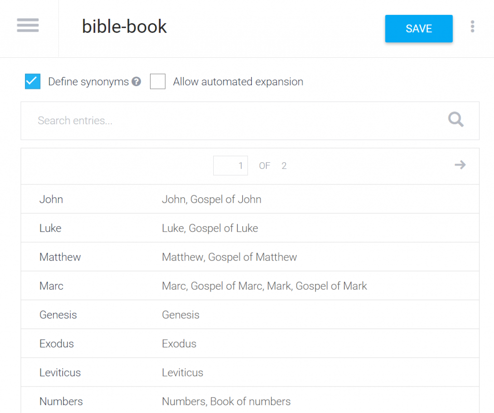
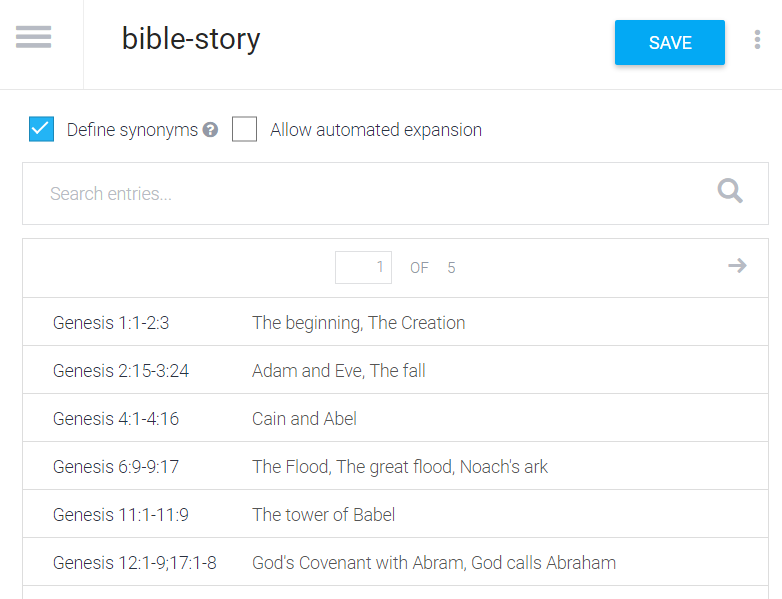
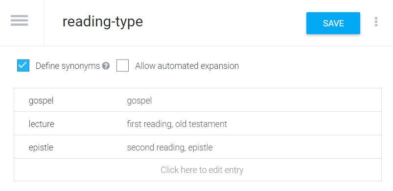
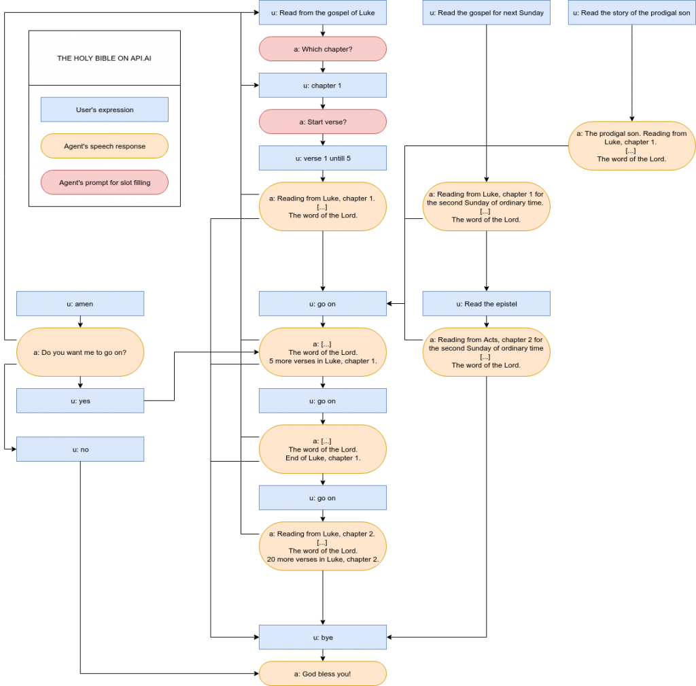
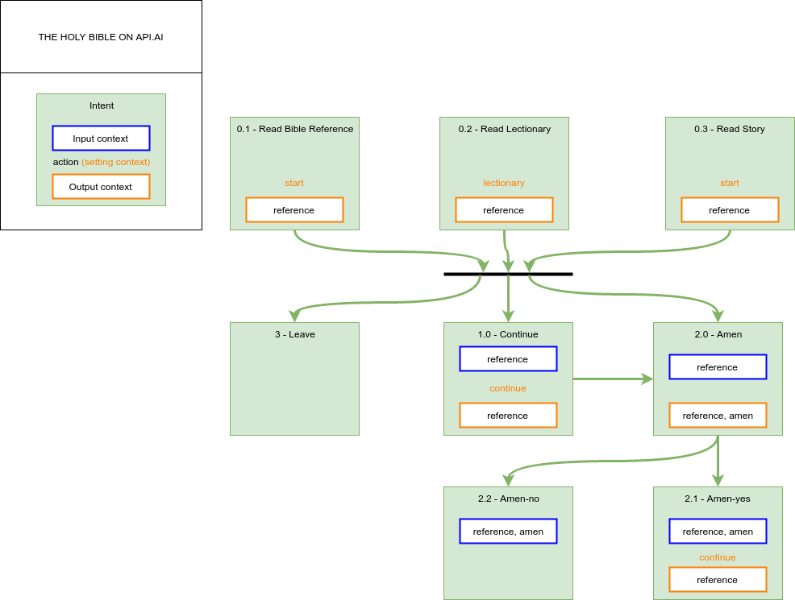

It's been quiet on my blog the latest couple of weeks. As my [latest post](/blog/robotlector-wat-is-het-evangelie-van-komende-zondag/) (in Dutch) already indicates, I'm temporarily obsessed by developing a personal assistant that will read the Bible.

My blog is in Dutch, but this post is in English, because my personal assistant will support English first. This is not because of the larger target audience, but because personal assistants like [Google Home](https://madeby.google.com/home/) are not yet available in Dutch and the platforms on which their internal logic is developed, have far better support for English than for Dutch. But still I hope to be able to make available a Dutch version, be it a prototype with less functionality.

I'll not go in too much technical details here (or at least I'll try not to), but I'd like to point out what it involves to create a personal assistant.  

### A personal assistant reading the Holy Bible

Why a Bible reading personal assistant? Because it's fun! I like technology projects and I like religion. In the past I already developed some [software for fetching bible fragments](https://github.com/vicmortelmans/yql-tables/tree/master/bible) from online sources and I also developed an algorithm that composes the [liturgical calendar](http://gelovenleren.net/liturgical-calendars/). By leveraging these efforts, I can get quick progress on my personal assistant.

[API.AI](https://api.ai/) is the platform where the 'brain' of the personal assistant is assembled. There are a few concepts to understand, but overall you can get a hang of it quite fast. Let's learn about entities, intents, contexts and webhooks.

### Entities

**Entities** are 'things' you want the personal assistant to understand. In my case I need the assistant to understand which book of the Bible must be read, so I have defined an entity "bible-book" and supplied it with the names of all books in the Bible. A book can be known under different names. The user can ask for _"the gospel of John"_, or just for _"John"_. By defining the entities, the assistant will be able to identify the book and the synoyms help to distinguish between _"John"_ (i.e. the gospel) and _"the first letter of John"_.

\[caption id="attachment\_3462" align="alignnone" width="640"\] Entity "bible-book"\[/caption\]

More experimental is the entity "bible-story", which lists titles for Bible stories. This entity is much less well-defined. There are hundreds of 'stories' in the Bible and they can have many different names. I found some lists of Bible stories on the web, but there's no canonical reference for this. Chances are that the user will use a name for a story that is not understood, like _"the woman at the well"_ i.o. _"the Samaritan woman"_. The only way to solve this is to keep track of the input once the assistant is released and to gradually improve the definitions in the entity. It would take an artificial intelligence that understands the stories of the Bible to get around this.

\[caption id="attachment\_3463" align="alignnone" width="782"\] Entity "bible-story"\[/caption\]

The entity "reading-type" on the other hand is very simple. It defines the three different lectures during Holy Mass, each with its synonyms.

\[caption id="attachment\_3464" align="alignnone" width="803"\] Entity "reading-type"\[/caption\]

### Intents

The next big thing in developing the assistant's brain are **Intents**. Roughly stated, an intent is a _type of command or question_ that you would give the assistant.

Each interaction with the assistant consists of the same steps:

1. you say something
2. the assistant tries to understand what you mean: it tries to link your question to one of the predefined _intents_
3. the assistant extracts from the question the data that is required for executing the task that is linked to the intent
4. the assistant executes the task, which returns with the answer to the question
5. the assistant says the answer so you can hear it

My first intent is "Read Bible Reference". It will answer when I ask _"read Luke, chapter 11 verse 9 until 10"_ and dozens of variants of this question. This intent is configured to obtain four pieces of data: a Bible book, a chapter number, a start verse number and an end verse number. When you provide it enough example phrases, it's quite capable to learn how to extract this data from the question, in whatever way you phrase it. Moreover, when you only give partial data, e.g. _"read Luke chapter 11",_ it will automatically ask for start verse and end verse.

### Webhooks

In the intent, a **Webhook** is defined. This is a reference to an external web service, outside of the assistant, that can execute a task. In this case, it's an URL where the text for Bible verses can be looked up based on book, chapter and verse numbers. I used a combination of some earlier development that I did to fetch Bible verses for [missale.net](http://www.missale.net/).

My second intent answers questions like _"read the gospel for next Sunday"_. I don't have to bother calculating the date: when I say _"next Sunday"_, API.AI converts this to an actual date. This intent calls a webhook that retrieves the Bible passage from the Lectionary. Luckily I already implemented the liturgical calendar and Lectionary lookup for [missale.net](http://www.missale.net/) long ago.

### Contexts

So far, an intent was only used an isolated way: you ask something, the intent provides the answer and you can ask the next question. There's no context. There are situations where you want to involve the assistant in a dialog, so there must be a way for the assistant to 'remember' what was said before. The assistant will be asking a question to you and activate a **Context** to 'remember' which question you'll be answering to.

Here's a simple example: the assistant may be programmed to ask a yes or no type question like _"do you want to continue"_ and activate an output context called "continue". It has two other intents that take the "continue" context as input context, one answering to you saying _"yes"_ (or _"OK"_, or _"yep"_,...) and another one answering to you saying _"no"_ (or _"nope"_, _"nay"_,...). This way the dialog can continue in two alternative flows.

### Design graphs

To design the intents, I first made a drawing of some typical dialog flows:

\[caption id="attachment\_3465" align="alignnone" width="640"\] Dialog flows\[/caption\]

Then in a new drawing, the intents are layed out with their actions (webhooks), input contexts and output contexts:

\[caption id="attachment\_3466" align="alignnone" width="986"\] Intents\[/caption\]

It looks quite complex, but when you're building it up, it grows organically.

### Personality

An important aspect of designing a personal assistant is to give it some personality. It's not just about parsing commands and returning text. Compare it to building a website. You'll have to spend much time on the layout and on the navigation to make it successful, although the essence of what you want to offer your users can be just plain text. The same goes for personal assistants. In my case, to make the assistant sound human, he's not just reading bible extracts. Before he starts reading, a reference is made to the bible reference (_"A reading from the gospel of Luke, chapter 11"_). When finished, proper reverence is payed (_"The Word of the Lord"_) and if the complete passage wasn't finished yet, the user is informed about the number of remaining verses, so he can ask the assistant to go on reading. That's important, because due to timing restrictions, the assistant will read at most seven verses at a time.

One also has to be prepared to catch 'human' reactions. When hearing a gospel reading in church, we typically respond saying _"Amen"_ or _"Glory to God"_. We do it almost instinctively. It would be awkward for the assistant to respond _"Sorry, I don't understand this"_, so I had to implement a special intent to catch this type of utterances. This type of interfacing is hardly on your mind when designing a website…

### Prototype

You can try out my bible reading personal assistant on the chat-based API.AI front-end:

[https://bot.api.ai/ce6f4de1-e8a3-4c99-91e6-fe005d33b0ff](https://bot.api.ai/ce6f4de1-e8a3-4c99-91e6-fe005d33b0ff)

Or you can try out this basic web front-end, which will read out loud for you. It's based on new browser speech technology, so it may not be working on browsers other than Chrome or perhaps Safari:

[https://vicmortelmans.github.io/Api-AI-Personal-Assistant-Demo/](https://vicmortelmans.github.io/Api-AI-Personal-Assistant-Demo/)

You can ask questions like _"Read from the gospel of John", "Read the gospel of next Sunday", "Read the story of the resurrection"_. Once it's finished reading, you can tell it to go on saying _"go on", "continue"_ or _"amen"_ or you can say it _"goodbye"_.

Have fun, and the Lord may be with you!
