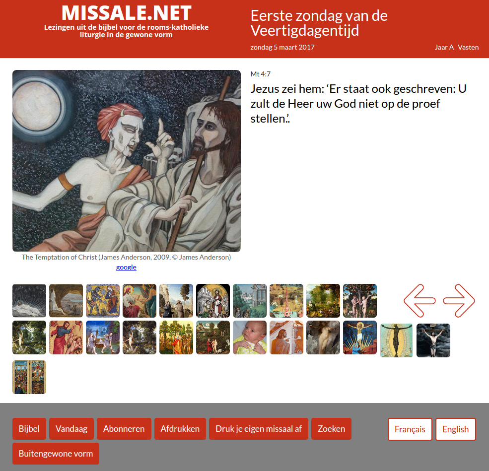
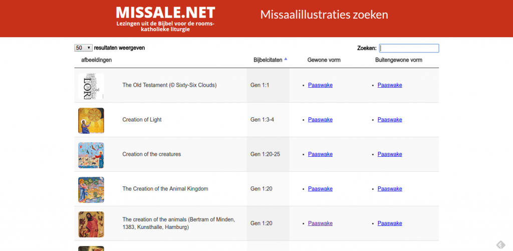

Een beeld zegt meer dan duizend woorden. Als je de Bijbel wil lezen, kan het helpen je lectuur te begeleiden met een goed boek over bijbelstudie, maar wist je dat een afbeelding je ook op weg kan zetten naar een verdieping van je lectuur? Zeven jaar geleden begon ik regelmatig zo'n afbeeldingen op te zoeken, om het bijbellezen met de kinderen te begeleiden, en tegelijk ben ik beginnen bricoleren aan een website om die prentjes ook te publiceren.

De [eerste website](/blog/nieuw-prentenmissaal/), gelanceerd eind 2011, heette Prentenmissaal.com en was enkel Nederlandstalig. Om technische redenen werd als snel een _redesign from scratch_ noodzakelijk en kwam de nieuwe website online. Deze keer onder de titel [Missale](http://www.missale.net/nl), want de site werd meertalig.

Die [tweede lancering](/blog/missale/) dateert van 7 februari 2014, dus Missale vierde onlangs zijn derde verjaardag en heeft daarmee een volledige liturgische cyclus van drie jaar doorlopen.

\[caption id="attachment\_3505" align="aligncenter" width="600"\] Eerste zondag van de Veertigdagentijd\[/caption\]

De databank bevat intussen 1000 afbeeldingen. Klassieke schilderkunst is het talrijkst vertegenwoordigd, omdat die het beeldendst is, maar ook heel wat moderne kunstwerken, tot abstracte toe, vonden een plaatsje. Daarnaast zijn er vrome prentjes en ook hier en daar een persoonlijke foto.

In die drie jaar is er nog behoorlijk wat nieuwe functionaliteit toegevoegd. De buitengewone vorm van de liturgie, met haar eigen kalender, staat broederlijk naast de gewone vorm. De [liturgische kalenders](http://gelovenleren.net/liturgische-kalenders/) kan je toevoegen aan je electronische agenda. De inhoud van de website is volledig beschikbaar in [als een reeks prentenmissaaltjes](http://www.missale.net/print/nl), om thuis af te drukken of via print-on-demand. De databank kan ook worden [doorzocht](http://www.missale.net/inventory/nl), handig voor wie een afbeelding zoekt als illustratie bij een bijbelvers. De prentjes voor de volgende zondag verschijnen op [Alledaags Geloven](http://alledaags.gelovenleren.net).

\[caption id="attachment\_3504" align="aligncenter" width="640"\] Alle afbeeldingen van missale.net, te doorzoeken op titel, bijbelpassage of liturgische dag\[/caption\]

Wie zelf een mooie afbeelding heeft die verband houdt met een zondagslezing uit het lectionarium, kan die suggereren via een [formulier](https://docs.google.com/forms/d/e/1FAIpQLSdW80T1u_vzvaUo_IW1OsU2DvtQbqNRL6kuidzBdqtYQ6Am5A/viewform).

Wat heb ik zoal geleerd in die drie jaar:

- stijlvolle afbeeldingen van bijbeltaferelen moet je _niet_ zoeken op websites die gespecialiseerd zijn in bijbelprentjes, want die komen niet veel verder dan _clip art_ en prentjes uit kinderboeken of foto's uit Jezusfilms. Gelukkig worden steeds meer _echte_ kunstwerken digitaal beschikbaar gesteld via websites van musea en digitaliseringsprojecten.
- hedendaagse kunstenaars zijn nog steeds (of opnieuw?) erg in de weer met de bijbel, zelfs figuratief, en velen hebben een eigen website met foto's van hun werken. Als het op auteursrechten aankomt is mijn handelswijze nogal middeleeuws van inslag: hoe meer je werk gereproduceerd wordt, hoe meer dat jou tot eer strekt. Ik vermeld natuurlijk de auteur van het werk en tot nu toe heb ik nog geen klachten gekregen.
- afbeeldingen opzoeken is erg interessant. Meestal vertrek ik van een prentje dat ik toevallig ergens op internet aantref. Dat voeg ik toe aan mijn bord [Missale](https://www.pinterest.com/vicmortelmans/missale/) op Pinterest, dat is zo'n beetje mijn to-do-lijstje. Als ik tijd heb, verwerk ik die afbeeldingen een voor een en ga ik in een [online lectionarium](https://drive.google.com/file/d/0B-659FdpCliwVm5MRW1QWjROM28/view?usp=sharing) (in het Engels, een Nederlandstalig vond ik nog niet) op basis van trefwoorden op zoek naar een bijpassend lezing. In het begin is het wat zoeken, maar ik laat de serendipiteit aan het werk: zelfs als ik geen lezing vind die exact het thema van de afbeelding verhaalt, kom ik toch vaak uit bij een relevante bijbeltekst. Vervolgens zoek ik de auteur, datum van creatie en huidige locatie van het werk in kwestie op en voeg ik als die gegevens toe aan mijn databank. Alles bijeen ben ik toch al snel zo'n vijf minuten bezig met één afbeelding.
- veel mooie afbeeldingen met bijbelse taferelen hebben geen plaats gevonden, omdat ze onderwerpen verbeelden die niet in het lectionarium voorkomen. Dat [dekt](http://catholic-resources.org/Lectionary/Statistics.htm) immers slechts 3.7% van het Oude Testament af en 40.8% van het Nieuwe Testament. Zelfs als ik er ooit toe kom de site uit te breiden met de lezingen voor de weekdagen, komt dat uit op 13.5% resp. 71.5%.
- evenmin als klachten, krijg je feedback op zo'n website, ondanks dat ze intussen maandelijks toch door meer dan 1000 bezoekers bekeken wordt… maar als ik erover nadenk, is dat wel normaal, want zelf ga ik ook nooit mailtjes sturen om feedback te geven over websites die ik bezoek. Toch zou het leuk zijn als je te horen zou krijgen of je site echt gebruikt wordt.

Voor de techneuten:

De [eerste website](/blog/nieuw-prentenmissaal/) ontwikkelde ik in XQuery en de eXist-server draaide op een virtuele machine bij Amazon. Daar kwam heel wat bij kijken. Om manueel werk bij het onderhoud van de database te minimaliseren, ontwikkelde ik een algoritme om bijbelreferenties te [parseren](https://github.com/yql/yql-tables/blob/master/bible/bibleref.xml) (YQL open table), een algoritme om liturgische kalenders te genereren voor een willekeurig jaar (XSLT) en een generieke [interface](https://github.com/yql/yql-tables/blob/master/bible/bible.bible.xml) om bijbelverzen in verschillende talen te downloaden van online bijbels (YQL open table). Een perl-scriptje laat me toe om PDF-files om te zetten naar [katernen](https://github.com/vicmortelmans/Signaturize) om zelf een boekje af te drukken. Jammer genoeg bleek de serverkost bij Amazon toch nogal duur (enkel het eerste jaar was gratis), dus moest ik herbeginnen _from scratch_.

Een zoektocht naar goedkope hosting bracht me bij Google App Engine. Daar krijg je basisquota gratis en je betaalt enkel wat je website meer verbruikt naargelang ze meer bezocht wordt, op voorwaarde dat je programmeert in een van de ondersteunde talen: Python, Java of Go. Ik leerde wat python en na enige tijd kwam de nieuwe website online: [Missale](http://www.missale.net/nl)
