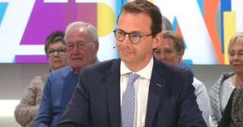

Vandaag viert de kerk het feest van de heilige evangelist Marcus. In de tridentijnse mis gebeurt dat met de lezing van het verhaal van de zending van de 72. Jezus zond hen uit met een waarschuwing: _"De oogst is wel groot, maar arbeiders zijn er weinig. Vraag daarom de eigenaar van de oogst om arbeiders in te zetten voor zijn oogst. Ga nu, maar weet wel, Ik stuur jullie als lammeren onder de wolven."_

In de nieuwe mis is er voor een andere lezing gekozen met hetzelfde thema: de zending van de apostelen net voor Jezus' hemelvaart. Ook aan hen is boodschap duidelijk: _"Trek heel de wereld door om aan elk schepsel de goede boodschap te verkondigen. Wie tot geloof komt en gedoopt wordt, zal gered worden, maar wie niet tot geloof komt, zal veroordeeld worden."_

 Wouter Beke

Ook vandaag las ik twee artikeltjes. Eerst eentje over een [uitspraak van Wouter Beke](http://sceptr.net/2017/04/wouter-beke-gelooft-wel-europese-islam/), een partijvoorzitter, die in een debat zit verwikkeld over de plaats van de Islam in ons land. Zijn stelling luidt: _"De mensen die in ons land de islam willen belijden, kunnen dat, maar enkel als het op een Europese leest geschroeid is, **de Europese islam**, dat is voor mij klaar en duidelijk”._

**Wat zou dat kunnen zijn, die Europese islam?** Het beestje heeft blijkbaar een naam, dus je zou haast gaan denken dat het ook bestaat? Is het een tak van de islam net als het soennisme of het sjiisme? Of is het een nieuwe obediëntie die nog moet worden uitgevonden? Het lijkt me waarschijnlijk dat Beke het zelf ook niet weet en zich met dit soort uitspraken aan _wishful thinking_ doet. Lees verder wat hij nog orakelt: _"Ik ben trots op onze westerse waarden, gebaseerd op een traditie die meer dan 2.000 jaar oud is."_ De enige traditie in het westen die 2.000 jaar oud is en die ik ken, is die van het katholieke geloof. Is dat een sluikse manier om te zeggen dat de "Europese islam" zich op het katholicisme moet baseren? Heel verwarrend allemaal...

Ik ben geneigd de man niet ernstig te nemen, maar dat is onverstandig van me. Wat hij zegt over de islam geldt---in onze seculiere samenleving---vanzelfsprekend ook voor mijn eigen geloof. De uitspraak van Beke betekent even goed het volgende:

_"De mensen die in ons land het katholieke geloof willen belijden, kunnen dat, maar enkel als het op een Europese leest geschroeid is, **de Europese Kerk**, dat is voor mij klaar en duidelijk”_

En wat blijkt: de islam moet slechts een voorbeeld nemen aan haar katholieke tegenhanger. Die "Europese Kerk" immers, wordt hoe langer hoe meer werkelijkheid, veel werkelijker dan de "Europese islam". Ter illustratie geldt het tweede artikel dat ik tegenkwam, over het bestuur van de Belgische ziekenhuizen van de broeders van liefde, die [euthanasie---op niet-terminale patiënten!---gaan toelaten in hun ziekenhuizen](http://sceptr.net/2017/04/belgische-broeders-liefde-zetten-licht-op-groen-euthanasie/) en dit tegen de wil van de superieuren van de congregatie en tegen de [leer van de Kerk](https://www.rkdocumenten.nl/rkdocs/index.php?mi=600&doc=663&id=252). (Gelukkig roept deze beslissing in [lokale katholieke bladen nog vragen op](http://www.tertio.be/tragische-illusie), wat niet altijd vanzelfsprekend is.)

Hier zie je de emanatie van "de Europese Kerk", die in de vorm deel uitmaakt van de Katholieke ("universele") Kerk van Christus, maar die in de geest afgestemd staat op de westerse waarden van een geseculariseerde samenleving cq. politiek. Zo'n vorm moet dus ook de islam aannemen. Ik wens het hen niet toe.

Ik krijg van de uitspraken van Beke de kriebels. Die "Europese Kerk", dat vind ik maar een linke soep, want wat staat me te wachten als ik mijn geloof wil belijden volgens de leer van de universele Katholieke Kerk, maar die hier en daar stevig botst met "onze westerse waarden"? Zal dat binnenkort nog toegelaten zijn? Of Beke zichzelf lid acht van de "Europese Kerk" dan wel van de Katholieke Kerk, laat ik in het midden, maar zijn uitspraken zullen de druk tot verdere secularisatie enkel verhogen. 

Het is een goeie zaak dat men kritisch is over de plaats van de islam in onze samenleving, maar als gelovige partijvoorzitter in een geseculariseerde staat zou je de eerste moeten zijn om het geloof van de islamitische inwoners te respecteren, ook al loop je dan het risico dat men je partij voor de grap een 'moslimpartij' noemt. Focus op orde en veiligheid en scherm niet met woorden die suggereren dat je een heel nieuw geloof voor de islamitische burgers van je land in petto hebt. Daar heeft de politiek zich niet mee in te laten.

Jezus stuurde zijn leerlingen "als lammeren onder de wolven" om "heel de wereld" tot geloof te brengen...
