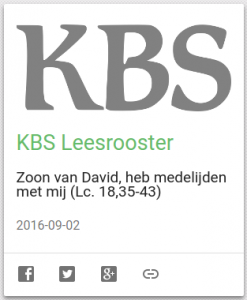

De katholieke referentiebijbelwebsite [RKBijbel.nl](https://rkbijbel.nl/kbs/home) groeit. Nog geen jaar geleden [fulmineerde](/blog/een-nieuwe-bijbelwebsite-en-ik-wist-van-niks/) ik over het amateurisme van de toen nog jonge site. Nu blijkt dat de site zich verder ontwikkelt. Gebruikers kunnen zich aanmelden en zo toegang krijgen tot de nieuwere willibrordvertaling van 1995 en de zoekfunctie gebruiken. Wat me het meest verheugt, is dat de website nu ook bruikbaar is op mobiele toestellen en dat verdient een plaatsje in mijn collectie [mobiele katholieke websites](/page/mobiele-websites/).

Ondertussen kijk ik vol verwachting uit naar de volgende update, en blijft een handige link naar het dagelijkse leesrooster beschikbaar op [Alledaags Geloven](http://alledaags.gelovenleren.net/).

 KBS Leesrooster op Alledaags Geloven
