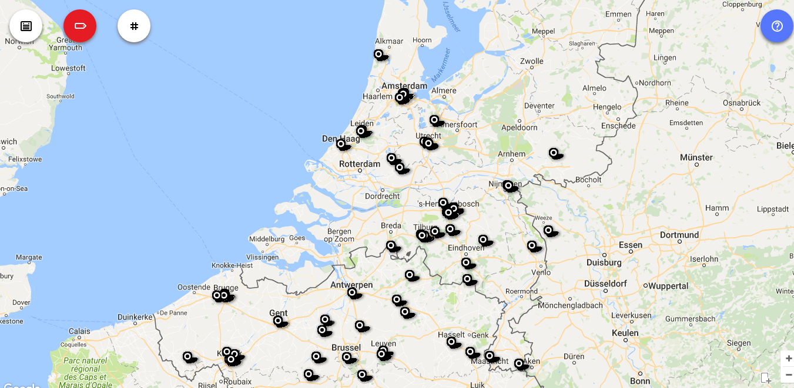

Al de plaatsen in Vlaanderen en Nederland waar gelovigen naar de biecht kunnen gaan zijn opgelijst op de [website van het Sint-Janscentrum in Den Bosch](http://sint-janscentrum.nl/index.php?p=biecht). Dezelfde gegevens zijn nu ook netjes overzichtelijk [op de kaart gezet](http://naar-de-mis.maptiming.com/51.847629,4.864626,8z,627px/all/biecht):

 Waar kan ik gaan biechten in Vlaanderen en Nederland?
