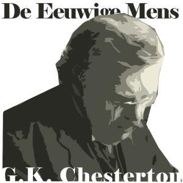

De detectiveverhalen van G.K. Chesterton waren aardig om te lezen, als is het maar omdat de hoofdrolspeler een priester is, maar het werd tijd voor het betere werk. Nu beluister ik op mijn mobiel [_The Everlasting Man_](https://archive.org/details/EverlastingMan). Het is een apologetisch boek dat stellingen weerlegt zoals _"de mens is louter een product van dierlijke evolutie"_, _"Jezus was een gewone mens"_ of _"het christelijk geloof is een religie zoals alle andere"_. De argumentatie is heel bevattelijk en vaak ook erg gevat verwoord. Een plezier voor het luisterend oor! Ik ben nog maar in twee derde van het boek, maar ik ben zo enthousiast dat ik er toch al een artikeltje aan wijd.

Vooral in het eerste deel van het boek wordt de toon gezet die ook in de titel naar voren komt. Het atheïsme wil met behulp van de wetenschap aantonen dat mens, cultuur en religie slechts producten zijn van een---langzaam---mechanisme van evolutie. Chesterton gebruikt de techniek van het bewijs uit het ongerijmde om aan te tonen dat die "wetenschappelijke" veronderstelling eigenlijk heel onlogisch is. De mens is in de natuur op alle vlakken singulier en ook het christendom is in de menselijke beschaving een singuliere religie. Die singulariteit is zo treffend dat het absurd is te veronderstellen dat ze louter door natuurlijke processen te verklaren is.

 De Eeuwige Mens

De honderd jaar en twee wereldoordlogen die ons scheiden van de verschijning van Chestertons _Eeuwige Mens_, bekrachtigen zijn stelling. Als goeie conservatief beklaagt hij zich regelmatig over de kwalen van de moderne tijd en wat blijkt, die kwalen zijn precies dezelfde als waarover een goeie conservatief zich vandaag moet beklagen. Zonet nog hoorde ik hoe hij zich eraan ergert dat in de moderne cultuur de kindsheid als referentiepunt geldt. Volwassenen hebben de neiging zich te gedragen als kinderen. Nu dacht ik dat juist dit een heel recent fenomeen was, maar niets blijkt minder waar! Extrapoleren is gevaarlijk, maar zouden die kwalen van de moderne tijd juist niet tijdloos zijn? _Everlasting_, zoals dat heet?

Ook interessant is zijn verdediging van het Evangelie van Jezus Christus als een singuliere gebeurtenis in de menselijke geschiedenis. Hij wijst herhaaldelijk op de ongerijmdheden in de persoon van Christus en in zijn leer. Ongerijmdheden die wij zelf vaak niet waarnemen, omdat we met het geloof zijn opgegroeid, maar die iemand die het Evangelie als _nieuw_ leest---nota bene: dit is de 'historisch-kritische' lezer!---, wel degelijk in het oog moeten springen. Juist die ongerijmdheden tonen de authenticiteit van Jezus als Zoon van God aan. We doen vaak zoveel moeite om de verhalen uit de Bijbel te kneden om ze verteerbaar te maken, dat we ons er niet meer over kunnen verwonderen. Ik verwijs als illustratie graag naar een recent artikel op mijn blog over het [scheppingsverhaal](/blog/ik-moet-hier-iets-uit-mijn-botten-slaan-of-het-is-om-zeep/).

En daarmee komen we op het punt van de evolutieleer. Voor moderne christenen is het haast een geloofspunt de wetenschappelijke evolutieleer te vededigen---en derhalve de Schepping te verwerpen of af te doen als een mythe---om niet als creationist door het leven te moeten gaan. Chestertons _Eeuwige Mens_ is een boekje dat die angst kan wegnemen. Creationist zijn hoeft niet te betekenen dat je de Schepping in etmalen uitdrukt of dat je de leeftijd van het heelal uit de Bijbel gaat afleiden. Geloven in de Schepping, als dat creationisme is, betekent dat de mens, zijn cultuur en zijn enige ware religie er _niet toevallig_ zijn, omdat elke andere veronderstelling, als je er logisch over nadenkt, absurd is.

Op de blog van Anton de Wit vond ik een twintigtal 'snippers' van Chestertons werk, vertaald in het Nederlands. Dat deed-ie omdat het boek al sinds 1948 niet meer in het Nederlands werd uitgegeven. Echt zonde! Net zo'n toegankelijk boek dat door jong en oud gesmaakt kan worden. Hoeveel jongeren lopen er vandaag niet rond die wel een kritische geest hebben en die heel ontvankelijk zijn voor het geloof, veel ontvankelijker dan de generatie van hun ouders, maar die deze tijdloze en immer actuele lectuur moeten ontberen!? Daar zou toch zelfs een uitgever brood in moeten zien, zou ik denken.
