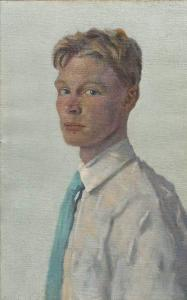

Een rijke man en zijn zoon hadden een grote verzameling bijeengebracht van zeldzame kunstwerken. Ze hadden alles, van Picasso to Rubens. Wanneer ze samen waren, zaten ze vaak de kunstwerken te bewonderen. Er brak echter oorlog uit, en de zoon werd gemobilizeerd.

Hij was erg moedig en sneuvelde in de strijd terwijl hij een andere soldaat probeerde te redden. Zijn vader werd op de hoogte gebracht en had veel verdriet over het verlies van zijn enige zoon.

Ongeveer een maand later, net voor Kerstmis, kwam er iemand aan de deur, een jongeman met een groot pak in zijn handen.

Hij zei: "Meneer, u kent me niet, maar ik ben de soldaat voor wie uw zoon zijn leven heeft opgeofferd. Hij heeft die dag vele levens gered. Ik was gewond en hij had me op zijn rug gelegd om me in veiligheid te brengen, wanneer een kogel hem in het hart trof."

"Hij sprak vaak over u en over uw liefde voor kunst." De jongeman reikte nu zijn pak aan. "Ik weet dat het niet veel waard is en ik ben geen goed kunstenaar, maar ik denk dat uw zoon gewild zou hebben dat u dit kreeg."

 Portrait of a Young Man 1910, Denman Waldo Ross, Museum of Fine Arts, Boston

De vader opende het pak. Het was een portret van zijn zoon, geschilderd door de jongeman. Hij staarde in bewondering naar het schilderij, waarin de soldaat de persoonlijkheid van zijn zoon treffend tot uitdrukking had gebracht.

De vader kreeg de tranen in zijn ogen. Hij bedankte de jongeman en bood hem aan voor het schilderij te betalen. "O nee, meneer. Ik zou nooit kunnen vergoeden wat uw zoon voor mij heeft gedaan! Het schilderij is een geschenk."

De vader gaf het schilderij een ereplaats in zijn huis. Als er bezoekers kwamen, toonde hij hen altijd eerst het schilderij van zijn zoon, voor hij hen de andere werken uit zijn verzameling liet zien.

Enkele maanden nadien stierf de man, zonder erfgenamen. Zijn schilderijen zouden openbaar verkocht worden. Veel hooggeplaatste lieden kwamen naar de veiling, om de beroemde meesterwerken te zien en hopend op de kans een werk voor hun eigen verzameling te kunnen bemachtigen.

De verkoop begon met het portret van de zoon. De veilingmeester sloeg met zijn hamer. "We starten met de biedingen voor dit werk. Wie biedt er voor dit portret van de zoon?" ...stilte.

Op de eerste rij riep iemand: "Wij zijn gekomen voor de meesterwerken. Sla dit maar over!"

Maar de veilingmeester ging verder. "Wie doet een bod op dit schilderij? 100 euro? 200 euro? Iemand?"

Een andere stem riep boos: "Wij zijn niet gekomen voor dit schilderij. Wij willen de Van Goghs zien en de Rembrandts. Begin met de echte veiling!"

Maar toch hield de veilingmeester niet op. "De zoon! De zoon! Wie neemt de zoon?"

Uiteindelijk klonk er een stem helemaal achterin de zaal. Het was de oude tuinman van de overleden man en zijn zoon. "Ik geef er 10 euro voor." Het was een arme man, dus meer kon hij niet geven.

"We hebben 10 euro, wie biedt 20 euro?"

"Geef het hem voor 10 euro en ga voort met de echte schilderijen!"

Het publiek werd onrustig. Ze wilden het schilderij van de zoon niet. Ze wilden de beroemde schilderijen om hun verzamelingen aan te vullen.

De veilingmeester sloeg met zijn hamer. "Eenmaal, andermaal, verkocht voor 10 euro!"

Nu riep een man middenin het publiek: "En nu over naar de beroemde collectie!"

De veilingmeester echter legde zijn hamer neer. "Het spijt me, maar de veiling is gedaan."

"Hoezo? En wat met de schilderijen?!?"

"Het zit zo. Als ik voor de veiling van de nalatenschap werd opgeroepen, bleek het testament een geheime clausule te bevatten. Enkel het portret van de zoon mag geveild worden. Wie dat schilderij koopt, erft de volledige nalatenschap, inclusief alle andere schilderijen. Wie de zoon aanneemt, krijgt alles!"

God gaf zijn Zoon tweeduizend jaar geleden om te sterven aan het wrede kruis.

Net zoals de veilingmeester, roept God tot ons: "De Zoon, de Zoon, wie neemt de Zoon?" Want, zie je, wie de Zoon neemt, krijgt alles!

* * *

_"Wie den Zoon heeft, heeft het leven; wie den Zoon van God niet heeft, heeft ook het leven niet."_ (1 Joh 5:12)
