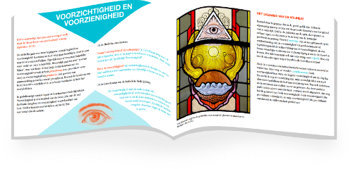
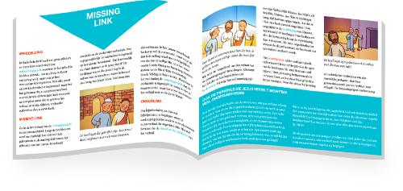
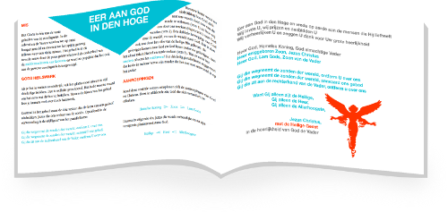

Als nieuwe spin-off van deze blog verschijnt binnenkort het boek ["Parels van het Katholieke Geloof"](http://parels.gelovenleren.net/).

_Parels van het Katholieke Geloof is een boek dat in veertien korte hoofdstukken een bloemlezing brengt van het rijke rooms-katholieke geloofsleven. Het streeft geen volledigheid na en is evenmin opgebouwd volgens een bepaald programma. De behandelde thema's zijn slechts een kleine selectie van de vele facetten van de katholieke traditie die vaak onderbelicht blijven, maar die wel heel kleurrijk oplichten als je ze met een onbevangen blik bestudeert._

_Het boek is gericht op jongeren die na hun vormsel bereid zijn hun geloof verder te ontwikkelen. Sommige hoofdstukken vereisen meer achtergrondkennis, dus het zou ideaal zijn als de ouders aan de lectuur deelnemen en erover met hun kinderen in dialoog treden, in de hoop dat het hen aanspoort om zelf ook naar nieuwe facetten van hun geloof op zoek te gaan._

De meeste teksten uit Parels van het Katholieke Geloof zijn afgeleid van artikels die reeds verschenen op deze blog. Onder de sectie [Boekjes](/page/katholieke-printerboekjes/) kan je al de afzonderlijke artikelen van het boek als PDF downloaden. Kijk er gerust ook eens rond, er zijn missaaltjes, catechismussen en gebedenboekjes die je zelf kan afdrukken en met een beetje handigheid tot een mooi boekje maken.
