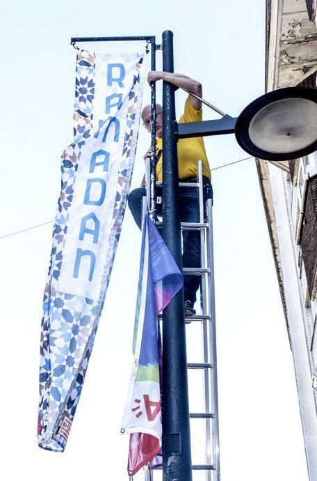
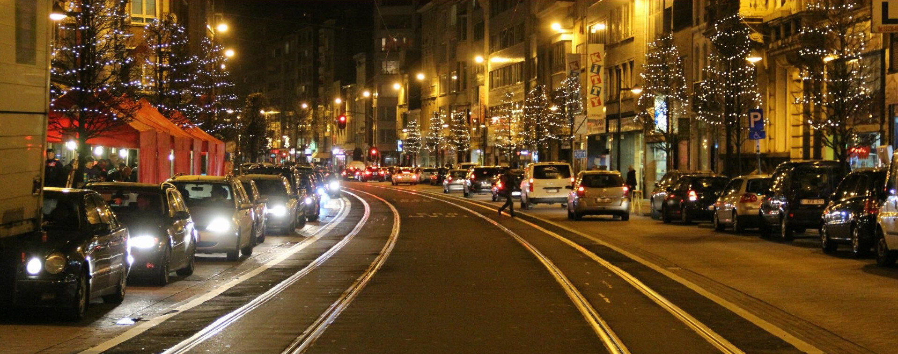

 \*A\* doe mee oan de Ramadan

De Turnhoutsebaan in Borgerhout is deze weken getooid met [sierlijke banieren](http://www.hln.be/regio/nieuws-uit-borgerhout/100-ramadan-vlaggen-op-turnhoutsebaan-a3169009/) die het woord "Ramadan" dragen. Het verraste me wel even. Ik vroeg me af: wie hangt die daar? Ik vermoed dat de stad dat doet, want doorheen het jaar worden aan dezelfde palen banieren opgehangen die publieke evenementen aankondigen, zoals een stoet of een braderij. Het zou ook kunnen dat de lokale middenstand mee kiest welke promotie verschijnt, want zo'n Ramadan mag dan wel [vasten](https://www.trouw.nl/religie-en-filosofie/-ramadan-is-een-een-spiegel-voor-de-christenen-~a6467e10/) inhouden, voor de talrijke islamitische voedingszaken in de Turnhoutsebaan is het een gouden tijd, vermoed ik, met al die iftarmaaltijden.

De Islam krijgt zo een plaats in het 'publieke domein'. Dat is niet abnormaal, zeker niet in die wijk. Je zou je provocerend kunnen afvragen of het wel normaal is een religieus evenement zo publiek te promoten. Dat doen we toch ook niet met de evenementen van onze 'eigen' religie, het christendom? Wanneer zal de stad eens banieren ophangen met promotie voor de katholieke vasten? Of voor het Hoogfeest van Pinksteren? Of Pasen? Of Kerstmis? … Oh, maar wacht eens even! Niet alleen de Turnhoutsebaan, maar de ganse stad hangt van Allerheiligen tot Maria Lichtmis vol met kerstversiering! Met lichtjes en slingers en kerstbomen en allerhande. Da's nog wel een categorie hoger dan die banieren van de Ramadan! Qua feestversiering zetten we als katholieken die moslims nog lekker in hun blootje!

Niet te vroeg gejuicht echter! Hoewel we het in de volksmond nog 'kerstversiering' noemen, hebben die lichtkransen natuurlijk niks meer met het religieuze feest van Kerstmis te maken. Het enige hoogfeest dat van die lichtjes beter wordt, is dat van het allerzuiverste hedonisme. De middenstand, weet je wel.

 Turnhoutsebaan in kersttooi

Even een sprongetje. Soms probeer ik me voor te stellen hoe dat duizenden jaren geleden is gegaan in Rome. Volgens de geschiedenisboekjes is de Romeinse godsdienst daar op een goeie dag op staatsbevel vervangen door het christendom. Dat kan natuurlijk niet zomaar gebeurd zijn. Ik vermoed dat die Romeinse godsdienst gewoon stilletjes is uitgebloeid, net zoals het christendom bij ons. De tempels zullen er nog gestaan hebben, netjes onderhouden met geld van de staat. De Romeinen hadden ongetwijfeld ook nog de jaarlijkse feestversiering uithangen voor de belangrijkste feesten van de hun goden. Maar zou het kunnen dat die versiering er uiteindelijk nog slechts hing bij de gunst van de stedelijke overheid die de middenstand wilde paaien? Terwijl de verering van de goden eigenlijk al lange tijd een stille dood was gestorven? Dan, op een goeie dag, beslist de staat dat er ook eens versiering mag hangen voor een christelijk feest en---hop---voor je er erg in hebt, is het christendom staatsgodsdienst geworden, omdat de oude godsdienst eigenlijk al jaren dood was.

Net hetzelfde kan gebeurd zijn bij de Germanen en de volkeren in onze streken, die ook hun eigen godsdienst hadden, maar enkele honderden jaren na de Romeinen toch gekerstend werden. En het was er nog gemakkelijker, want de kerstversiering hadden ze al! Die konden de christenen gewoon recyleren. Zo komt de ene---levende---godsdienst zonder slag of stoot in de plaats van de andere---dode---godsdienst.

Ik wil het geen doemdenken noemen, maar zo zou het hier ook kunnen verlopen. Het is een natuurlijk proces. Voor ons, katholieken, is het nu een kwestie om niet te beschaamd te zijn om ook onze religieuze feesten te durven promoten. De nieuwe interesse voor processies, zoals die van het Heilig Sacrament die zich volgende week weer aandient (in Antwerpen vanuit [Sint-Jacob](http://www.sintjacobantwerpen.be/aankondiging-sacramentsprocessie-2017) en de kapel van het [Allerheiligste Sacrament](http://fsspx.be/sites/sspx/files/pb_17_06_juni_do.pdf)), is een mooie opsteker. Daarmee kom je buiten en laat je zien waarin je gelooft zonder dat te doen als slaaf van de commercie.

In dat opzicht zouden die Ramadanbanieren in de winkelstraat wel eens een ferme pad in de korf van de Islam kunnen worden, want ze zijn het eerste teken dat ook dit geloof---eens verwesterd---zich voor de kar van de wereldse belangen van de middenstand laat spannen. Zo wordt de "Europese Islam" dan toch nog werkelijkheid. En langs de achterdeur wordt Europa heimelijk [opnieuw gekerstend](https://www.trouw.nl/home/europa-wordt-stilaan-opnieuw-gekerstend~a689b458).
