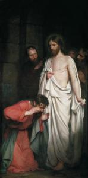

De ongelovige Thomas intrigeert me en dat is niet alleen omdat zijn feestdag op mijn verjaardag valt. Ergens in mijn _newsfeed_ kwam ik een artikeltje tegen waar een verrassende verklaring werd voorgesteld voor het ongeloof van Thomas. Ik herinner me niet meer precies welke blog het postte, maar voor de zekerheid doe ik het hier nog eens over.

 De ongelovige Thomas (Carl Heinrich Bloch)

Het [verhaal](https://rkbijbel.nl/kbs/bijbel/neovulgaat/willibrord1975/johannes/20) is kort. Na Jezus' dood zijn de apostelen bijeen in een huis in Jeruzalem. Op zondag verschijnt Jezus' hen een eerste keer, maar Thomas was niet thuis en als ze het hem vertellen, gelooft hij het niet. "Pas als ik mijn hand de wonde in zijn zij kan leggen, zal ik het geloven", beweert hij. De volgende zondag zijn ze weer bijeen, nu met Thomas, en ook Jezus verschijnt weer en confronteert Thomas met zijn woorden, die terstond voor zijn Heer op de knieën valt.

Het ongeloof van Thomas wordt graag voorgesteld als dat van iemand die alles heel nuchter bekijkt, die kritisch denkt en die slechts iets voor waar aanneemt indien het onomstotelijk aantoonbaar is. Kortom: we stellen Thomas graag voor zoals we onszelf voorstellen, een moderne, verlichte en wetenschappelijke geest.

Valt dat echter te rijmen met Thomas' achtergrond? Hij behoorde tot Jezus' apostelen, "zendelingen", dus hij was er al op uitgetrokken om in stad en land Jezus' boodschap te verkondigen. Daarbij zal hij ongetwijfeld getuigd hebben van de talrijke wonderen die Jezus verrichtte, tot de opwekking van de dode Lazarus toe. Niets wijst erop dat Thomas al die wonderen in twijfel trok. Dus waarom zou hij plots Jezus' verrijzenis zelf wel in twijfel trekken? Onwaarschijnlijk.

De verklaring in het blogartikel dat ik las, lag helemaal anders.

Na Jezus' gevangenname hielden de apostelen zichzelf verborgen, terwijl ze wisten dat hun Heer aan het kruis hing te sterven. Petrus, misschien nog dronken van het laatste avondmaal, had nog even uitgehaald met zijn zwaard, om vervolgens Jezus driemaal te verloochenen. Johannes ontmoeten we nog aan de voet van het kruis, samen met Jezus' moeder. De andere apostelen stuurden hun kat. Moesten ze echt bang zijn om opgepakt te worden? Waarom was Johannes dat dan niet? Als Thomas terugkijkt op wat er gebeurde, moet hij toegeven dat hij Jezus verraden heeft.

Het laatste wat Thomas zich zou kunnen inbeelden, is niet zozeer dat Jezus zou verrijzen, maar wel dat Hij zijn leerlingen cq. verraders nog een blik waardig zou gunnen. Dat verklaart het ongeloof van Thomas. Wanneer de andere leerlingen hem het verhaal van de verschijning vertellen, gelooft hij minder in zichzelf dan in de verrijzenis.

Theologisch hapert er ongetwijfeld heel wat aan deze uitleg, anders had hij wel deel uitgemaakt van de canonieke exegese, maar ik vind het wel nuttig om ook eens een ander perspectief te nemen. Zeker als je merkt dat er anders ongerijmdheden blijven bestaan, die vaak net de toegangspoort zijn tot het werkelijk begrip van de Bijbel. De ongelovige Thomas houdt ons, moderne en kritische geesten, een les van nederigheid voor, want misschien is zijn ongeloof wel helemaal niet het ongeloof dat we in onszelf herkennen!
