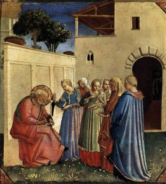
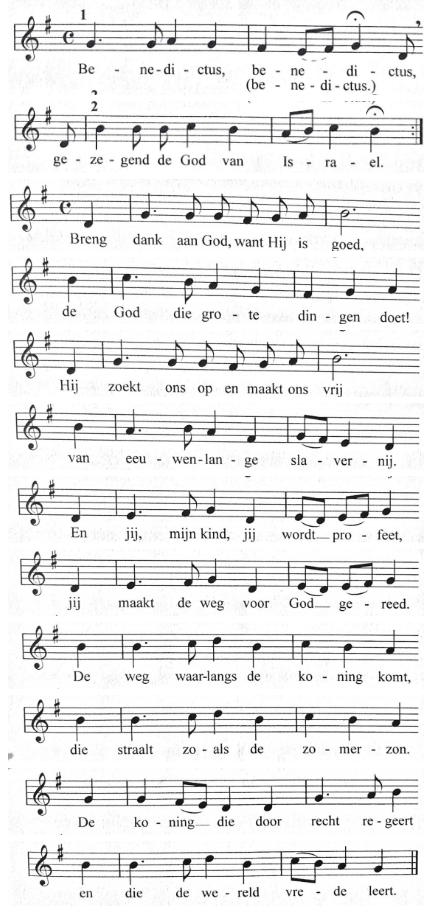

Je mag een bijbeltekst voor de duizendste keer herlezen, er kunnen nog altijd nieuwe eigenaardigheden opduiken. Dat had ik met het verhaal van de geboorte van Johannes de Doper, dat in het [evangelie van Lucas](https://rkbijbel.nl/kbs/bijbel/willibrord1975/neovulgaat/lucas/1) wordt verhaald, als onderdeel van het verhaal van Christus' geboorte.

Zacharias kreeg in de tempel bezoek van de Engel met de boodschap dat hij, een oude man, een kind zou krijgen. Hij geloofde de Engel niet en werd 'met stomheid geslagen' (is die uitdrukking afgeleid van het evangelieverhaal, ook een interessante vraag!). Dat gebeurde met deze woorden:

> _Zie, gij zult zwijgen en niet in staat zijn te spreken tot de dag waarop dat zal gebeuren, omdat ge mijn woorden niet geloofd hebt; deze zullen echter op hun tijd in vervulling gaan._

Zacharias' vrouw Elisabeth bleek inderdaad zwanger. Wanneer het kind wordt geboren voltrekt zich het volgende tafereel:

> _Op de achtste dag kwam men het kind besnijden en ze wilden het naar zijn vader Zacharias noemen. Maar zijn moeder zei daarop: 'Neen, het moet Johannes heten.' Zij antwoordden haar: 'Maar er is in uw familie niemand die zo heet.' Met gebaren vroegen zij toen aan zijn vader, hoe hij het wilde noemen. Deze vroeg een schrijftafeltje en schreef erop: 'Johannes zal hij heten.' Ze stonden allen verbaasd._

\[caption id="attachment\_3836" align="alignright" width="271"\] Naming of John (Fra Angelico, 1435, Museo di San Marco, Florence)\[/caption\]

Ook al omdat in het evangelie beide passages chronologisch van mekaar gescheiden worden door het bezoek van de Engel aan Maria en het bezoek van Maria aan Elisabeth, valt de ongerijmdheid slechts de oplettende lezer op: waarom gebruiken de buren gebaren om Zacharias aan te spreken? Iemand die niet kan spreken, maar wel horen, kan je toch gewoon aanspreken? Was Zacharias dan niet alleen stom, maar ook doof?

Ik heb er ook even op moeten googlen en een eensluitend antwoord is er niet te vinden. Er zijn er die menen dat Zacharias niet doof was, maar dat de buren gebaren gebruiken omdat een expliciete vraag de gevoelens van Elisabeth had kunnen kwetsen. Er zijn er ook die uit eigen ervaring weten dat je snel geneigd bent om iemand met een handicap neerbuigend te benaderen en dat je er haast vanzelf van uitgaat dat iemand die niet kan spreken ook niet kan horen. Dat zijn mooie verklaringen, maar ze vormen niet meteen een meerwaarde in het verhaal, vind ik.

Anderen menen dat Zacharias wel degelijk doof moet zijn geweest. Zij leiden dat taalkundig af uit de woorden van de Engel, die merkwaardig genoeg een dubbele formulering bevatten: "gij zult zwijgen _en_ niet in staat zijn te spreken". Ik ben geen exegeet, maar ik kan me best voorstellen dat wat nu vertaald is als 'zwijgen' langs vertaalstappen en betekenisverschuivingen om, in de oorspronkelijke tekst eigenlijk 'doof zijn' betekende. Ook in het Nederlands is de verwarring tussen 'stom', 'stomdoof' en 'stokdoof' snel gemaakt. Deze verklaring is best wel intrigerend, maar echt warm word ik er ook niet van.

Er is echter één verklaring die me bijzonder charmeerde. Als Zacharias zijn antwoord op het schrijftafeltje heeft neergeschreven, staat er: "ze stonden allen verbaasd". Maar waarom? Zijn die buren verbaasd dat Zacharias en Elisabeth dezelfde mening hebben? Hadden ze zich eerder verwacht aan een huiselijke twist tussen het oude echtpaar? Alles lijkt er nochtans op dat die twee een harmonieus huwelijk hadden. Echter, als Zacharias inderdaad doof was, had hij de discussie tussen de buren en Elisabeth niet kunnen horen en dus ook niet de naam die Elisabeth aan hun kind wilde geven. Juist dat maakt het feit verbazingwekkend, nee, zelfs wonderbaarlijk, dat het precies dezelfde naam is die Zacharias vervolgens op het schrijftafeltje neerschrijft.

Zacharias' doofheid, hoewel tekstueel niet aan te tonen, lost een ongerijmdheid op. Wij zijn zo vertrouwd met het verhaal dat we op die details al lang niet meer letten, en misschien zijn ze ook helemaal niet belangrijk, maar als ik vanaf nu het geboorteverhaal nog herlees, ga ik ervan uit dat de Engel Zacharias niet alleen stom, maar ook doof heeft gemaakt, want het levert een mooier verhaal op.

Dan zie ik daar die oude sukkelachtige man in zijn zetel zitten (hmm… een zetel in het jaar 0? in wat voor zitmeubel zou een oude van dagen in die tijd zijn dagen gesleten hebben?), onmachtig om met anderen te communiceren en in zijn eigen gedachten verzonken, die misschien wel in de gaten had dat er een discussie was tussen zijn vrouw en de kraambezoekers, en die fier de naam op het tafeltje schreef die hij de Engel hem had horen noemen als laatste gesproken woord voor de doofheid hem overviel. En dan zie ik die oude grijsaard opspringen, de mond openen en klaar en duidelijk hoorbaar voor iedereen Gods lof zingen:

