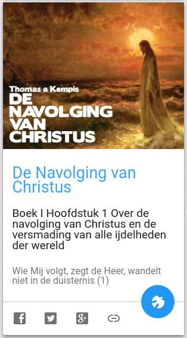

 De Navolging van Christus op Alledaags Geloven

De Navolging van Christus verscheen hier enkele maanden geleden als [gastblog](/blog/de-navolging-van-christus-in-de-sterke-tijden/). Vanaf nu is er op [Alledaags Geloven](http://alledaags.gelovenleren.net/) (je dagelijkse dashboard voor gebed, studie of bezinning) een kaart waarmee je de bezinnende teksten van Thomas a Kempis opnieuw kan opnemen in je dagelijks gebed.

Kom je er even niet uit, klik dan op de Heilige Geest om je te laten begeleiden naar een passage uit de Navolging die je vast zal inspireren.
