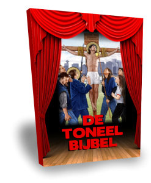

 De Toneelbijbel

Binnenkort verschijnt [_De Toneelbijbel_](http://toneelbijbel.gelovenleren.net/) als boek. 

De basis van _De Toneelbijbel_ is de synopsis van de vier Evangeliën volgens Mattheüs, Markus, Lukas en Johannes. In de synopsis worden de verhaallijnen samengesmolten tot een enkele verhaallijn die alle elementen bevat uit de afzonderlijke Evangeliën en die uit overlappende verhaallijnen degene kiest die het meest geschikt is voor dramatisering. Zowat alle dialogen zijn reeds uitgeschreven door de evangelisten, dus de omzetting naar toneel is rechttoe-rechtaan en het resultaat is een toneelscript dat haast helemaal is samengesteld uit letterlijke bijbelfragmenten. De publicatie geeft bij elk element van de dialoog en bij elke regieaanwijzing de referentie naar de brontekst.

De toneelbewerking van het Evangelie is niet bedoeld om uit te voeren voor groot publiek, maar aarzel niet om bij gelegenheid samen met de kinderen thuis, in de catechesegroep of in de klas een of meerdere bedrijven uit te voeren om het bijbelverhaal wat leven in te blazen. Of neem het stuk zelf bij de hand als alternatieve bijbellezing!

INHOUD :

- HET GEBOORTEVERHAAL
- HET DOOPSEL VAN JEZUS
- DE BEKORING VAN JEZUS
- DE LEERLINGEN VAN JOHANNES
- JEZUS EN DE SAMARITAANSE VROUW
- DE KNECHT VAN DE HONDERDMAN
- STORM OP HET MEER EN GENEZING VAN EEN BEZETENE
- JEZUS EN DE OVERSPELIGE VROUW
- DE VERLOREN ZOON
- DE PARABEL VAN LAZARUS EN DE RIJKE MAN
- HET KONINKRIJK GODS
- DE TALENTEN
- DE OPWEKKING VAN LAZARUS
- DE GEDAANTEVERANDERING
- HET LIJDEN EN STERVEN VAN ONZE HEER JEZUS CHRISTUS
- DE VERRIJZENIS VAN JEZUS
