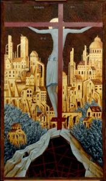
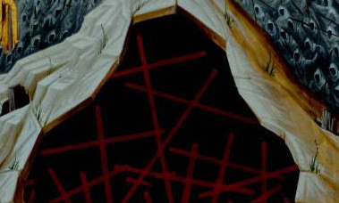
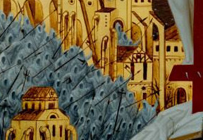
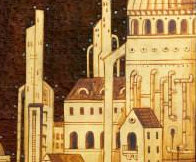

Als ik het gemekker op Twitter over fundamentalisme even beu ben, wil ik wel eens rondneuzen op [Pinterest](https://www.pinterest.com/vicmortelmans/missale/) op zoek naar illustraties voor [missale.net](http://www.missale.net). Daar trof ik vandaag een merkwaardig kruisigingsicoon aan.

\[caption id="attachment\_3898" align="alignright" width="175"\] Dystopisch Kruisigingsicoon\[/caption\]

Het icoon viel me meteen op, omdat het een ongewone blik op de kruisiging geeft. Je bekijkt de gekruisigde van de achterzijde en in de achtegrond zie je de stad Jeruzalem liggen. Ik bedacht me dat dit perspectief best wel eens realistisch kan zijn. De kruisiging voltrok zich op een heuvel, niet ver van Jeruzalem. Toch zie je op een afbeelding van de kruisiging zelden een stad in de achtergrond liggen. Omdat je in dezelfde richting kijkt als Jezus, zie je Hem als het ware Jeruzalem overschouwen en daarbij kwamen me de bijbelverzen voor de geest waar Hij, enkele dagen voor zijn dood, Jeruzalem ook vanop een heuvel aanschouwt en beweent.

> En toen Hij de stad naderde en haar zag, weende Hij over haar, en sprak: Ach, mocht ook gij op deze dag nog erkennen, wat u tot vrede strekt; maar dat is thans voor uw ogen verborgen! Waarachtig, er zullen dagen over u komen, dat uw vijanden een wal om u werpen, u omsingelen, en u van alle kanten benauwen; dat ze u zullen verdelgen, u en uw kinderen, die in u wonen; en dat ze bij u geen steen op de andere zullen laten, omdat ge uw tijd van ontferming niet hebt erkend. (Lucas 19:41-44)

En toen bekeek ik de icoon van wat dichterbij en merkte op dat het helemaal geen klassieke voorstelling betreft! De symboliek vat ik nog niet helemaal, maar hier zie je enkele details:

De berg onder het kruis bevat een holle ruimte waarin een heleboel kleinere kruisen zijn opgeborgen.

De grijze massa die de stad omgeeft bestaat uit spookachtige gedaantes gewapend met lansen, die uit de gebouwen van de stad lijken op te trekken. Dit lijkt wel een rechtstreekse verwijzing naar het bovenstaande bijbelvers.

De gebouwen in de stad ogen op het eerste zicht heel klassiek, maar je vindt er ook moderne elementen terug: een schouw, een telescoop en tal van buizen aan de buitenkant van de gebouwen, die je aan het Centre Pompidou doen denken.

Nu lijkt het icoon plots meer op het decor van een dystopische film van David Lynch of zo. Knap werk. Jammer dat ik op internet niks terugvind over de auteur van dit icoon...
