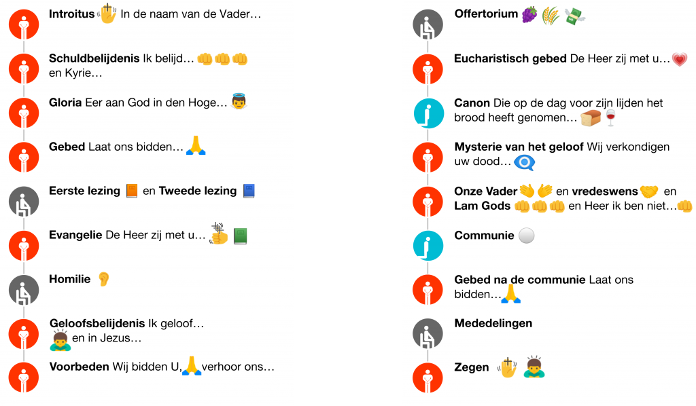

Een tijdje geleden postte ik een [infografiek van het gewone van de mis](/blog/het-gewone-van-de-mis-als-infografiek/). Hier is er een nieuwe, die de voorgeschreven gebedshoudingen benadrukt.

 Gebedshouding in de mis

Je vindt deze versie ook in het boek "[Parels van het Katholieke Geloof](http://parels.gelovenleren.net/)".
