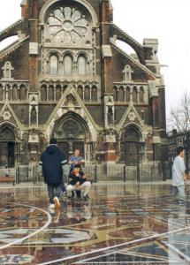

In de eerste week van de vakantie werden onze kinderen [dagelijks lastiggevallen](https://twitter.com/vicmortelmans/status/881933489666392064) door allochtone kinderen als ze op het plein gingen voetballen. Na enkele ergernisvolle 'gesprekken' (de eergevoeligheid die de sociale omgang met deze gemeenschap hypothekeert, maakt het moeilijk om dit woord zonder aanhalingstekens te vermelden) en een bezoekje van de politie leek het alsof de spanningen waren opgelost. Omdat we zelf ook op vakantie gingen en er tal van andere activiteiten waren, werd er niet meer dagelijks gespeeld, maar goed, de laatste weken kon het weer terug zonder problemen.

 Borgerhouts plein

Vandaag waren er drie vriendjes op bezoek, die mee op het plein gingen spelen. Na nog geen half uurtje bleek het weer terug ambras. Weer opnieuw met die mannetjes gaan onderhandelen en weet je wat het merkwaardige is: die nieuwe vriendjes waren het probleem! Het waren vreemdelingen! Als je die allochtone jongeren er (weer eens) op aanspreekt dat ze toch ook onze kinderen in vrede moeten kunnen laten spelen, krijg je te horen dat ze onze kinderen niet hebben lastiggevallen. Maar die nieuwe vriendjes, die kenden ze niet.

Je moet toch wel een hogere studie psychologie achter de rug hebben, om bekwaam te zijn in vrede op een pleintje te gaan voetballen! Het lijkt wel een apenroedel, waar een 'indringer' eerst uitgebreid besnuffeld en op de proef gesteld moet worden, als hij niet buitengekegeld wil worden.

Die hogere studie psychologie zal ongetwijfeld de jongerenwerkster (of hoe zich dat ook graag betitelt) achter de rug hebben, die toevallig passeerde en zich in ons 'gesprek' met de jongeren kwam moeien, met de sussende (?) boodschap dat het geen zin had de politie te bellen en dat het allemaal "op een andere manier" moest worden opgelost (maar spijtig genoeg zelf niet 'bevoegd' was voor ons plein). Zal wel zijn, maar de meeste hulp hebben we toch gehad van een allochtone volwassene (zijn relatie tot de jongeren was me niet duidelijk), die de grootste heethoofden uit het 'gesprek' wegtrok (letterlijk).

Er zat ook een ander heethoofdje tussen dat het, op zijn eigen opgehistste manier, nog niet eens zo slecht meende, want hij bezwoer dat hij, als wij geen moeilijkheden maakten met politie en zo, wel zou zorgen dat onze kinderen ook niet meer lastiggevallen zouden worden. Benieuwd…

Op een of andere manier geloof ik wel dat het moet mogelijk zijn om met die mannen samen te leven, maar je moet verdomd goed weten hoe je ze moet aanpakken. Je kan toch moelijk op elk plein een diplomaat delegeren om de cultuurverschillen te overbruggen?

En om dit alles te relativeren was er een van onze gasten die zelf jong was in Antwerpen zo'n vijftig jaar geleden en vertelde dat het toen niet anders was. Op elk pleintje heerste een kliek jongeren (autochtoon in dit geval) en als je zomaar als 'vreemdeling' even wilde gaan voetballen, ging dat ook niet zonder slag of stoot.

Het is ook geen toeval dat al onze Vlaamse jeugdbewegingen waar we vandaag nog zo fier op zijn, de scouts, de chiro, de KSA-KSJ-KAJ-en-noem-maar-op, in het begin van de vorige eeuw het licht zagen. Dat waren allemaal acties om de jeugd van de straat te halen en hen aan te leren op een deugdzame wijze te spelen ("ten strijde tegen de zedenverwildering" heette dat toen). Het zal toen op onze pleintjes ook niet zo gemakkelijk zijn geweest.

Misschien is het aan de allochtone gemeenschappen om nu ook eens werk te maken van zo'n jongerenbeweging? Maar zal onze moderne samenleving dat nog wel aanvaarden? Want ook onze katholieke jongerenbeweging van vorige eeuw was niet vies van een ferme geut [radikalisering](/blog/o-kruise-den-jihadi/) in haar programma. Dat willen we met een door de islam gepatroneerde beweging natuurlijk niet meemaken. Is dat de catch-22 van onze Borgerhoutse pleintjes?
