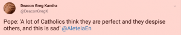

De voorbije weken werd er veel aandacht besteed aan _fake news_. In een discussie tussen Bart de Wever en de redactie van _De Standaard_ werd duidelijk dat het meeste nieuws feiten zijn, doorspekt met opinies van journalisten. Het euvel begint vaak bij de titels die voor stukken worden gekozen, die de lading van de boodschap niet meer dekken.

Op zich is dat niet erg. Opinies zijn relevant. De grens tussen opinie en leugen, als het eigenlijk om feiten zou moeten gaan, is jammer genoeg vaag. Je zou denken dat een christelijk medium zich daarvoor hoedt. Tot ik deze week _Kerknet_ zeg koppen met een quote van de paus: ["Katholieken die zich volmaakt voelen, hoe droevig is dat"](https://www.kerknet.be/kerknet-redactie/blog/paus-%E2%80%98katholieken-die-zich-volmaakt-voelen-hoe-droevig-dat%E2%80%99).

Zo citeert Kerknet

Zo citeert men correct

Ik voelde dat er iets wrong met het citaat, maar ik kon er de vinger niet opleggen, tot ik elders hetzelfde citaat in een lichtjes andere vorm zag opduiken. Wat de paus voluit zei is: "ik denk aan veel katholieken die zich volmaakt voelen **en de anderen minachten**… hoe droevig is dat." Het stukje zin in vet had nog perfect in de 144 twitterkarakter gepast, maar het is weggelaten. Waarom?

Het is geen onbelangrijke vergetelheid, want ik denk, ik hoop althans, dat die weggelaten zinsnede de werkelijke bezorgdheid bevat die de paus wil uitdrukken. In elk geval zijn beide bezorgdheden niet dezelfde. De katholieke gelovige die zich dankzij zijn uitmuntende inzet voor het christelijke leven (haast) volmaakt weet, heeft misschien een tikkeltje gebrek aan nederigheid, een euvel dat hij ongetwijfeld bij het volgende bezoek aan de biechtstoel zal rechtzetten. De katholieke gelovige die een andere gelovige minacht, als die zich naar eigen vermogen ook inzet voor een christelijk leven, maar desondanks terug ten val komt, die zal zich voor veel grotere zonde moeten verantwoorden. Die weerstreeft Gods genade en voorzienigheid.

### Verdrietig

Ik voelde me verdrietig als ik die quote las. Ik ga dan aan het denken en vraag me af waarom die belangrijke zinsnede is weggelaten. Nee, de redacteur heeft dat natuurlijk niet met kwaad opzet gedaan. Wellicht onbewust, maar dat maakt de weglating niet minder veelzeggend. Ik voel het als een illustratie van een malaise in de Kerk. Een oude rekening die nog moet vereffend worden. Een Kerk die niet met zichzelf in het reine is. Een Kerk waarin onderhuids de ontsteking blijft branden op een oude kwetsuur, die bij de minste druk hevige pijn veroorzaakt.

Om een of andere reden lees ik in dit ontwrichte citaat een sneer naar traditionele katholieken. De gremia van de Kerk in Vlaanderen zijn bevolkt met katholieken die een grondige afkeer hebben van hun meer traditioneel georiënteerde geloofsbroeders. Die durven immers, gewapend met negentien-en-een-halve eeuw geloofstraditie, wel eens stevig inbeuken op de laat-twintigste-eeuwse verworvenheden van onze Kerk.

De wijze waarop traditionele katholieken hun geloof beleven, straalt zelfvertrouwen uit, maar dat maakt hun geloof niet minder nederig. Buiten de biechtstoel zijn die traditionele katholieken echter niet erg geneigd zichzelf tot zondaar uit te roepen. Zo kan het lijken dat zij zich "volmaakte katholieken" voelen. Sommigen onder hen durven zo vurig van leer geven dat het overkomt alsof ze zichzelf boven alle kritiek verheven voelen. Dan worden "volmaakte katholieken" plots "volmaakte kritikasters", een soort waar de paus niets van moet hebben. De weerzin die ze daarmee oproepen bij de generatie die de Kerk de een-en-twintigste eeuw heeft binnengeloodst, beperkt zich echter niet tot hun kritiek, die een---soms terechte, soms weerlegbare---mening is, maar omvat al snel hun traditionele geloofsleven.

De ironie wil dat die weerzin nu zelf een vorm van minachting is geworden voor iedereen die zich met een traditioneel geloofsleven wil inlaten. Vandaar misschien dat het tweede deel van het citaat wijselijk achterwege werd gelaten? Als je vindt dat om een goeie katholiek te zijn, je om het hardste moet roepen dat je een zondaar bent, dan minacht je degene die dat niet doet als een slechte katholiek.

### Blij

Zou het niet mooi zijn als we als gelovigen allemaal met zelfvertrouwen konden proberen goeie katholieken te zijn, elk op onze eigen manier? Dat we fier konden zijn op het leven dat we leiden, zonder daarin een vorm van trots te zoeken? Dat we onszelf, om de grootsheid van ons geloof te bewijzen, niet voortdurend moesten misprijzen? Als ik denk aan een gelovige die zich aardig op weg naar volmaaktheid voelt, dan wil ik niet droevig zijn, dan wil ik blij zijn in zijn plaats en zijn voorbeeld volgen!

Twee uitspraken van Jezus komen in me op. Hij zegt dat zijn juk licht is en dat we volmaakt moeten zijn, zoals zijn Vader in de Hemel volmaakt is. We zijn immers zijn kinderen. Zou dat dan niet mogelijk zijn, die volmaaktheid na te streven en, als Gods genade het toestaat, die volmaaktheid zelfs te benaderen? Zouden we ons als kinderen van een volmaakte God niet volmaakt mogen voelen als we ons daar gans voor inzetten?

### Christelijke volmaaktheid

Ik ben zo'n katholiek die het aandurft om bij dit soort vragen te rade te gaan bij de catechismus. Zelfs de _Mechelse Catechismus_, een boekje dat in inhoud en en in opbouw een pareltje is van geloofspedagogiek dat zijn gelijke niet kent, tot gelovigen het jammer genoeg als een last gingen beschouwen omdat ze het helemaal van buiten moesten leren. Nu zit het onherroepelijk in de verdomhoek, want het is een instrument van "volmaakte katholieken". De catechismus wijdt een heel hoofdstuk aan de christelijke volmaaktheid (zie het uittreksel onderaan dit artikel). Ooit was dit dus geen loos begrip, geen reden om geminacht te worden. Het was een duidelijk streefdoel en de rest van de catechismus reikte afgelijnde middelen aan waarmee dit doel binnen het bereik van gewone mensen kwam.

Zo'n catechismus is iets voor bèta-katholieken. Die houden van orde, van hiërarchie, van leerstellingen, van rechtlijnigheid. Daar worden ze gelukkig en zelfzeker van. Alfa-katholieken benaderen geloof met hun gevoelens. Zij beleven hun geloof in hun omgang met andere mensen en hun motivatie is meer spiritueel. Voor alfa-katholieken is een catechismus een keurslijf. Nochtans ben ik ervan overtuigd dat je ook een catechismus op spirituele wijze kan lezen en er zelfs als alfa-katholiek inspiritatie uit kan halen. Bent u een alfa-katholiek? Lees dan eens het stukje over christelijke volmaaktheid met een onbevangen blik. Het hoeft niet altijd mystieke literatuur te zijn!

### Checklist

Ik heb eens de oefening gedaan en op basis van de _Mechelse Catechismus_ en enkele andere bronnen een _checklist_ samengesteld (zie onderaan dit artikel). Bèta-katholieken vinden zoiets geweldig. Die lijst bevat praktische richtlijnen en tips die je helpen om je geloofsleven een _boost_ te geven. Je kan de lijst gebruiken om nieuwe _challenges_ te zoeken die je spirituele grenzen verleggen of om hulp en steun te vinden in je geestelijke ontwikkeling. Het enige risico dat moderne bèta-katholieken lopen, is de neiging om de lijst te gebruiken als een _bucket list_. Dan worden al die puntjes een doel op zich, terwijl het allemaal slechts middelen zijn om dat ene doel te bereiken: de christelijke volmaaktheid. Die volmaaktheid is gedefinieerd als _"de innige vereniging met God door de liefde, zodat wij in al onze handelingen geleid en bezield worden door de liefde tot God"_.

Het is zoals het scherpe verwijt van Jezus aan de farizeeën als hij hen uitscheldt voor "witgekalkte graven", omdat ze anderen vrome regels opleggen die ze zelf niet volgen, of erger nog, die ze misbruiken om er zelf beter van te worden. Oppervlakkig lijkt het alsof Jezus ten strijde trekt tegen de religieuze leefregels, maar niets is minder waar! Jezus’ toorn richt zich op de leegte van de uitvoering van de wet,  niet op de wet zelf, waaraan Hij geen jota verandert, maar die Hij ‘vervult’; lees: Hij maakt ‘vol’ wat ‘leeg’ was, de praktijk krijgt weer inhoud. God vraagt slechts onze liefde, Hij maalt er niet om hoeveel van de puntjes we kunnen afchecken op het einde van de reis. Maar laat ons alsjeblieft die hulpmiddelen niet afwijzen. Ik weet dat alfa-katholieken van zo'n lijstjes huiveren, maar we zijn niet allemaal alfa-katholieken.

* * *

### Christelijke Volmaaktheid (Mechelse Catechismus §198-207)

- Wat is de christelijke volmaaktheid? — De christelijke volmaaktheid is niets anders dan het volmaakte christelijk of bovennatuurlijk leven.
- Waarin bestaat het volmaakte christelijk leven? — Het volmaakte christelijk leven bestaat in de innige vereniging met God door de liefde, zodat wij in al onze handelingen geleid en bezield worden door de liefde tot God.
- Wat veronderstelt de christelijke volmaaktheid? — De christelijke volmaaktheid veronderstelt dat wij trouw de geboden van God en van de heilige Kerk onderhouden en, zo volmaakt mogelijk, de plich­ten van onze staat volbrengen.
- Noem enige middelen die ieder christenmens moet aanwenden om tot de christelijke volmaaktheid te komen? — Om tot de christelijke volmaaktheid te komen, moet ieder christenmens veel bidden, dikwijls biechten en communiceren, het woord Gods gaarne aanhoren, zichzelf verloochenen en getrouw zijn ook in het kleine.
- Wat zijn evangelische raden? — Evangelische raden zijn middelen die Jezus Christus in het Evangelie bijzonder aanraadt om de christelijke volmaaktheid gemakkelijker en vollediger te bereiken.
- Welke zijn de drie voornaamste evangelische raden? — De drie voornaamste evangelische raden zijn: de vrijwillige armoede, de volmaakte zuiverheid en de volkomen gehoorzaamheid.
- Waarom wordt de kloosterstaat de staat van volmaaktheid genoemd? — De kloosterstaat wordt de staat van volmaaktheid genoemd, omdat de kloosterlingen zich door geloften verbinden tot het onderhouden van de drie voornaamste evangelische raden.
- Kunnen alle christenen de christelijke volmaaktheid bereiken? — Alle christenen kunnen, met de genade van God, de christelijke volmaaktheid bereiken, elk in zijn staat, zoals de levens der heiligen het duidelijk bewijzen.
- Hoe heeft onze goddelijke Zaligmaker het volledig programma van het volmaakte christelijk leven samengevat? — Onze goddelijke Zaligmaker heeft het volledig programma van het volmaakte christelijk leven op heerlijke wijze samengevat in de « acht zaligheden », die Hij in zijn bergrede heeft verkondigd.
- Welke zijn de voortreffelijkste uitwerkingen van het volmaakte christelijk leven? — De voortreffelijkste uitwerkingen van het volmaakte christelijk leven zijn die deugdzame daden, die verricht worden onder de bijzondere werking van de heilige Geest, en daarom de «vruchten van de heilige Geest» genoemd worden.

* * *

### Checklist voor verbetering van het katholiek geloofsleven

- Ochtendgebed
- Avondgebed
- Gebed voor de maaltijd
- Gebed na de maaltijd
- Gebed of kruisteken bij een belangrijk werk
- Gebed bij bekoring of gevaar
- Gebed tot de engelbewaarder
- Bidden met de vertrouwde woorden van het onze vader en het wees gegroet
- Bidden voor onze naaste, dit is voor al degenen die de eeuwige zaligheid kunnen verwerven: de levenden op aarde en de zielen in het vagevuur.
- De heilige Maagd Maria vereren op een bijzondere wijze boven alle heiligen en boven alle engelen, omdat zij de Moeder van God is, de Koningin van de hemel en de Middelares van alle genaden
- De heilige Maagd Maria vereren door het bidden van het weesgegroet, van het angelus en van de rozenkrans, door het dragen van haar schapulier en door het vieren van haar feesten
- De heilige Jozef vereren en aanroepen, beschermer van de heilige Kerk
- De relikwieën en de beelden van de heiligen vereren, want daardoor vereren wij de heiligen zelf en bekomen wij hun bijstand
- Eucharistie op zondag
- Eucharistie op verplichte feestdagen
- Zondagsrust
- Dagelijkse eucharistie
- Tijdens de Mis, aandachtig volgen wat er aan het altaar geschiedt, samen met de priester het goddelijk offerlam opdragen, en zich verenigen met Jezus Christus door een sacramentele of ten minste een geestelijke communie
- Een uur nuchterheid in acht nemen voor de communie
- Zonodig biechten alvorens de communie te ontvangen
- Jaarlijkse biecht
- Maandelijkse biecht
- Wekelijkse biecht
- Alle doodzonden biechten die wij na een ernstig onderzoek indachtig zijn; wij moeten hun getal en hun soort doen kennen, alsook de omstandigheden die de boosheid van de zonde veranderen
- De opgelegde penitentie volbrengen onmiddellijk na de biecht, of zo spoedig mogelijk
- De opgelegde penitentie aanvullen met bidden, aalmoezen geven of verstervingen doen
- Bedevaart
- Vasten
- Vleesderven op vrijdag
- Pieterspenning doneren
- Huwelijkstrouw in goede en kwade dagen, in armoede en rijkdom, in ziekte en gezondheid
- Aanvaarden van kinderen uit het huwelijk
- Kinderen dopen
- Kinderen gelovig opvoeden
- Kinderen binnen het gezin voorbereiden op het sacrament van de biecht
- Kinderen binnen het gezin voorbereiden op de eerste communie
- Kinderen binnen het gezin voorbereiden op het vormsel
- Ouders helpen in nood en bijstaan
- Kerkelijke oversten eerbiedigen en beminnen, hun gehoorzamen, voor hen bidden en hen helpen
- De christelijke leer kennen en onderhouden, heel ons leven
- Verdieping in de waarheden van het geloof, geopenbaard door God en voorgehouden door de heilige Kerk, en oplossing zoeken voor twijfels
- Lezing van de Heilige Schrift, met name het Evangelie
- Openlijk getuigenis geven van het geloof als de belangen van de godsdienst of het geestelijk welzijn van de naaste het vereisen
- De gewoonte oefenen alles te beoordelen naar de leer van het Evangelie en van de Kerk en ernaar handelen
- Met een vast vertrouwen hopen dat God oneindig goed is voor ons, almachtig en getrouw in zijn beloften
- Onze naaste beminnen om God, is hem beminnen om te behagen aan God, die hem bemint als geschapen naar zijn beeld
- Onze naaste beminnen zoals onszelf, is hem geen kwaad willen, maar hem het goede wensen en het goede doen dat wij redelijkerwijze voor onszelf verlangen
- Onze vijanden beminnen, want ook zij zijn onze naasten, en Jezus Christus heeft ons het bevel en het voorbeeld van de liefde tot de vijanden gegeven
- Belangrijkste gebeden van de Kerk kennen
- Onze zonde verfoeien en vermijden
- Leven volgens de twee geboden van Christus: de Heer uw God beminnen uit geheel uw hart, uit geheel uw ziel en uit al uw krachten, en uw naaste zoals uzelf
- Leven volgens de tien geboden
    * Het eerste gebod van God gebiedt God alleen te aanbidden en Hem boven alles te beminnen.
    * Het vierde gebod van God gebiedt onze ouders en onze geestelijke en wereldlijke oversten te eren.
    * Het vijfde gebod van God gebiedt ons eigen leven en dat van de naaste te eerbiedigen, zowel het leven van de ziel als dat van hel lichaam.
    * Het zesde en het negende gebod van God gebieden de deugden van kuisheid en van zedigheid te beoefenen.
    * Het zevende en het tiende gebod van God gebieden de eigendom van de naaste te eerbiedigen, en aan iedereen te geven wat hem toekomt.
    * Het achtste gebod van God gebiedt oprecht te zijn in woorden en in daden. En de faam en de geheimen van de naaste te eerbiedigen.
- Leven volgens de geboden van de Kerk
    * Het eerste gebod van de heilige Kerk gebiedt, op zondagen en geboden feestdagen Mis te horen, en de zondagsrust te onder­houden.
    * De zondagsrust bestaat hoofdzakelijk hierin, dat men zich onthoudt van lichamelijke werken die niet door gewoonte of door noodwendigheden gewettigd zijn.
    * Het tweede gebod van de heilige Kerk gebiedt zich te onthouden van vlees en vleesnat op vrijdagen en op andere dagen die door de heilige Kerk worden bepaald.
- Leven met de kardinale deugden
    * De voorzichtigheid is de deugd die ons de beste middelen doet aanwenden om christelijk te leven en in de hemel te komen.
    * De rechtvaardigheid is de deugd die ons aan iedereen doet geven wat hem toekomt.
    * De sterkte is de deugd die ons het goede doet beoefenen ondanks moeilijkheden en zelfs vervolgingen.
    * De matigheid is de deugd die ons de zinnelijke goederen doet gebruiken volgens de voorschriften van de rede.
- Leven met de zedelijke deugden, zoals de nederigheid, de gehoorzaamheid, de dankbaarheid, de verduldigheid, de zachtmoedigheid, de boetvaardigheid, de kuisheid.
- zo goed en zohaast mogelijk, het onrecht te herstellen, dat wij de naaste hebben aangedaan in zijn gezondheid, zijn tijdelijke goederen of zijn goede naam.
- Goede werken verrichten met Gods genade, ter ere van God en tot welzijn van onszelf of van de naaste: het gebed, de versterving, en de werken van barmhartigheid of van naastenliefde
- In stervensgevaar zonder uitstel mijn zonden biechten, en, indien mijn biechtvader het goedvindt, een algemene biecht spreken over geheel mijn leven; zodra ik mag berecht worden, zal ik godvruchtig de heilige Communie en het heilig Oliesel ontvangen, alsook de pauselijke zegen
- In stervensgevaar zonder mogelijkheid een priester te ontmoeten, zal ik in mijn hart gevoelens opwekken van volmaakt berouw; ik zal de akten van geloof, hoop en liefde bidden; ik zal al mijn vertrouwen stellen op de goddelijke barmhartigheid en mijn ziel aanbevelen aan God en aan de heilige Maagd Maria.
- Gods oordeel vrezen, omdat God een strenge en onverbiddelijke Rechter zal zijn, en zijn vonnis onwederroepelijk
