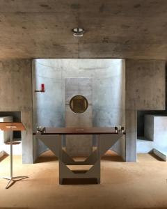

Bidden is aandacht geven aan Iemand die je niet kan zien of niet kan horen. Dat is niet vanzelfsprekend. Mensen zijn geneigd hun aandacht te vestigen op wat om hen heen is. En zelfs al heb je iets waarop je je aandacht wil vestigen, dan nog is het moeilijk om je aandacht er langere tijd bij te houden. Mensen zijn ook geneigd zelf aandacht te vragen. Zeker kinderen.

Nikolaas Sintobin postte onlangs op [Instagram](https://www.instagram.com/p/BZV2jI3nH8Z/?taken-by=nikolaassintobin) enkele foto's van een kapel in Wenen waardoor hij blijkbaar gecharmeerd was. Naar mijn smaak veel te sobere architectuur. Betonnen muren en een stalen altaar. Geen afbeeldingen, zelfs geen kruisbeeld. Wel een prominente positie voor het tabernakel, gelukkig.

Na weer een slapengaan waarbij de kinderen eigenlijk alleen bezig waren met aandacht trekken op zichzelf en met aandacht te geven aan mekaar en alles om hen heen, en niet met het gebed, begrijp ik beter wat zo'n architectuur beoogt. Zelfs een geestelijke heeft het blijkbaar soms moeilijk de aandacht bij het gebed te houden.
