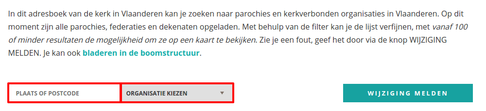
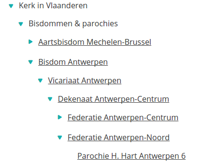
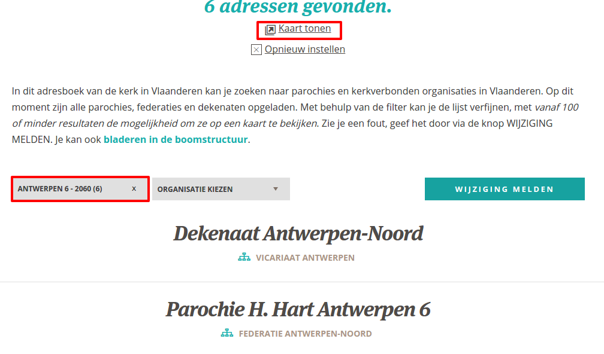
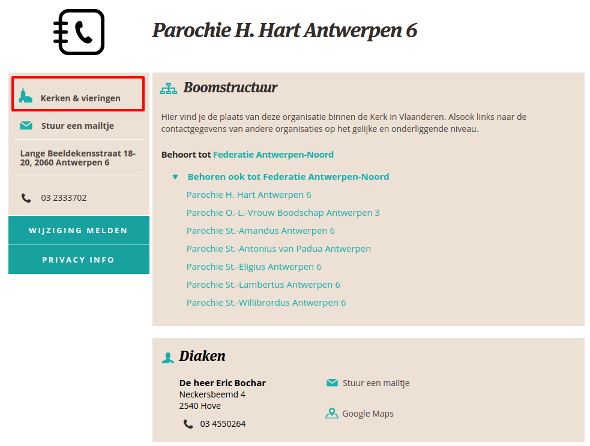

Paus Franciscus heeft het begin deze maand nog gezegd in zijn [maandelijkse gebedsintentie](https://www.kerknet.be/gebedsnetwerk-van-de-paus/video/gebedsintentie-paus-september-2017-parochie-bron-van-vreugde): Parochies moeten een bron van vreugde zijn. Veel gelovigen zijn echter de band met hun parochie verloren.

De portaalwebsite van de katholieke Kerk in Vlaanderen, [kerknet.be](http://www.kerknet.be), is niet alleen een algemene nieuwswebsite, maar wil ook een toeganspoort tot het parochieleven worden. Van bij de lancering van de nieuwe website is ingezet op het concept van microsites, dat parochies en andere geloofsgemeenschappen toelaat onafhankelijk van de redactie hun eigen content te publiceren onder de paraplu van de algemene website. Het bleef echter moeilijk die informatie gestructureerd terug te vinden.

Stilaan wordt het netwerk overzichtelijker gemaakt. De eerste stap daartoe is de beschikbaarheid van de contactgegevens van alle Vlaamse parochies en hun onderlinge relaties in federaties, pastorale eenheden, dekenaten, enz.

Die gegevens kan je opzoeken via het item "[Contacten](https://www.kerknet.be/zoeken/adresboek/lijst?)" in het hoofdmenu van de website:

Daar heb je twee mogelijkheden: zoeken op "Plaats of postcode", of "Organisatie kiezen":

Die tweede optie vereist enige voorkennis, want om mijn eigen parochie terug te vinden moet ik de plaats van mijn parochie in de hiërarchische structuur van het kerklandschap goed kennen. Ik navigeer van "Kerk in Vlaanderen" naar "Bisdommen en parochies" naar "Bisdom Antwerpen" naar "Vicariaat Antwerpen" naar "Dekenaat Antwerpen-Centrum" naar "Federatie Antwerpen-Noord" en dan tenslotten naar "Parochie H. Hart Antwerpen".

Dezelfde weg kan je afleggen als je de optie "[Bladeren in de boomstructuur](https://www.kerknet.be/organisaties-bladeren-2)" gebruikt:

Nu denk ik dat er niet erg veel gelovigen rondlopen die er bewust van zijn in welke federatie, dekenaat of vicariaat hun parochie ligt. Als ze al weten tot welk bisdom die behoort, zal het al welletjes zijn.

Gemakkelijker is het te zoeken op postcode (wel opletten: niet gewoon de postcode ingeven en <enter>, maar bij het intypen netjes wachten tot het lijstje verschijnt om het juiste item te selecteren!). Daar vond ik mijn parochie in één stap:

Ook interessant is dat er nu bovenaan de pagina een nieuwe link zichtbaar wordt die zegt "Kaart tonen". Dan zie je de resultaten van je zoekopdracht op de kaart weergegeven.

Als je nu verder klikt, kom je uit op de [parochiefiche](https://www.kerknet.be/parochie-h-hart-antwerpen-6/contact). Die is heel overzichtelijk. Je vindt er alle contactgegevens van de pastorale verantwoordelijken, verwijzingen naar de andere parochies in de federatie en bij wijze van _teaser_ een link naar "Kerken en vieringen". Voor mijn parochie schuilen daar op dit ogenblik nog geen gegevens achter, maar ik mag verklappen dat we elke zondag drie missen hebben (in drie verschillende talen en volgens twee ritussen), een weekmis en doordeweekse aanbiddingen, catecheses, lectio divina en daar komt elke maand wel iets bij. Het ware dus wel mooi geweest als dat allemaal netjes een kleine aankondiging zou krijgen, want zelfs in je eigen parochie dreig je anders het overzicht te verliezen :)

