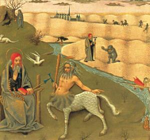
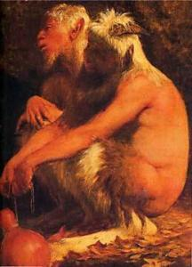
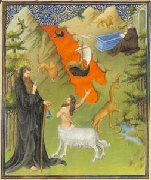
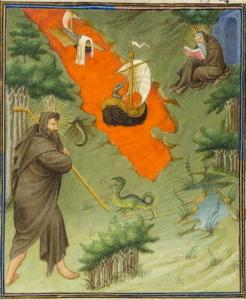
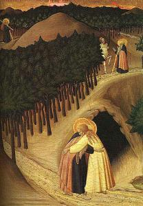
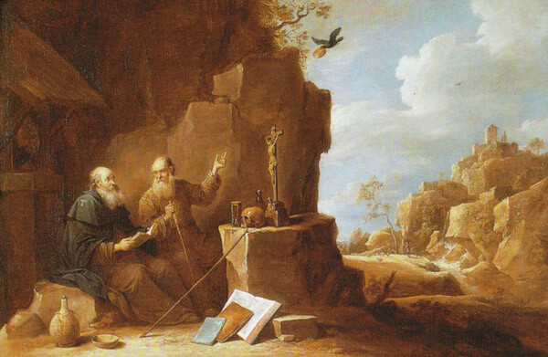

_Vandaag sloten we in onze cursus_ [_mystieke literatuur_](http://www.ccv.be/antwerpen/vorming/id/15017/?backto=vorming%7Cantwerpen) _het hoofdstuk van de cisterciënzerauteurs af met enkele zijsprongetjes in de kerkelijke geschiedenis. We lazen ook het fantastische en soms ook hilarische verhaal dat Sint Hiëronymus optekende van de ontmoeting tussen de heilige kluizenaars Antonius en Paulus. Het verhaal maakt deel uit van de_ _vita van Paulus van Thebe_ _en ik vond het terug op de website_ _Adolphus__, die een quasi eindeloos archief bevat van allerhande materiaal: vitae, boeken, kunst, toneel, films,... dat van ver of nabij te maken heeft met de vroege christelijke asceten. Zeker het doorsnuisteren waard! \[2018-01-15 de website Adolphus is niet meer online, maar het verhaal van het bezoek van Antonius aan Paulus is ook te vinden op [heiligen.net](http://heiligen.net/heiligen/01/15/01-15-0342-paulus.php), evenwel zonder vermelding van de mythische wezens\]_

Tegen de tijd dat Paulus de leeftijd van honderd en dertien jaar bereikte, leefde de negentigjarige Antonius op een andere plek in de woestijn. Antonius zei altijd dat het toen gebeurde dat hij zich afvroeg of er in de woestijn geen monnik zou zijn die volmaakter was dan hij, en dat hem ‘s nachts in zijn slaap geopenbaard werd, dat er een ander was die veel beter was dan hij, dieper de bergen in, en dat hij zich moest haasten hem te gaan bezoeken.

Bij het aanbreken van de dag ging de eerbiedwaardige grijsaard op weg naar hij wist niet waarheen, zijn zwakke oude ledematen met behulp van een staf ondersteunend. Tegen het midden van de dag met de hete zon boven zijn hoofd, brandde hij van de hitte, maar toch overwoog hij geen moment om met de eenmaal begonnen reis op te houden. 'Ik geloof in mijn God,’ zei hij, ‘die mij Zijn dienaar zal tonen, zoals Hij beloofd heeft.'

Sint Antonius en de centaur. Secrets d'histoire naturelle. 15e eeuw. Bibliothèque Nationale de France. Parijs.

Hij had dat nog niet gezegd of hij zag een wezen half mens, half paard, dat naar de mening van de dichters centaur wordt genoemd. Zodra hij die zag, maakte hij op zijn voorhoofd het kruisteken. ‘Hé, jij daar,’ riep hij, ‘waar in deze streek woont de dienaar van God ongeveer?'

Het wezen maakte vreemde, gekke geluiden, waarbij het woorden verhaspelden die niets betekenden, met een gezicht geheel overdekt met borstelige haren, maar onderdanig probeerde het toch zichzelf begrijpbaar te maken. Het wees toen met de rechterhand in de gewenste richting, racete over het wijde land met de snelheid van een vogel en verdween uit het zicht.

Ik weet niet echt, of dit nu een verschijning was door de duivel gezonden om hem bang te maken, of eenvoudigweg een dier dat door de woestijn, die een broedplaats is van allerlei monsterlijke beesten, was verwekt.

Sprakeloos liep Antonius verder en dacht na over wat hij had gezien. Na korte tijd zag hij in een rotsachtige uitholling een heel kleine dwerg met een gekromde snuit en gehoornd voorhoofd, wiens onderste ledematen eindigden in de hoeven van een geit. Hoewel hij bevreesd was voor deze verschijning, greep Antonius, als de goede strijder die hij was, het schild van het geloof en het harnas van de hoop. (Ef. 6,14-17)

De Faunen, Arnold Böcklin

Ondanks de angsten van Antonius, bood dit merkwaardige schepsel hem als een soort vredesoffer enkele dadels aan als voedsel voor op reis, die hij aanvaardde en hij ging dichter naar hem toe. ‘Wat ben jij?’ vroeg Antonius. 'Ik ben een sterveling,’ antwoordde hij, ‘en een van de bewoners van de woestijn die de heidenen aanbaden als faunen, saters en incubi. Ik kom tot u als een afgevaardigde van mijn volk. Wij smeken u dat u voor ons bidt tot onze gemeenschappelijke Heer, van Wie we weten dat Hij kwam om de wereld te redden. Want Zijn geluid heeft weerklonken over heel de aarde.’ (Ps. 19,3-4 )

Bij deze woorden rimpelden overvloedige tranen over het gezicht van onze bejaarde reiziger, een teken van de diepe vreugde die zijn hart in stroomde. Want hij verheugde zich over de glorie van Christus die Satan heeft overwonnen, en betuigde tegelijkertijd zijn dank dat hij kon verstaan wat het wezen zei. Hij sloeg met zijn staf op de grond en riep uit: 'Wee u, Alexandrië, dat afgoden in plaats van God aanbidt! Wee u, O stad die de hoer heeft gespeeld, waar demonen van over de hele wereld samenstromen! Wat kan je nu nog zeggen? Want zelfs de beesten spreken van Christus terwijl jij afgoden vereert in plaats van God!' Hij was nauwelijks uitgesproken of het gehoornde dier vluchtte alsof het vleugels had.

Antonius vervolgde zijn reis zoals hij was begonnen, uitkijkend naar de sporen van wilde dieren in de enorme uitgestrektheid van de woestijn. Hoe hij het deed of waarheen zijn weg hem leidde, ik weet het niet. Alweer was een andere dag ten einde gekomen. Wat hem niet bleek te verontrusten, als iemand die er op vertrouwt dat Christus hem niet in de steek zal laten.

De Ontmoeting van St. Antonius en St. Paulus, 1445, Sassetta (Stefano di Giovanni) The National Gallery of Art, Washington D.C.

De tweede periode van duisternis bracht hij door met bidden de hele nacht lang, en in het schemerige licht van het ochtendgloren zag hij een wolf, hijgend van een brandende dorst, die naar de voet van een berg kroop. Hij hield hem in het oog om te zien waar hij heenging, en nadat de wolf weer uit een grot te voorschijn gekomen en weggegaan was, ging hij zelf naar de grot toe.

Hij begon naar binnen te kijken, maar hij kon niets zien dat zijn nieuwsgierigheid bevredigde, want het donker verduisterde zijn blik. Maar, zoals de Schrift zegt, 'volmaakte liefde drijft vrees uit,' (1 Joh. 4,18 ) en zo ging hij met langzame stappen en met ingehouden adem naar binnen, als een ervaren onderzoeker. Beetje bij beetje ging hij een stukje verder, terwijl hij vaak stilstond, totdat hij plotseling een geluid hoorde. En toen bespeurde hij door de benauwende, blinde donkerte in de verte een glimpje licht. Hij haastte zich er gretig naar toe, en stootte met zijn voet tegen een steen, wat nog een hard geluid maakte. Toen de gezegende Paulus dit hoorde, sloot hij de deur die opengestaan had, denkend dat hij de wolf nu wel kon buitensluiten.

Antonius liep toen daarbuiten heen en weer tot het later was dan het zesde uur \[= de middag\], en smeekte om toegelaten te worden. ‘U weet wie ik ben, waar ik vandaan kwam, en waarom ik gekomen ben,’ zei hij. ‘Ik weet dat ik het niet verdien u te zien. Maar toch, ik ga niet weg voordat ik dat gedaan heb. U laat wel de wilde dieren binnen. Waarom jaagt u dan mensen weg? Ik heb naar u gezocht en u gevonden. Ik heb geklopt, dus doe nu open! Als ik daar niet in slaag, zal ik hier op uw drempel sterven. En dan moet u mijn lichaam begraven.'

Zulke woorden uitend hield hij vol en bleef onberoerd. En de held gaf hem beknopt dit ten antwoord. 'Zeker, niemand vraagt zo als hij van plan is moeilijkheden te veroorzaken,’ zei hij, ‘en niemand die zulke tranen huilt zal een ander waarschijnlijk kwetsen, maar waarom zou het u verbazen dat ik mijn deur niet geopend heb, aangezien u zelf hebt gezegd dat u hier gekomen bent om te sterven?'

En met een glimlach deed Paulus tenslotte de deur open. Ze omarmden elkaar, begroetten elkaar bij hun naam, dankten gezamenlijk de Heer, gaven elkaar een heilige kus, en gingen zitten. Dan opeens kent Paulus hem blijkbaar wel, en Antonius weet ook opeens dat de ander Paulus heet.

‘Stil maar!’ zei Paulus. ‘Kijk nou eens naar datgene waar u zoveel moeite voor gedaan hebt om te vinden: niets dan onverzorgde grijze haren die door ouderdom verteerde ledematen bedekken. Kijk, ik ben alleen maar een mens, en spoedig zal ik alleen nog maar stof zijn. Maar evenzogoed, “omdat de liefde alles verdraagt,” (1 Cor. 13,7 ) vertelt u me eens, hoe het met de mensheid gaat, of er in de oude steden nieuwe huizen verrijzen, hoe de wereld wordt geregeerd, en of er nog steeds mensen zijn die in de ban van de demonen verkeren.’

Terwijl ze zaten te praten, zagen ze een raaf in de takken van de boom gaan zitten. Deze vloog zachtjes omlaag en legde voor hun verbaasde ogen een heel brood neer, alvorens weer weg te vliegen.

Antonius en Paulus in een Landschap (detail); David Teniers de Jongere, (ca. 1636 – 38), Allen Memorial Art Museum, Oberlin College.

‘Hoe wonderbaarlijk,’ zei Paulus, ‘de goedertieren en barmhartige Heer heeft me de laatste zestig jaar steeds een half brood gestuurd. En nu, vanwege uw komst, heeft Hij Zijn dienaren een dubbel rantsoen gestuurd!'

Ze dankten God voor Zijn werken en gingen aan de rand van de sprankelende bron zitten. Vanaf toen tot aan de avond hadden zij een discussie over wie nu het brood moest breken. Paulus zei dat de gast het moest doen, Antonius zei dat de oudste het moest doen. Uiteindelijk bereikten ze het compromis dat ieder het brood aan een kant zou beetpakken en eraan trekken, met als resultaat dat ieder een deel van het brood in zijn handen zou hebben. Op handen en knieën dronken ze een beetje water uit de bron, en brachten daarna de nacht door wakend in gebed, God’s lof prijzend.
