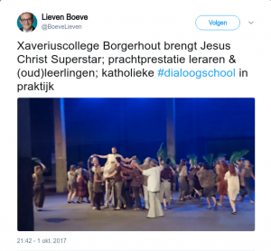

In januari werd de musical _Jesus Christ Superstar_ uitgevoerd in de Antwerpse stadsschouwburg. Ik had reeds lang een aantekening in mijn agenda gemaakt, maar uiteindelijk kon ik me toch niet vrijmaken. Bovendien waren de kaarten behoorlijk prijzig. Toch had ik er spijt van niet te kunnen gaan.

Ik wist toen reeds dat in het najaar ook iets rond JCS ging gebeuren in het Xaveriuscollege, mijn oude school, die net haar 75ste verjaardag had gevierd. Opnieuw: aantekening in de agenda, maar toch weer noodgedwongen _overruled_ door een familieweekend. Dat weekend hebben we _last minute_ moeten afzeggen wegens een begrafenis, maar hoe jammer dat ook allemaal is, het gaf het me wel de gelegenheid om nog enkele van de laatste kaarten te bemachtigen voor de uitvoering door OXACO!

Wat mocht ik ervan verwachten? Zou het een Engelse of een Nederlandse versie zijn? Zou zang en muziek wel live gebracht worden? Zou het een vrije interpretatie zijn of een klassieke enscenering?

Alle verwachtingen werden mateloos overtroffen!

De uitvoering sloot nauw aan bij die van de film (de musical heb ik nooit gezien, dus daarover kan ik niet oordelen). Zang, muziek, choreografie, het was allemaal van ongelooflijk hoog niveau. Je zou echt niet geloven dat dit maar losse medewerkers waren, die er in hun vrije tijd nog even een muscial bijpakken. Werkelijk onvoorstelbaar!

Het enige moment waarop ik me fameus geërgerd heb was helemaal op het einde, tijdens het applaus. Er was dan wel een staande ovatie, welverdiend niet in het minst door mevr. Seghers, de regisseur, die me trouwens mijn eerste woordjes Latijn heeft bijgebracht, maar nog voor alle spelers goed en wel van het toneel verdwenen waren, was het applaus reeds uitgestorven. Bij deze een voortgezet applaus en een luide awoert voor het lamme publikum!

Het was trouwens in diezelfde eerste Latijnse dat meneer De Bruyn, wel degelijk pater en in eigen bewoordingen een 'levend fossiel', grossierde met cassettebandjes die een opname bevatten van… _Jesus Christ Superstar_. Dat was in 1987. _Nil novi sub sole_. Om een of andere reden heeft dat stuk me toen meteen begeesterd, hoewel ik niet actief met geloof bezig was, en terugkijkend is het misschien wel het belangrijkste zaadje geweeest om, vele jaren later, meer en meer met geloof bezig te zijn, om erover na te denken.

Het schijnt dat de inhoud van de opera controversieel is. Zeker niet alle dialogen kunnen door de beugel van de canonieke geloofsleer. Ik zou er niet voor pleiten JCS op te voeren in een kerk, laat staan op Goede Vrijdag. Maar in een oud slachthuis, waarom niet? De personages van Jezus, Judas en Maria Magdalena krijgen elk een heel specifieke belichting, maar ze worden geen karikaturen. Er is slechts een minimum aan goeie wil nodig om ze in te passen in het verhaal dat we kennen uit de Evangeliën. Wat je er gratis bijkrijgt, is voer voor nadenken, om de ongerijmdheden te ontdekken die het Evangelie zo vaak ontsluiten.

Van die controverse was ik me in 1987 echter helemaal niet bewust. Over het Evangelie moest je me niks vragen, dus voor mij was JCS toen het prille werktuig van de openbaring.

Terug naar 2017 nu. Had ik al gezegd dat het een geweldige uitvoering was? Zo jammer dat er buiten een (betaald?) item op [ATV](https://atv.be/nieuws/video-jezus-christus-in-het-slachthuis-49624) geen mediacoverage te bespeuren is! Je zou toch echt denken dat zoiets weerklank krijgt! ...tot plots Lieven Boeve erover twittert: ["katholieke dialoogschool in praktijk"](https://twitter.com/BoeveLieven/status/914576334961209346).

Ik viel even naast mijn stoel. Ik heb er de hashtag [#dialoogschool](https://twitter.com/hashtag/dialoogschool?src=hash) nog even op nageslagen en wat ik wel wist werd bevestigd: tot nu toe zijn er over dat concept van die fameuze dialoogschool enkel nog maar uiterst wollige, hoogdravende teksten verschenen waarmee je alle kanten uit kan en waarover je eindeloos kan debatteren.

Dus die uitvoering van JCS is nu de eerste officiële implementatie van de dialoogschool in het Katholieke onderwijs in Vlaanderen? Dat snap ik toch niet goed. Wat ik alvast niet heb meegemaakt in de voorstelling is een "[wereld van diversiteit en verschil](https://pincette.vsko.be/meta/properties/dc-identifier/VSKO-20150626-katholieke%20dialoogschool)". Ik vermoed dat het publiek van het college sinds mijn tijd behoorlijk 'gediversifieerd' is, maar op het podium viel daarvan weinig te merken (tenzij de aanwezigheid van meisjes als 'diversiteit' geldt?).

Wat ik wel heb ervaren in de voorstelling is de "[uitmuntendheid](http://nikolaassintobin.blogspot.be/2017/09/uitmuntendheid-aangebrand-erfstuk-of.html)" van elke deelnemer, volgens de oeroude principes van de ignatiaanse pedagogiek. Maar om die toe te passen hebben we geen nieuwe woorden nodig, toch?

Als ik even de rol van Judas mag opnemen, wil ik me stout afvragen of de tweet van Lieven Boeve geen gratuïte recuperatie is en of het voor hem misschien voldoende is om iets te doen dat controversieel is in de katholieke leer om te gelden als "dialoogschool in praktijk"?

Desalniettemin hoop ik dat het voor alle deelnemers, vooral de leerlingen, een verrijkende ervarig is geweest, zeker als het (ooit, later?) een zaadje kan worden om meer met geloof bezig te zijn!
