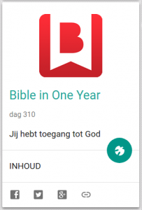

De website [Alledaags Geloven](http://alledaags.gelovenleren.net/) geeft je dagelijks nieuwe gebeden, bezinningsteksten en geestelijk studiemateriaal. Vandaag werden twee nieuwe kaarten toegevoegd.

- [Bible in One Year](http://bijbeljaar.nl/) is een project van [Alpha Nederland](http://www.alphanederland.org/). Het is een dagelijks leesrooster voor de Bijbel met begeleidende teksten.
- [Jozefmaria](http://opusdei.nl/nl-nl/section/jozefmaria/) is een rubriek op de website van [Opus Dei Nederland](http://opusdei.nl/nl-nl/). Die bevat elke dag een bezinnend tekstje van de heilige Jozefmaria Escrivá.

**Bezoek dagelijks de** [**website**](http://alledaags.gelovenleren.net/) **voor nieuw geestelijk voedsel, of volg de hoogtepunten (en nieuws uit andere bronnen) via** [**facebook**](https://www.facebook.com/alledaagsgeloven)**.**

 
