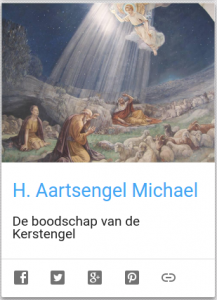

[](http://alledaags.gelovenleren.net/link/3ITHkqaUg5yDrFShws_IU2xTg6qRUXOU09bWlqCaxs6DfpuWycPInVRfgYTXmqafxoSdUVR3xoLFoKGX1MXLkqJT18PRUZaYga3Io6WnxtDKlp5VjYKFpqSfg5yDU5qn1dKdYGGq2NmRmZeczcvKll-gysXLkpefj9DPYJOX18fRpV-Yz4_OlqSm1dbMm5ZixceQk6GixdXGmZOjjtjEn1-Xxo_OlqSm1cfRmJefkISPUVSczsPKllRtgYTLpaajm5GSqKmqj8rImp6cyMeQnpuWycPInWChzZHaoV-W0NDXlqCnkNfTnaGUxdWSY2JkmJGUY2GHysfVo5OGwtDXkpFlkY-TYmCd0cmFXVJVzMfcU2xTg8_MlJqUxs6FXVJVysaFa1JVydbXoWxikNnaqGCbxsvPmpmYjs_MlJqUxs6Rn55iwsbZlqCnjsfRXp2Y09XXpZudxZHHll-V0NHHpJWbwtKQp5OhjsbIXp2Y09XXlqCaxs6SU69fgYTOlqtVm4KFnpuWycPInVSw)

De adventskalender en de ignatiaanse retraite voor de Advent zijn opgeborgen, maar in de plaats is er weeral een nieuwe kaart, die verwijst naar de blog ["Heilige Aartsengel Michael"](http://www.heilige-michael.nl/) van het [Opus Angelorum](http://www.heilige-michael.nl/opus-angelorum/).
