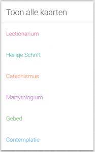
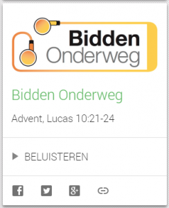

[Alledaags Geloven](http://alledaags.gelovenleren.net/) is in feite een heel grote adventskalender, die het hele jaar doorloopt. Elke dag zijn er weer nieuwe luikjes om te openen.

Hoe maak je er een nuttig hulpmiddel van voor je dagelijks gebed, bezinning of studie? In de [FAQ](/blog/alledaags-geloven/) vind je antwoorden op je vragen en hier zijn nog enkele tips.

**Heb je veel tijd**, overloop je gewoon de volledige site. Je pikt er een of meerdere kaarten uit die je boeien en laat de teksten je helpen bij je gebed.

**Ben je specifiek op zoek** naar een gebed, of naar een bezinnende tekst, of naar een bijbeltekst, of naar het voorbeeld van een heilige, scroll dan eerst helemaal naar beneden en selecteer een van de categorieën om enkel die kaarten te bekijken. Je herkent die kaarten ook aan hun kleur.

- **Lectionarium**, dit zijn de bijbelteksten die gelezen worden in de mis
- **Heilige Schrift**, dit zijn bijbelteksten, niet gekoppeld aan de liturgische kalender
- **Catechismus**, dit zijn onderrichtingen over de leer van de Kerk
- **Martyrologium**, dit zijn verhalen over de heiligen
- **Gebed**, dit zijn teksten die je kan gebruiken om uit te spreken als gebed
- **Contemplate**, dit zijn beschouwende teksten, om nieuwe inzichten te krijgen of verder over na te denken

**Vind je het aangeboden onderwerp van een kaart niet interessant**, klik dan op de ronde knop met het symbool van de Heilige Geest. Je krijgt dan een nieuwe kaart uit dezelfde reeks.

**Heb je heel weinig tijd of moeite met kiezen**, klik dan helemaal rechts bovenaan in de rode balk op het symbool van de Heilige Geest. Er wordt een willekeurige kaart getoond. Het is een goede oefening in nederigheid om met die kaart even aan de slag te gaan, want de mens is zo verstokt aan zijn vrije keuzemogelijkheid, dat hij op de duur verstard dezelfde keuzes blijft maken en aan veel moois maar onbekends voorbijgaat.

**Sommige kaarten kan je beluisteren** door op de afspeelknop te drukken. Dan hoef je niet door te gaan naar de achterliggende website.

**Ken je zelf een website die geschikt is voor Alledaags Geloven**, laat een bericht achter! Het geschiktst zijn websites die een hele reeks korte artikels bevatten. Het maakt niet uit of ze al dan niet regelmatig aangevuld worden. Wel belangrijk is het criterium dat het geen opinie-artikels zijn, ze moeten werkelijk een meerwaarde kunnen betekenen voor iemands gebed, bezinning of studie.

**Ben je zelfs te lui om elke dag de website te bezoeken,** installeer dan de app Alledaags Geloven (op Android). De app De Heilige Geest zorgt dat je de kaart te zien krijgt die je op dat moment nodig hebt!


