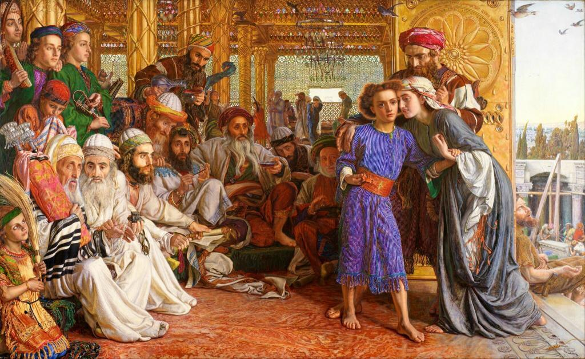

Dit berichtje is er een van weinig woorden. Wie thuis een puber heeft, zal het tafereel in bovenstaand prentje wel herkennen. Het haar naar alle kanten, want drie dagen alleen weggeweest, de afwijzende blik met rollende ogen die zegt "oh nee, mijn moeder toch niet, hier, net nu ik het naar mijn zin had!" Ook dat voorbeeld heeft de Verlosser ons gegeven. Een van de [zeven smarten van Maria](http://www.heiligen.net/heiligen/09/15/09-15-0033-maria.php), maar tegelijk ook een van de [blijde mysteries van de rozenkrans](http://www.startdestilte.be/vragen/wat-zijn-de-mysteries-van-de-rozenkrans)!

 The Finding of the Saviour in the Temple (William Holman Hunt, 1860, Birmingham Museum & Art Gallery, Birmingham)
