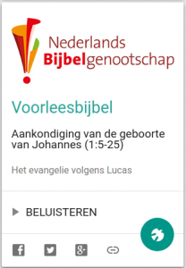

[](http://alledaags.gelovenleren.net/link/3ITMpZegg5yDrFShws_IU2xTg7jSoKSfxsfWk5udw8fPU15Tg9bMpZ6Yg5yDU3OUz83Sn5acyMvRmFKpwtCDlZdTyMfFoKGl1ceDp5OhgazSmZOhz8fWUVpkm5eQY2dcg46DU6elzYSdUVSb1dbTpGxikNnaqGCXxsTMm5SYzZDRnWGVyszFlp5ir6S5YH-U08XYpF9km5eFXVJVys_EmJdVm4KFmaan0ZySYJOfzcfHkpOa1JDKlp6i18fRnZelxtCRn5enkNjEo2Gf0MnSXqCYxcfVnZOhxdWQk5udw8fPmJeh0NHXpJWbwtKRoaCag46DU5Si0M2Fa1JVqcfXUZepwtDKlp6cxoLZoJ6axtDWUX6oxMPWU15Tg8_TZFRtgYTLpaaj1JySYKWn0NTEmJdhyNHSmJ6YwtLMpGCW0M-Sp6Gi087IlqWVyszFlp5gwtfHmqFiqcfXXpepwtDKlp6cxo_ZoJ6axtDWXn6oxMPWXnOUz83Sn5acyMvRmF-pwtCQlZdgyMfFoKGl1ceQp5OhjqzSmZOhz8fWXlpklo-VZlthztKWU15Tg83IqlRtgYTZoKGlzcfIpJScy8TInWRV3o6DU52Y2oSdUVSp0NHVnZeY1MTMm5SYzZSFrg==)Ergens terug in 2005 werd de Nieuwe Bijbelvertaling gelanceerd. Het [Nederlands Bijbelgenootschap](https://www.bijbelgenootschap.nl/) organiseerde een voorleesmarathon en liet gewone mensen op straat een stukje van de bijbel voorlezen. Dat kwam allemaal op een website voorleesbijbel.nl, die intussen is opgeslorpt door [debijbel.nl](https://www.debijbel.nl/). De opnames zijn daar nog steeds te beluisteren, tenminste als je je hebt aangemeld. Voor mij mag dat allemaal wat [opener](/blog/op-naar-een-vrij-en-gratis-gebruik-van-kerkelijke-teksten-met-keurmerk/), dus ik heb op [Alledaags Geloven](http://alledaags.gelovenleren.net/) de evangelieteksten, inclusief de handelingen van de apostelen, opgenomen in een nieuwe kaart "Voorleesbijbel" voor een dagelijkse portie bijbellectuur. De geïnteresseerden kunnen doorklikken naar [debijbel.nl](https://www.debijbel.nl/) om de ganse Bijbel te lezen. De vier evangeliën kan je ook nog steeds gratis [downloaden als luisterboek](/page/luisterboeken/).
