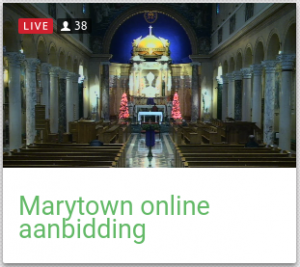
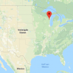

Als ik kijk hoe mijn kinderen met internet omgaan, dan merk ik dat het meeste tijd gespendeerd wordt aan filmpjes. Niet enkel voor het vermaak, maar ook om praktische informatie op te zoeken, bijvoorbeeld om iets te knutselen. Ik geef de voorkeur aan uitgeschreven instructies, eventueel met afbeeldingen, maar dat is blijkbaar hopeloos uit de tijd.

 Kaart met online aanbidding via de webcam

Dat zou ik ook meer willen aanbieden op [Alledaags Geloven](http://alledaags.gelovenleren.net/). Nu vind je er al kaarten die gekoppeld zijn aan geluidsfragmenten, bijvoorbeeld de dagelijkse bezinning van Bidden Onderweg, de zondagse preken van de Antwerpse Kapucijnen, de artikels uit de Navolging van Christus en de live gebedstijden op Radio Maria. Filmpjes heb ik echter nog niet gebruikt.

 Ligging van het National Shrine of St. Maximilian Kolbe

Als een eerste stap heb ik helemaal onderaan een kaart toegevoegd waarop je de [webcam](https://kolbeshrine.org/chapel-live-stream) kan bekijken van de aanbiddingskapel in het [National Shrine of St. Maximilan Kolbe](https://kolbeshrine.org/) in Marytown. Dat is niet bij de deur, maar dichterbij vond ik geen gelijkaardige service... Een oproep?

Als je de website bezoekt op je PC, krijg je meteen live beeld, dat je kan vergroten door op de kaart te klikken. Als je met je mobiel de website bezoekt, moet je eerst even klikken om het beeld te activeren. Dat is om ervoor te zorgen dat je dataverbruik niet de pan uitswingt.

Af en toe is er in de kapel natuurlijk ook een mis, maar wegens het uurverschil zal je die hier niet op het normale uur aantreffen.

Nu ga ik op zoek naar andere kanalen op Youtube waar nuttige nederlandstalige geloofsinhoud te vinden is!
