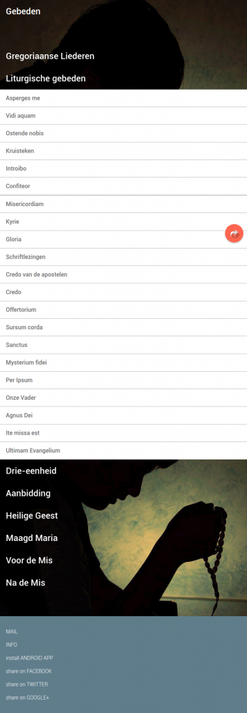
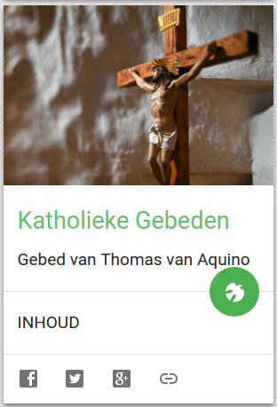

> **UPDATE 2021:** Er is *eindelijk* een officieel digitaal online missaal beschikbaar voor de Nederlandse kerkprovincie. Meer informatie op: [Geloven Leren - Het digitaal missaal](https://gelovenleren.net/blog/het-digitaal-missaal/ "Geloven Leren - Het digitaal missaal")
 
Op de _Google Search Console_ kan ik aflezen welke zoekopdrachten bezoekers van mijn blog hebben ingegeven op Google en hoe vaak mijn blog in de resultaten werd aangeklikt. Dit is de top-10 van de vaakst voorkomende zoektermen, met het aantal doorverwijzingen in de laatste 90 dagen:

1. missaal online 40
2. noveen 34
3. noveen bidden 26
4. noveengebed 17
5. bart paepen 17
6. kleuren in de bijbel 16
7. gewetensonderzoek 16
8. getijdengebed meebidden 14
9. getijdengebed 14
10. katholieke bijbel app 12

De aantallen zijn misschien niet hoog genoeg om significant te zijn, maar de zoekopdracht op nummer 1 valt wel op. **Er zijn mensen op zoek naar een online missaal!** Bijna om de andere dag landt er iemand op mijn website die daarnaar op zoek is. De reden waarom zoekers zo snel op mijn blog terechtkomen is duidelijk: er bestaat helemaal geen online versie van het missaal en ik heb die nood al [hier](/blog/op-naar-een-vrij-en-gratis-gebruik-van-kerkelijke-teksten-met-keurmerk/) en [daar](/blog/nieuw-kerknet-eerste-indrukken-en-verzuchtingen/) aangeklaagd op mijn blog.

 Liturgische Gebeden

Enkele vrije dagen in de kerstvakantie heb ik gewijd aan het uitbreiden van de [website met katholieke gebeden](http://gebeden.gelovenleren.net/). Daar vind je nu onder de hoofding "Liturgische gebeden" de vaste gebeden van de mis in het Latijn en het Nederlands. Je krijgt er ook de dagelijkse schriftlezingen (dankzij [evangelizo.org](https://dagelijksevangelie.org/NL/gospel)). Voorlopig staan de gebeden van de gewone vorm en de buitengewone vorm nog dooreen, maar op termijn zou ik die beter ontdubbelen.

Dit zijn de vaste gebeden die nu beschikbaar zijn: _Asperges me, Vidi aquam, Ostende nobis, Kruisteken, Introibo, Confiteor, Misericordiam, Kyrie, Gloria, Credo van de apostelen, Credo, Offertorium, Sursum corda, Sanctus, Mysterium fidei, Per Ipsum, Onze Vader, Agnus Dei, Ite missa est, Ultimam Evangelium_.

De layout van de website is gericht op mobiel gebruik en bij wijze van _proof of concept_ heb ik enkele functies ingebouwd die het gebruik kunnen vergemakkelijken als men de teksten zou willen projecteren tijdens de dienst. Zo kan je op de hoofding klikken om gemakkelijk door te scrollen naar de volgende tekst. Wordt er na de mis nog een [Salve Regina](http://gebeden.gelovenleren.net/#salve-regina) gezongen of een [andere hymne](http://gebeden.gelovenleren.net/#gregoriaanse-liederen), vind je die ook op de website. In mijn planning zit ook het toevoegen van de gezangen uit het Kyriale, voor de gezongen mis en ook de [bijhorende app](https://play.google.com/store/apps/details?id=net.gelovenleren.gebeden) moet nog worden aangepast.

Een volledige versie van het missaal maken, zou veel meer tijd en moeite vergen, want dan moet je de liturgische kalender inbouwen om de veranderlijke gebeden in te voegen en die teksten ook allemaal digitaliseren, zoals bijvoorbeeld op de website [Divinum Officium](http://divinumofficium.com/cgi-bin/missa/missa.pl) voor de tridentijse ritus (buitengewone vorm) in het Engels. Als ik iets in de pap te brokken had in een diocesane liturgische commissie, zou dit met stip op de prioriteitenlijst staan.  Ik zou hogerop gaan en de handen in mekaar slaan met buitenlandse bisdommen, zodat er een universele website en bijhorende app komt, waar alle bisdommen wereldwijd hun vertaling van het missaal kunnnen opladen. Dat zou de kosten drukken, maar de belangrijkste troef van zo'n project zou erin bestaan zichtbaarheid te geven aan de eenheid van liturgie in de Kerk. Geen idee of dit al in bepaalde hoofden leeft, maar wie weet, is mijn website een eerste steen…

De gebeden van de website verschijnen intussen ook op [Alledaags Geloven](http://alledaags.gelovenleren.net/) als een nieuwe kaart, voer voor jouw dagelijks gebed:

