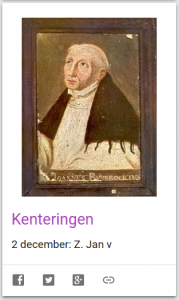
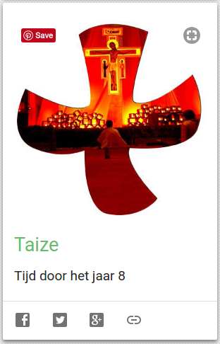

[Alledaags Geloven](http://alledaags.gelovenleren.net/) geeft nu ook een link naar

- de Heilige van de Dag op de website [kenteringen.nl](https://www.kenteringen.nl/)
- de Gebeden voor Elke Dag op de website taize.fr

Veel klikplezier!

 
