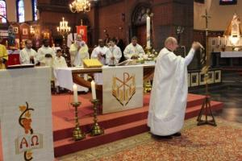

Het komt wel eens voor dat je met mensen die je niet kent een praatje moet maken en dan gaat het vaak over trivialiteiten zoals het weer, waar je werkt, waar je woont en hoe je je naar je werk begeeft. Vier vragen die mensen ondanks hun trivialiteit toch belangrijk vinden, want het zijn alledrie factoren die mee aan de oorzaak liggen van het enorme verkeersinfarkt waaronder zoveel pendelaars te lijden hebben.

Ik prijs me dan telkens gelukkig dat ik me per fiets naar het werk kan begeven en dus van al die files geen last heb. Ik woon immers in de stad en bijna alle verplaatsingen, prive of voor het werk, kan ik maken per fiets of met het openbaar vervoer. Als mijn occasionele gesprekspartner, niet zelden een uitwijkeling van de stad, zich erover verwondert dat ik geen huisje op het platteland verkies, steek ik dat altijd fijntjes door.

Een ander niet te miskennen voordeel van het wonen in de stad, dat minder snel ter sprake komt in occasionele gesprekken, heeft met het geestelijk leven te maken. Ik heb achter de hoek een parochiekerk die voor 90% bevolkt wordt door vreemdelingen, net als onze wijk in de stad, maar waar ik me meer thuisvoel dan in de gemiddelde plattelandsparochie. Onze eucharistie wordt elke zondag voorgegaan door minstens twee gedreven priesters, eveneens van buitenlandse origine, en we hebben een zeer gemengde, maar actieve geloofsgemeenschap. Elke zondag heb ik het geluk te ervaren wat een levende liturgie betekent.

Vorige zondag was ik op verplaatsing in Lier, een klein stadje in de buurt van Antwerpen. Ik had gelukkig de gelegenheid om naar de mis te gaan. Geen kwaad woord over de parochie in kwestie, maar een priester was er niet en ondanks de aanwezigheid van een parochiekoortje dat erg zijn best deed, viel me op hoe passief het gelovige volk er aan de liturgie deelnam. Het was een zittende kerk die naar een voorganger kwam luisteren.

De [zittende kerk van Vlaanderen](/blog/de-zittende-kudde/), het is een gruwel. Ik ben veel te jong om de tijden van het Concilie gekend te hebben, maar ik probeer me soms wel voor te stellen hoe de liturgische revolutie die daarop volgde (of er reeds aan voorafging) tot stand is gekomen. Het heet dat men ervoor wilde zorgen dat gelovigen actiever aan de liturgie konden deelnemen, wat---zo zag men---in de tridentijnse mis niet het geval was. Wel, dat nobel streven is niet geslaagd.

Als je merkt dat gelovigen niet actief deelnemen aan de liturgie, zou het kunnen dat dat niet zozeer te wijten is aan de liturgie, zoals de bisschoppen van het Concilie meenden, maar eerder aan de geloofsbeleving van het volk? Sleutelen aan de liturgie is natuurlijk gemakkelijker, want daarover heb je als kerkelijke overheid directe controle. Heeft het veel opgelost? Het volk bleef even passief, erger nog: nu blijft het gewoon in de banken zitten, waar het voorheen tenminste nog werd aangemaand af en toe te [knielen](/page/praktische-gids-bij-gebedshoudingen-in-de-liturgie/).

Misschien is de tridentijnse liturgie, die inderdaad een zekere afstand aanbrengt tussen de celebrerende priester en de deelnemende gelovigen, wel geëvolueerd tot die vorm, juist omdat gelovigen in alle tijden, net als nu, toch niet geneigd waren hun deelname op expressieve wijze te beleven. Misschien waren de vormgevers van die liturgie bezorgd genoeg over de sacrale dimensie, om die niet te laten afhangen van de wispelturige geloofsbeleving van het volk en hebben ze daarom besloten tenminste de sacraliteit veilig te stellen, ook als er op de uitnodiging tot actieve participatie geen antwoord komt. 

 Heilig Hartkerk, Antwerpen-Noord

Er zijn gelukkig tekenen van kentering. [Onze parochie](http://jezus-hart.be/) is een mooi voorbeeld, omdat we veel vreemdelingen aan boord hebben voor wie een zittende kerk een anomalie is. Op dat publiek zet onze Poolse pastoor nu dankbaar in met catechese, aanbidding en _lectio divina_, en een missaalgetrouwe liturgie, om onze parochie naar de toekomst te profileren. Ook vanuit de [kathedraal](http://famcat.be/) wordt er naarstig aan de weg getimmerd om opnieuw de liturgie uit het missaal als standaard te poneren en tegelijk het volk aan te zwepen om zich van publiek te ontpoppen tot biddende gemeenschap.

Het zal allemaal nog vele jaren duren voor de vruchten zichtbaar zullen zijn, maar er is nog hoop. Gelukkig woon ik reeds in de stad, en hoef ik niet in de file te staan wachten!
