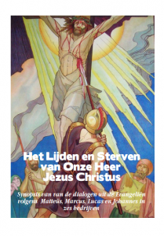

 Het lijdensverhaal in toneelvorm

Bij ons in de kerk wordt er al volop reclame gemaakt voor de uitvoering van [De Passie in Lier](https://www.depassie.be/) dit jaar. Er wordt zelfs een bus ingelegd. Als je wil gaan voor iets minder spectakel, maar evenveel beleving, voer de passie dan zelf uit, thuis, aan de hand van een [bijbelgetrouw toneelscript](/blog/999-bijbelgetrouw-passiespel/).
