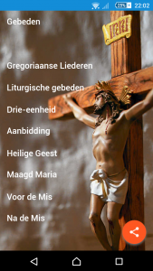

Op de Google Play Store kan je een nieuwe versie downloaden van de [gratis app met katholieke gebeden](https://play.google.com/store/apps/details?id=net.gelovenleren.gebeden). Wie de app reeds gebruikt, krijgt de update wellicht vanzelf. De app is opnieuw in lijn gebracht met de website [gebeden.gelovenleren.net](http://gebeden.gelovenleren.net/). De belangrijkste toevoeging zijn de [liturgische gebeden, de vaste gebeden van de mis](/blog/online-missaal/). Dankzij de app kan je die nu ook offline overal oproepen, dus zonder netwerkverbinding. Enkel om de dagelijkse schriftlezing uit het lectionarium te lezen, moet je online zijn. Het begint stilaan echt wel op een online missaal te lijken :)

\[caption id="attachment\_4145" align="aligncenter" width="300"\] De belangrijkste gebeden van de katholieke kerk in een handige app\[/caption\]
