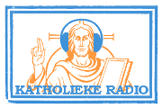

Vanaf 1 januari verandert er wat in katholiek radiolandschap. Radio Spes stopt volledig met uitzenden, zowel via de ether (FM) als via internet. De radio houdt wel de achterdeur op een kier om ooit [door te starten via de website Kerknet](https://www.kerknet.be/vicariaat-brussel/artikel-informatie/radio-spes-stopt-met-radio-maken-maar-de-boodschap-klinkt-voort). Deze radio verdwijnt dus op de katholieke zapmachine [radio.gelovenleren.net](http://radio.gelovenleren.net/).

\[caption id="attachment\_4133" align="aligncenter" width="300"\] Radio Spes verdwijnt, Radio Maria blijft!\[/caption\]

[Radio Maria verdwijnt ook](https://www.kerknet.be/kerknet-redactie/nieuws/radio-maria-verliest-fm-frequentie), maar enkel uit de ether. Internet is nu het aangewezen kanaal om deze radio te beluisteren! Op je PC gebruik je best de [website](http://radio.gelovenleren.net/), op je mobiel de [app](https://play.google.com/store/apps/details?id=net.credomobiel.katholiekeradio).

\[caption id="attachment\_59" align="aligncenter" width="180"\] Katholieke Radio\[/caption\]
