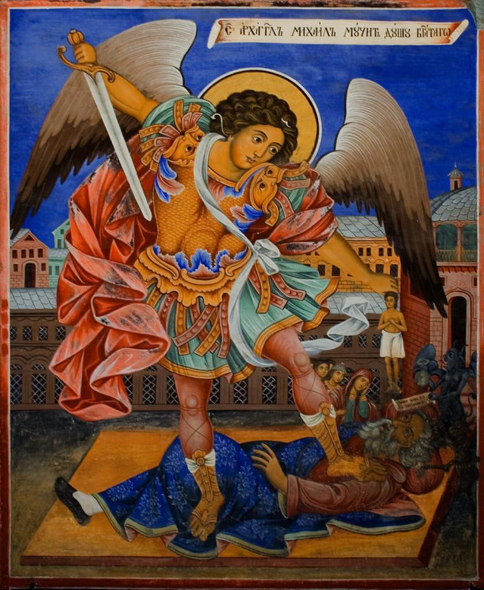

Vriendelijke mensen, die van het Opus Angelorum. Ik zat onlangs met een vraag over een ikoon van de engel Michael waarvan ik de betekenis niet snapte, dus ik heb de vraag gesteld via het contactformulier van de gelijknamige website [http://www.heilige-michael.nl](http://www.heilige-michael.nl) en kreeg prompt antwoord van een zuster die me kon uitleggen hoe het ikoon in mekaar zat. Ze heeft er ook een artikeltje over geschreven op de blog van hun website: [Een bijzonder ikoon](http://www.heilige-michael.nl/st-michael/een-bijzondere-icoon/).

Vandaag kreeg ik onverwacht weer een mailtje van de zuster, die er verder op doorgegaan was en een ander ikoon wilde tonen waarop Sint-Michael zijn taak vervult als behoeder van de zielen van de overledenen. Ditmaal heeft hij geen weegschaal vast, maar een zwaard. Michael gaat de boze te lijf, die reeds de aanklacht in de hand heeft om zich meester te maken van de ziel van de gestorvene.

Zo zie je maar: zelfs als je sterft is het laatste woord over je rechtvaardiging nog niet gezegd!

 De engel Michael beschermt de ziel van een overledene
