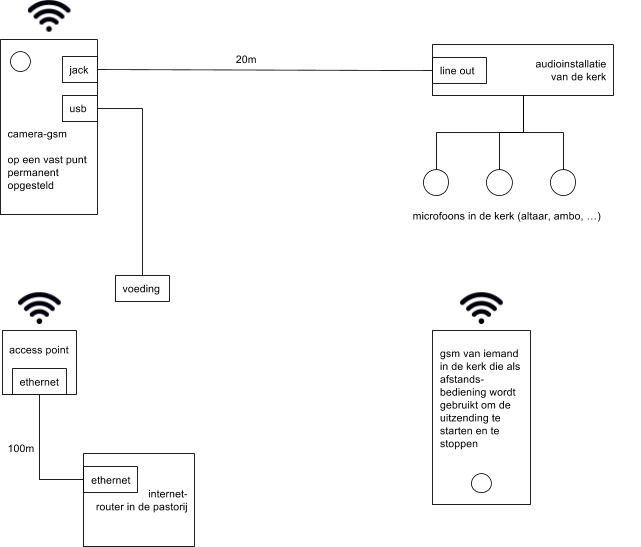
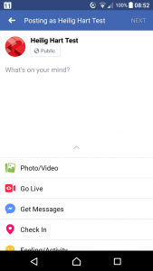

Een tijdje geleden werd me gesuggereerd om te proberen de wekelijkse zondagsmis in onze parochie live uit te zenden. Ik heb toen bestudeerd wat daarvoor nodig zou zijn en al bij al leek het plan toch iets te complex. Zelfs een eenvoudig opzet zou een soort van Gopro-camera vereisen, wat al snel enkele honderden euro's kost, en dan heb je nog wat speciale programma's nodig en een PC om het allemaal te besturen.

Het is wat blijven stilliggen, tot mijn mobiele telefoon problemen met het touchscreen begon te vertonen en de aanschaf van een nieuw exemplaar zich opdrong. Wat moest ik doen met de oude, die eigenlijk nog heel goed was, maar wegens het defect niet verkoopbaar?

Telefoons zijn eigenlijk heel krachtige multimediatoestellen, dus waarom zou die geen dienst kunnen doen voor de live streaming van de mis? Hier is het schema van hoe het zal werken:

Enkele uitdagingen van het project op een rijtje:

### Netwerk

Zonder verbinding met het internet gaat het natuurlijk niet lukken. De kerk heeft geen wifi en het mobiel netwerk gebruiken zou wel eens een dure onderneming kunnen worden. Gelukkig is er in de pastorij wel internet. Die ligt vlak naast de kerk. We gaan een kabel leggen die de modem in de pastorij zal verbinden met een access point in de kerk. Ruw gemeten zal de lengte van die kabel zo'n 100 meter zijn, wat meevalt, want dat is de maximale lengte om signaalverlies te vermijden. De camera-gsm, die wordt gebruikt voor de uitzending, zal via het access point toegang hebben tot internet. Ook de telefoon die wordt gebruikt als afstandsbediening zal via het wifi-netwerk verbinding kunnen maken met de camera. Dit is meteen het duurste aspect van de onderneming, want een access point kost al snel 40 euro en 100m UTP-kabel 80 euro.

### Positie van de camera

Als we elke week de mis willen uitzenden, is een vaste opstelling ideaal. Anders moet je elke keer het zaakje installeren en terug opbergen en dat hou je niet vol. Volgende overwegingen moet je in acht nemen bij het kiezen van een goeie positie voor de camera-gsm:

- **Kadrering.** De camera is vast opgesteld, dus je moet zorgen dat alle belangrijke elementen altijd in beeld zijn: het altaar, de ambo, een deel van de middengang waar de processie voorbijkomt, eventueel ook het tabernakel of een heiligenbeeld waar offerkaarsen branden. Anderzijds moet je er ook rekening mee houden dat de camera van een telefoon een brede beeldhoek heeft, dus je wil de camera zo dicht mogelijk bij je onderwerp houden, anders zal het centrum van de actie heel klein in beeld komen.
- **Omgeving.** Vanuit een logische reflex, zou je de camera tussen de kerkbanken willen plaatsen, zodat je hetzelfde perspectief krijgt als de gelovigen in de kerk. Dan moet je wel zorgen dat niemand voor de camera kan gaan staan of de opstelling verstoort. Veel kerken hebben pilaren waar je de camera tegen kan bevestigen met een mooi zicht op het altaar. Onze kerk heeft geen pilaren, maar naast het altaar staat wel een scherm waarop we liedteksten projecteren. Als we de camera daarbovenop monteren, hoop ik dat je een verrassend vogelperspectief (of in dit geval liever: engelenperspectief) op de mis zal krijgen. Met wat geluk krijgen we ook nog het tabernakel in beeld, dat zich in een zijaltaar bevindt.
- **Beveiliging.** Zelfs een tweedehandse gsm die eigenlijk stuk is, zou wel eens gestolen kunnen worden. Kies dus best een positie of een bevestigingsmethode die niet uitnodigt tot diefstal.

### Geluid

Het microfoontje van een gsm is goed genoeg om van dichtbij in te spreken, maar hopeloos als je al het geluid in een ruimte wil opnemen. Net als de meeste kerken hebben we een geluidsinstallatie en we gaan proberen die in te pluggen op de gsm. Het geluid dat opgevangen wordt door de opgestelde microfoons zou dan goed hoorbaar moeten zijn, maar het omgevingsgeluid in de kerk, zoals zingende gelovigen of zelfs het orgel, zal wellicht moeilijk hoorbaar zijn. Dat wordt experimenteren en later zullen we misschien nog extra microfoons moeten installeren om de klankweergave in de opname beter te laten overeenstemmen met wat je als gelovige in de kerk hoort.

Er zijn twee manieren om geluid op je gsm op te nemen van een externe bron. Je kan de jack-aansluiting gebruiken, waar je meestal je hoofdtelefoon of headset inplugt. Daarvoor heb je wel enkele hulpstukken nodig, want zo'n gsm-jack is een 4-polige stekker (één pool is aarde, één pool is mono-geluid voor de microfoon en twee polen zijn stereogeluid voor de hoofdtelefoon) en een gewone audiokabel zoals die waarmee je de aansluiting op je geluidsinstallatie kan maken is 3-polig (gewone stereo). Je hebt dus een jack-splitter nodig, die de 4-polige gsm-stekker splitst naar twee aparte 3-polige stekkers, één voor microfoon en één voor hoofdtelefoon. Je moet nog goed opletten, want er zijn twee types van 4-polige jacks en afhankelijk van welke gsm je hebt, moet je een splitter nemen van type [OMTP](https://www.allekabels.be/jack-kabel/4/1193117/jack-y-kabel.html) of van type [CTIA](https://www.allekabels.be/jack-kabel/4/1279697/jack-splitter-kabel-microfoon-en-audio.html). Op internet vind je dat vast wel terug.

Een andere methode om een externe geluidsbron aan te sluiten is via de USB-aansluiting van je gsm. Daarvoor heb je een [USB sound adapter](https://www.allekabels.be/usb-adapter-omvormer/177/3663/usb-20-naar-surround-adapter-51.html). Nadeel van deze methode is dat je niet tegelijk je gsm in de voeding kan steken en geluid kan laten opnemen. Je zal dus tijdens het streamen de USB-aansluiting op de geluidsbron moeten aansluiten en dan nadien weer overpluggen naar de voeding om de batterij op te laden.

Om alle onderdelen aan mekaar te hangen zal je hier of daar nog wel wat verloopstukken of verlengkabeltjes moeten kopen, maar die vind je ongetwijfeld op [allekabels.be](https://www.allekabels.be/) (even reclame mag wel, want ze hebben werkelijk alles en leveren ongelooflijk snel!).

### Streaming

Echt veel keuze heb je niet om te gaan streamen. Er zijn heel wat professionele aanbieders, maar daar betaal je maandelijkse abonnementskosten die snel oplopen. Zelfs YouTube is geen voor de hand liggende optie, want voor je kan gaan streamen moet je al beschikken over een videokanaal met meer dan 25 abonnees. Eigenlijk blijft enkel Facebook over als je meteen aan de slag wil. Je maakt best een pagina aan voor je parochie en via de Facebook-app [Paginabeheer](https://play.google.com/store/apps/details?id=com.facebook.pages.app&hl=nl) kan je met twee klikken "live gaan". Je opname wordt dan live uitgezonden via je pagina op Facebook en na afloop kunnen bezoekers ze ook opnieuw afspelen.

\[appbox googleplay com.facebook.pages.app\]

### Bediening

Vermits de camera-gsm permament wordt opgesteld op een misschien moeilijk bereikbare positie, moet je die vanop afstand kunnen bedienen. Daarvoor bestaan heel handige apps. Op de camera-gsm kan je [TeamViewer Host](https://play.google.com/store/apps/details?id=com.teamviewer.host.market) installeren. De persoon (of personen) die de opnames zullen starten en stoppen, moeten op hun gsm [TeamViewer for Remote Control](https://play.google.com/store/apps/details?id=com.teamviewer.teamviewer.market.mobile&hl=nl) installeren. Als je daarmee inlogt op de camera-gsm kan je die volledig bedienen alsof je hem in je hand hebt.

\[appbox googleplay com.teamviewer.host.market\]

\[appbox googleplay com.teamviewer.teamviewer.market.mobile\]

Zo, dat zijn onze plannen. Het materiaal ligt gereed. Hopelijk hoor (en zie) je spoedig meer, via [https://www.facebook.com/antonius.heilighart.antwerpen/](https://www.facebook.com/antonius.heilighart.antwerpen/)

\[caption id="attachment\_4220" align="aligncenter" width="169"\] Go Live!\[/caption\]
