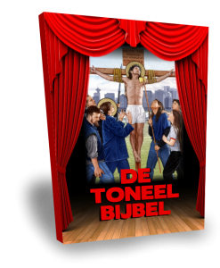

[De Toneelbijbel](http://toneelbijbel.gelovenleren.net/) is een unieke uitgave waarin de belangrijkste verhalen uit het Evangelie elk omgevormd zijn tot een kort toneelstuk. Je zal verrast zijn hoe goed de originele bijbelteksten zich daartoe lenen!

De teksten in De Toneelbijbel zijn 100% bijbelgetrouw, meer nog: bij elk vers vind je de verwijzing waar je de tekst in het Evangelie kan terugvinden. De vier evangelisten volgen verschillende verhaallijnen, die in De Toneelbijbel zijn samengevoegd tot één dramatische ontwikkeling om je beleving van het Evangelie met zoveel mogelijk details te prikkelen.

De toneelbewerking van het Evangelie is niet bedoeld om uit te voeren voor groot publiek, maar aarzel niet om bij gelegenheid samen met de kinderen thuis, in de catechesegroep of in de klas een of meerdere bedrijven uit te voeren om het bijbelverhaal wat leven in te blazen. Of neem het stuk zelf bij de hand als alternatieve bijbellezing!

De uitgave is [beschikbaar in boekvorm](http://toneelbijbel.gelovenleren.net/) (aan kostprijs) en de afzonderlijke verhalen kan je [gratis downloaden](/page/bijbeltoneel/) (met uitzondering van het verrijzenisverhaal).

 De Toneelbijbel

Dit zijn de gebeurtenissen die je met De Toneelbijbel kan beleven:

- De aankondiging van de geboorte van Johannes de Doper
- De aankondiging van de geboorte van Jezus en het bezoek aan Elisabet
- De geboorte van Johannes de Doper
- De geboorte van Jezus
- De opdracht van Jezus in de tempel
- De wijzen uit het Oosten
- Maria en Jozef vinden Jezus in de tempel
- Het Doopsel van Jezus
- De Bekoring van Jezus
- De leerlingen van Johannes
- Jezus en de Samaritaanse vrouw
- De knecht van de honderdman
- Storm op het meer en genezing van een bezetene
- Jezus en de overspelige vrouw
- De verloren zoon
- De parabel van Lazarus en de rijke man
- Het Koninkrijk Gods
- De Talenten
- De opwekking van Lazarus
- De Gedaanteverandering
- Het Lijden en Sterven van Onze Heer Jezus Christus
- Met het oog op zijn begrafenis — Complot tegen Jezus
- Voorbereiding van het paasmaal — Voetwassing — Laatste Avondmaal
- Ze zullen allemaal ten val komen — In Getsemane — Arrestatie van Jezus
- Verloochening door Petrus — Verhoor door de hogepriester
- Voor Pilatus — Bespotting en kruisiging
- De dood van Jezus — Begrafenis van Jezus
- De Verrijzenis van Jezus
- Het Lege Graf
- De Emmaüsgangers en de Ongelovige Thomas
- De Belofte van Petrus en de Hemelvaart

https://issuu.com/vicmortelmans/docs/bijbeltoneel2
