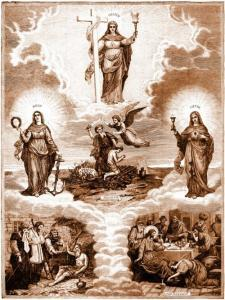

De [eerste lezing op de vijfde zondag in de Vasten](http://www.bijbelcitaat.be/lezing/lezingen-van-de-dag-zondag-18-maart-2018/) bevat deze uitspraak van de Heer, bij monde van zijn profeet:

> Ik zal mijn wet in hun binnenste leggen en hem in hun hart schrijven.

Vanuit de context van die bijbelpassage en ook de eraan gekoppelde lezing uit het Evangelie, wordt dit gelezen als een voorspelling van het nieuwe Verbond: de komst van Jezus en van zijn omgang met de wet.

Het is prachtig hoe de ganse heilsgeschiedenis van de mensheid op die manier tot een korte liturgische eenheid wordt samengebald. Wat ik me echter bedacht is hoe dat zinnetje uit Jeremia ook betrekking heeft op de kleine heilsgeschiedenis van ons eigen leven. De schepping, de zondvloed, de doortocht door de woestijn, de wereldse bekoringen waaraan koningen onderhevig waren en de verwerping van profeten, de komst van Christus en zijn belofte van eeuwig leven: we kunnen het allemaal meemaken in ons eigen geestelijk leven.

Jeremia geeft in dat korte zinnetje een perfecte definitie van wat een **deugd** is!

 De goddelijke deugden: geloof, hoop en liefde

De [catechismus](https://www.rkdocumenten.nl/rkdocs/index.php?mi=600&doc=1&id=1285) bepaalt als volgt de deugd:

> De deugd is een levenshouding, een vaste gesteltenis, om het goede te doen.

Of in de oude [prentencatechismus](http://prentencatechismus.org/uncategorized/de-deugden-de-goddelijke-deugden/):

> Een deugd is een bepaalde geestelijke ingesteldheid die ons doet neigen naar het goede.

Het is jammer dat zo'n begrippen nog maar weinig gebruikt worden, toch niet in hun catechetische betekenis. De catechismus heeft een rijk begrippenapparaat waarmee we ons geloofsleven kunnen uitdrukken, maar we leren het niet meer hanteren. Het zou nochtans nuttig zijn, want de manier waarop we nu ons geloof uitdrukken mist vaak de nodige helderheid. Duidelijke begrippen voor ontastbare werkelijkheden kunnen ons meer inzicht verschaffen in ons geestelijk leven.

Nog zo'n verloren begrip is de [ergernis](/blog/schandalig-geloof/). Hoe meer ik erover nadenk, hoe meer ik inzie dat dit begrip essentieel is om het christelijk geloof te begrijpen. Heb ik het echter al ooit in de catechetische betekenis horen gebruiken in een homilie of in een kerkelijke tekst? Ik kan het me niet meteen herinneren…

Wie het recht wil bestuderen, moet bepaalde begrippen kennen en hun definities. Wie wiskunde wil studeren, idem. Wie een bepaalde technische vaardigheid onder de knie wil krijgen, evenzo. Waarom zou dat dan niet gelden voor wie zich in zijn geloof wil verdiepen?
