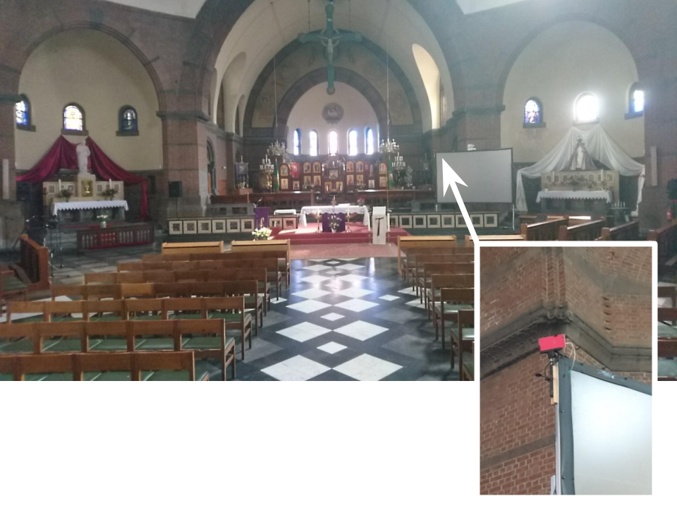

Zoals in een [vorig bericht](/blog/de-heilige-mis-live-uitzenden-met-een-oude-gsm/) aangekondigd, maken we plannen om de wekelijkse eucharistie live uit te zenden via Facebook. Deze week hebben we een proefopname gemaakt, die als geslaagd mag beschouwd worden! Je kan ze hier bekijken:

\[contentcards url="https://www.facebook.com/150933195565099/videos/161496114508807/"\]

Voorlopig nog op een tijdelijke facebookpagina, hopelijk een van de komende weken op de [officiele pagina van onze parochie](https://www.facebook.com/antonius.heilighart.antwerpen).

Wat heb je hiervoor nodig:

- wifi-netwerk in de kerk
- een oude gsm die op een geschikte plaats vast opgesteld wordt, bv. met een selfie-stick
- usb-bekabeling voor stroomtoevoer
- audio-bekabeling naar de versterker van de geluidsinstallatie (let op het juiste gebruik van een jack-kabel van het type OMTP of CTIA)
- een facebookpagina
- iemands gsm die als afstandsbediening wordt gebruikt om opname te starten en te stoppen via de TeamViewer-app

Meer technische details vind je hier:

\[contentcards url="/blog/de-heilige-mis-live-uitzenden-met-een-oude-gsm/"\]

De TeamViewer-app is heel krachtig, want voor de proefopname kon ik zelf niet aanwezig zijn in de kerk, maar via de app kon ik de opname zelfs vanop afstand bedienen!

Geen gedoe dus om telkens de boel te installeren en af te breken, gewoon op de knop duwen en we zijn vertrokken!

Hier zie je de opstelling van de camera in onze kerk (ja, mijn oude gsm was roze, dat klopt).

